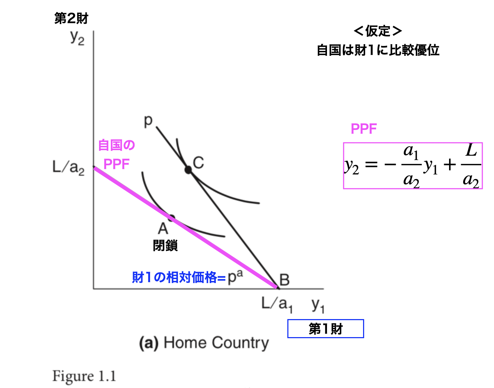
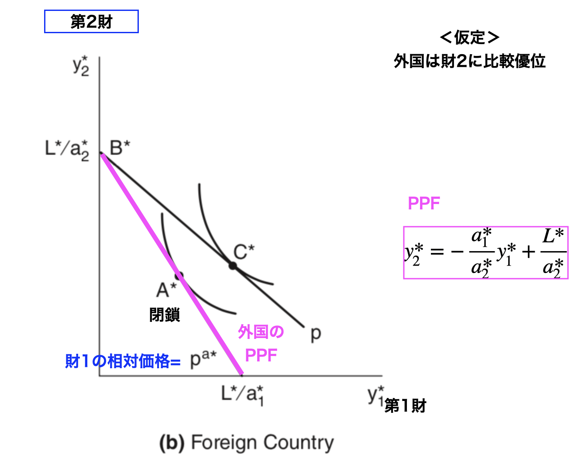
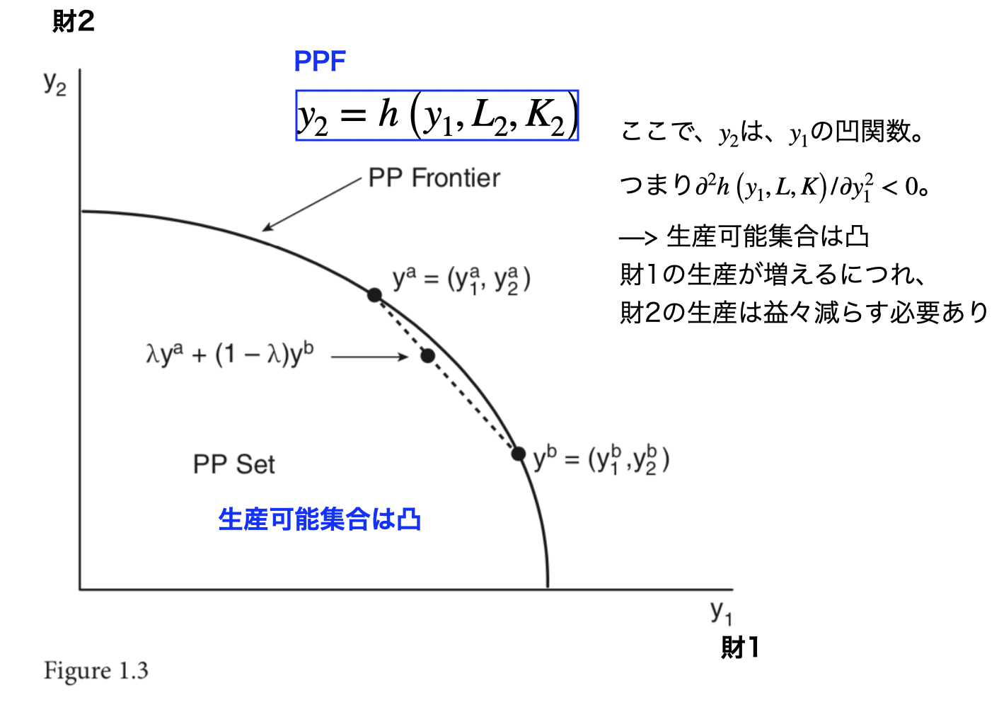
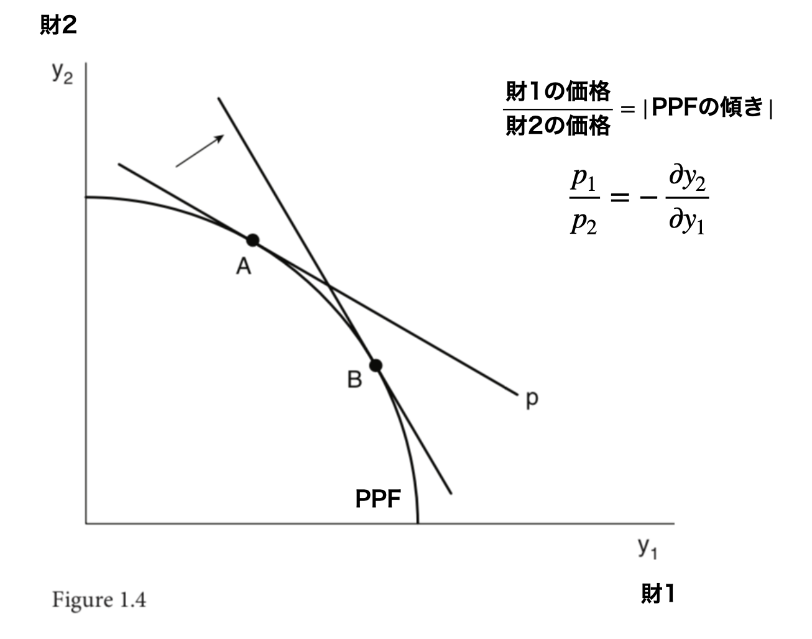
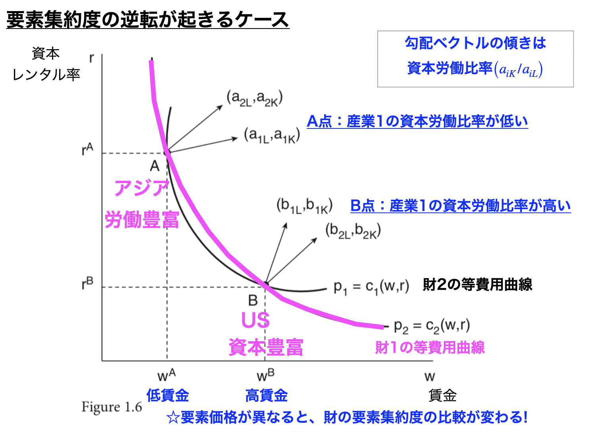
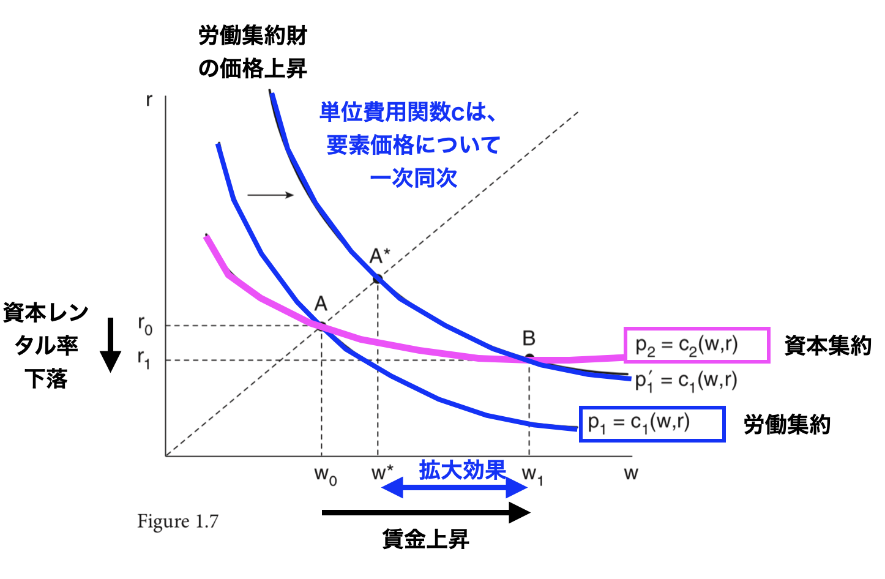
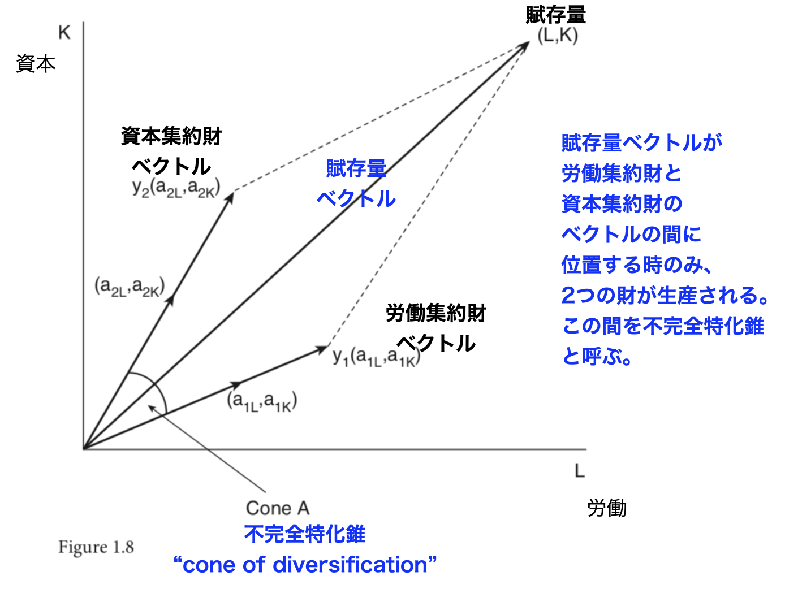

```{r setup, include=FALSE}
knitr::opts_chunk$set(echo = FALSE)
# install.packages("revealjs")
```


# 1. 導入：二部門モデルの基礎

## リカード・モデル (Ricardian Model) の概要

*   国際貿易の研究は、古典的な**リカード・モデル**から始まる。
*   **特徴:** 2財と1要素（労働）のみ。
*   **核心的な洞察:** **技術的な差異**が国家間の貿易の基盤となることを示す。
*   リカード・モデルは、そのシンプルさにもかかわらず、現代の貿易パターンを説明する上で現在でも妥当性がある。
*   **労働の移動性:** 各国内の産業間では労働は完全に移動可能だが、国家間では移動不可能。

## 設定：投入係数

*   各財の生産に必要な単位当たりの労働投入量を示す。
    - 財1の労働投入量: $a_{1L}$
    - 財2の労働投入量: $a_{2L}$
*   外国の投入係数は、$a^*_{1L}$ および $a^*_{2L}$ で表される。

|        | 財1          | 財2          |
|--------|--------------|--------------|
| 本国   | $a_{1L}$     | $a_{2L}$     |
| 外国   | $a^*_{1L}$   | $a^*_{2L}$   |


## 設定：生産量

*   各財の生産量をそれぞれ $y_1$ および $y_2$ とする。
*   外国の生産量は $y^*_1$ および $y^*_2$ で表される。


|        | 財1          | 財2          |
|--------|--------------|--------------|
| 本国   | $y_1$        | $y_2$        |
| 外国   | $y^*_1$      | $y^*_2$      |


## 設定：労働者数

*   各国の労働力の総賦存量をそれぞれ $L$ および $L^*$ とする。
* 財1に従事する労働者数は、$a_{1L} y_1$、財2に従事する労働者数は $a_{2L} y_2$ で表される。

|        | 財1          | 財2          | 合計      |
|--------|--------------|--------------|----------|
| 本国   | $a_{1L} y_1$ | $a_{2L} y_2$ | $L$      |
| 外国   | $a^*_{1L} y^*_1$ | $a^*_{2L} y^*_2$ | $L^*$    |

## 生産可能性フロンティアの導出

労働の完全雇用条件:
$$
a_{1L} y_1 + a_{2L} y_2 = L 
$$
より、
$$
y_2 =  - \frac{a_{1L}}{a_{2L}} y_1 + \frac{L}{a_{2L}}
$$

ここから、生産可能性フロンティア (PPF: Production Possibility Frontier) が描かれる。

## 比較優位と生産可能性フロンティア (PPF)


*   **PPFの傾き:** PPFの傾き（符号を無視）は、国内における財1の財2に対する相対価格 $p = \frac{p_1}{p_2}= \frac{a_{1L}}{a_{2L}}$ に等しくなる。
*   **比較優位:** 本国が財1の生産に比較優位を持つ場合、その相対価格は外国よりも低くなる:
$$
\frac{a_{1L}}{a_{2L}} < \frac{a^*_{1L}}{a^*_{2L}}
$$
*   **貿易パターン:** 貿易は、国家が**比較優位**を持つ財を輸出し、相対的に劣位な財を輸入する。


## Figure 1.1(a)

{width=90%}

## Figure 1.1(b)

{width=90%}


## 自由貿易下の利益

*   **世界相対供給曲線:** PPFの線形性（直線形状）を反映して、「階段状 (stair-step)」の形状を持つ。
*   **均衡価格:** 自由貿易下の均衡価格 $p$ は、通常、両国の**自給自足価格** ($p^A$ と $p^{A*}$) の間に位置。
*   **貿易利益:** 自由貿易の下では、各国は消費可能集合がPPFの外側にある点C（図1.1(a)(b)を参照）に到達でき、**自給自足時よりも豊かになる**。


## 賃金の決定

*   **賃金の調整:** 労働投入量が外国より多い（絶対劣位にある）場合でも、自由貿易の下では**賃金水準が生産性を反映して調整される**ため、輸出が可能。

貿易パターンは比較優位によって、賃金水準は絶対優位によって決定される。

# 2. 2財2要素モデル：GDPと最適生産

## モデルの構造と前提

*   このモデルは、次章で学ぶ**ヘクシャー・オーリン・モデル**の基礎を形成。
*   **要素:** 2つの要素（**労働 L** と**資本 K**）が存在。
*   **要素の移動性:** 要素は産業間では完全に移動可能だが、国境を越えては移動しない。
*   **生産関数:** 各財の生産関数 $y_i = f_i(L_i, K_i)$ は、**規模に関して収穫一定 (Constant Returns to Scale)** であると仮定。

## 生産可能性フロンティア (PPF) とGDP関数

*   **PPFの形状:** 2要素モデルのPPFは、一般的に**凹関数 (Concave function)** として描かれる。これは、生産可能性集合が**凸集合 (Convex set)** であることを意味。


## Figure 1.3

{width=80%}


## GDP最大化問題

*   **GDPの最大化:** 完全競争の下、経済は国民総生産 ($GDP=p_{1} y_{1}+p_{2} y_{2}$) を最大化するように生産を行う。
$$
G(p_1, p_2, L, K) 
= 
\max_{y_1, y_2} \{p_1 y_1 + p_2 y_2\} 
$$
$$
\text{s.t.} \quad y_2 = h(y_1, L, K) \tag{1.2}
$$


*   **生産点:** 経済が生産を行うのは、財1の相対価格 $p = p_1/p_2$ がPPFの傾き（負の値）に等しい点。

## Figure 1.4

{width=80%}

## 費用関数と均衡条件

*   **単位費用関数 $c_i(w, r)$:** 1単位の生産を行うための最小費用（$w$は賃金、$r$は資本レンタル）として定義。規模に関して収穫一定であるため、これは限界費用および平均費用に等しくなる。
*   **ゼロ利潤条件:** 完全競争の下、利潤はゼロでなければならない。
$$
p_1 = c_1(w, r), \quad p_2 = c_2(w, r) \tag{1.7}
$$


## 要素市場の均衡条件

*   **完全雇用条件:** 労働と資本の両資源が完全に雇用されている必要がある。

$$
a_{1L} y_1 + a_{2L} y_2 = L \tag{1.8a}
$$
$$
a_{1K} y_1 + a_{2K} y_2 = K \tag{1.8b}
$$

*   これらの4つの式（1.7と1.8）は、4つの未知数 ($w, r, y_1, y_2$) を決定。


# 3. 均衡結果：FPIとFPE

## 要素価格の非感応性 (Factor Price Insensitivity: FPI)

###   要素価格の非感応性補題

両財が生産され、かつ**要素集約度の逆転 (FIRs: Factor Intensity Reversals)** が起こらない限り、所与の価格ベクトル $(p_1, p_2)$ には一意の要素価格 $(w, r)$ が対応。

*   **驚くべき結果:** FPIは、**要素賦存量 $(L, K)$ が要素価格 $(w, r)$ の決定に影響を与えない**ことを意味。


## 要素集約度の逆転 (FIRs)

**要素集約度の逆転 (FIRs: Factor Intensity Reversals)**

* ゼロ利潤条件を示す等費用線が複数回交差する場合（図1.6参照）に発生し、要素集約度（資本労働比率 $K/L$）の比較が要素価格によって変化。

* FIRsが存在する場合、FPIの定理は成立しない。

## Figure 1.6

{width=80%}

\footnotesize
* US（B点）では、機械化された工場で少人数で生産
* アジア（A点）では、少なく古い機械で多人数で生産

## 要素価格均等化定理

###  **要素価格均等化定理 (Samuelson 1949)**

**Factor Price Equalization (FPE) Theorem**

2国が自由貿易を行い、技術は同一だが要素賦存量が異なるとき、もし両国が両財を生産し、FIRsが起こらないならば、要素価格 $(w, r)$ は両国間で均等化。

*   **重要性:** FPE定理は、**財の貿易が要素の貿易の「完全な代替物」となる能力を持つ**ことを示唆。
*   **背景:** 労働豊富国が労働集約財を、資本豊富国が資本集約財を不釣り合いに多く生産し、それを輸出することで、両国は同じ賃金水準で自国の要素を完全に雇用できる。

# 4. 要素価格と産出量の変動：主要定理

## ゼロ利潤条件

$$
p_{1} =c_{1}(w, r)=wa_{1L}(w, r) + ra_{1K}(w, r) \tag{1.7a}
$$
$$
p_{2} =c_{2}(w, r)=wa_{2L}(w, r) + ra_{2K}(w, r) \tag{1.7b}
$$

## Jones Algebra

**Jones Algebra (Jones, 1965)**を利用すると、(1.7)を全微分した結果を次のように表現できる。

$$
\hat{p}_{1}=\theta_{1 L} \hat{w}+\theta_{1 K} \hat{r}, \tag{1.9a}
$$
$$
\hat{p}_{2}=\theta_{2 L} \hat{w}+\theta_{2 K} \hat{r}, \tag{1.9b}
$$


* $\theta_{iL}=\frac{w a_{iL}}{ c_{i}}$は、財$i$の生産における労働の費用シェアを表す。
* $\theta_{iK}=\frac{r a_{iK}}{ c_{i}}$は、財$i$の生産における資本の費用シェアを表す
* $\theta_{iL}+\theta_{iK}=1$が成り立つ。
* $d \ln w=d w / w=\hat{w}$は、賃金の変化率を表す。
* $d \ln r=d r / r=\hat{r}$は、資本レンタルの変化率を表す。

## ストルパー・サミュエルソン定理の導出

(1.9)を連立して、$\hat{w}$と$\hat{r}$について解くと、次のようになる。

$$
\begin{pmatrix}
\hat{w} \\ 
\hat{r}
\end{pmatrix}
= \frac{1}{|\theta|}
\begin{pmatrix}
\theta_{2K} & -\theta_{1K} \\ 
-\theta_{2L} & \theta_{1L}
\end{pmatrix}
\begin{pmatrix}
\hat{p}_{1} \\ 
\hat{p}_{2}
\end{pmatrix}
$$


証明の詳細は略すが、ここからストルパー・サミュエルソン定理が導出される。

## ストルパー・サミュエルソン定理

### ストルパー・サミュエルソン定理 (Stolper-Samuelson Theorem, 1941)

ある財の相対価格の上昇は、その財の生産に**集約的に使用される要素**の実質収益を増加させ、もう一方の要素の実質収益を減少させる。

*   **例:** 労働集約財（財1）の価格が上昇すると、賃金 $(w)$ は財1の価格上昇率よりも大きく上昇し、資本レンタル $(r)$ は財2の価格上昇率よりも小さく変化。


## 拡大効果

**拡大効果 (Magnification Effect)**

製品価格の変化は要素価格に**拡大された影響**をもたらし、貿易機会が強い**所得分配上の結果**（勝ち組と負け組）を生じさせる。

$$
\hat{r} < \hat{p}_2 < \hat{p}_1 < \hat{w} \tag{1.13}
$$

*   (ただし、ここでは$\hat{p}_1 > \hat{p}_2$を仮定し、財1が労働集約的 ($\theta_{1L} > \theta_{2L}$) な場合)

## Figure 1.7

{width=80%}

## リプチンスキー定理 (Rybczynski Theorem)

### リプチンスキー定理 (1955)

要素賦存量の増加は、その増加した要素を**集約的に使用する産業の産出量**を増加させ、もう一方の産業の産出量を減少させる（製品価格が固定されている場合）。

*   **要因:** 製品価格が固定されているため、FPIの補題により要素価格 $(w, r)$ も固定される。
*   **直感:** 労働賦存量が増加した場合、労働集約産業がすべての追加労働を吸収するだけでなく、資本集約産業から労働と資本の両方を吸収し、両産業の資本/労働比率を不変に保つ。

## リプチンスキー定理の導出方法

完全雇用条件（1.8）を全微分して、Jones Algebraを用いると、次のように表現できる。

$$
\begin{pmatrix}
{\hat{y}_{1}} \\ {\hat{y}_{2}}
\end{pmatrix}
=\frac{1}{|\lambda|}
\begin{pmatrix}
{\lambda_{2 K}} & {-\lambda_{2 L}} \\ 
{-\lambda_{1 K}} & {\lambda_{1 L}}
\end{pmatrix}
\begin{pmatrix}
{\hat{L}} \\ {\hat{K}}\end{pmatrix}
$$
ここから詳細は省略するが、リプチンスキー定理が導出される。

## 多様化のコーン

**多様化のコーン (Cone of Diversification):**

両財が生産されるためには、要素賦存量ベクトル $(L, K)$ が2つの要素投入量ベクトルによって張られるこの「コーン」内に位置する必要がある。

* それぞれの不完全特化錐の中に要素賦存ベクトルがあれば、両方の財の生産行う。

* 不完全特化錐の外側に要素賦存ベクトルがあれば、片方の財の生産のみを行う。

## Figure 1.8

{width=80%}


# 確認問題 (10問){-}

## **問1**

リカード・モデルとヘクシャー・オーリン・モデルの、貿易の基礎を説明する上での主な焦点の違いとして、最も適切でないものはどれか。

A. リカード・モデルは技術的な差異を重視する。

B. ヘクシャー・オーリン・モデルは要素賦存量の差異を重視する。

C. リカード・モデルは1要素（労働）のみを扱う。

D. ヘクシャー・オーリン・モデルは技術的な差異がないことを前提としない。

## **問2**

リカード・モデルにおいて、
財1を横軸、財2を縦軸にとった場合、
本国のPPFの傾き（負符号を無視した絶対値）が示す経済的な意味は何か。

A. 財1の生産における絶対優位。

B. 財1を生産するために諦めなければならない財2の量（機会費用）。

C. 財1と財2の間の賃金率の比率。

D. 労働力の総賦存量。

## **問3**

リカード・モデルにおける貿易パターンと賃金水準の決定要因に関する記述として、正しいものはどれか。

A. 貿易パターンは絶対優位によって決定される。

B. 賃金水準は比較優位によって決定される。

C. 貿易パターンは比較優位によって、賃金水準は絶対優位によって決定される。

D. 貿易パターンも賃金水準も、技術的な差異に依存しない。

## **問4**

2財2要素モデルにおいて、各財の生産関数について、次のどの技術的仮定が維持されているか。

A. 収穫逓増 (Increasing Returns to Scale)。

B. 規模に関して収穫一定 (Constant Returns to Scale)。

C. 収穫逓減 (Diminishing Returns to Scale)。

D. 外部性の存在。

## **問5**

完全競争下にある2財2要素モデルの経済において、生産点におけるPPFの傾き（負の絶対値）は何と等しくなるか。

A. 労働の限界生産力。

B. 資本の限界生産力。

C. 財1と財2の相対価格 $p_1/p_2$。

D. 単位費用関数 $c_i(w, r)$。

## **問6**

要素価格の非感応性（FPI）の補題によれば、特定の条件下において、以下のどの要因が要素価格 $(w, r)$ の決定に影響を与えないか。

A. 財の相対価格 $(p_1, p_2)$。

B. 要素賦存量 $(L, K)$。

C. 単位費用関数 $c_i(w, r)$ の形状。

D. 労働の産業間移動性。

## **問7**

要素価格均等化定理（FPE）が成立しなくなる条件の一つとして、最も重要なものは何か。

A. 財の貿易が制限されること。

B. 要素集約度の逆転（FIRs）が発生すること。

C. 規模に関して収穫一定の仮定が破られること。

D. 労働が完全に非移動的であること。

## **問8**

ストルパー・サミュエルソン定理が示す、労働集約財（財1）の相対価格が上昇した場合の結果として正しいものはどれか。

A. 資本の実質収益が増加する。

B. 労働の実質賃金が減少し、資本の実質レンタルが増加する。

C. 労働の実質賃金が増加し、資本の実質レンタルが減少する。

D. 労働と資本の両方の実質収益が同率で増加する。

## **問9**

ジョーンズの拡大効果（Jones Algebra）における、財1の価格上昇率 $\hat{p}_1$、財2の価格変化率 $\hat{p}_2$、賃金変化率 $\hat{w}$、レンタル変化率 $\hat{r}$ の間の一般的な順序関係（財1が労働集約的で $\hat{p}_1 > \hat{p}_2$ の場合）を示すものはどれか。

A. $\hat{r} < \hat{w} < \hat{p}_1 < \hat{p}_2$

B. $\hat{r} < \hat{p}_2 < \hat{p}_1 < \hat{w}$

C. $\hat{p}_2 < \hat{r} < \hat{w} < \hat{p}_1$

D. $\hat{p}_2 < \hat{p}_1 < \hat{r} < \hat{w}$

## **問10**

リプチンスキー定理に基づき、財の相対価格が固定された状態で、一国の資本賦存量が著しく増加した場合、資本を**集約的に使用する**産業の産出量と、もう一方の産業の産出量はどのように変化するか。

A. 両産業の産出量が増加する。

B. 資本集約産業の産出量は減少し、もう一方の産業の産出量が増加する。

C. 資本集約産業の産出量が増加し、もう一方の産業の産出量が減少する。

D. 両産業の産出量は不変である。

## 解答

1. D
2. B
3. C
4. B
5. C
6. B
7. B
8. C
9. B
10. C
