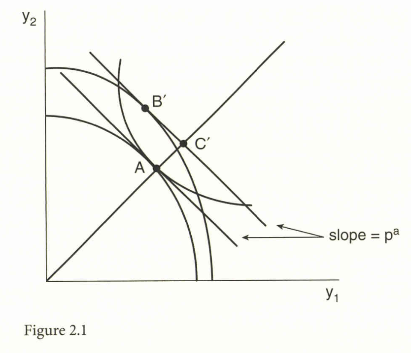
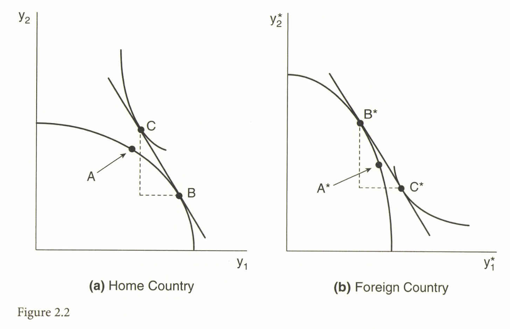

```{r setup, include=FALSE}
knitr::opts_chunk$set(echo = FALSE)
# install.packages("revealjs")
```


# 1. Heckscher-Ohlin-Samuelson (HOS) モデル


## HOSモデルの概要と前提

* 国際貿易のパターンを、**要素賦存量の差異**に基づいて予測することを目的とする。
* HOSモデルは、エリ・ヘクシャーとベルティル・オーリンの洞察に基づき、ポール・サミュエルソンが数学モデルとして発展させたもの。

## HOSモデルの主な前提

* **技術 (Technologies):** 全ての国で**同一** (Identical technologies)。
* **選好 (Tastes):** 全ての国で**同一かつ同次的** (Identical and homothetic tastes)。
* **要素賦存量 (Factor Endowments):** 国によって**異なる** (Differing factor endowments)。
* **貿易:** 財の自由貿易は行われるが、**要素は国境を越えて移動しない**。
* **追加の仮定:** **要素集約度の逆転 (FIRs)** が起こらないことを前提とする場合が多い。
    * FIRsが起こらない限り、すべての国が「**多様化のコーン (Cone of Diversification)**」内に賦存量を持つ場合、自由貿易の下で**要素価格均等化 (FPE)** が生じる。

## Heckscher-Ohlin (HO) 定理

### ヘクシャー・オーリン定理

各国は、自国に**豊富に存在する要素**を**集約的に使用する財**を輸出する。

* 例: 本国が労働豊富国 ($L/K > L^*/K^*$) で、財1が労働集約的である場合、本国は財1を輸出し、外国は財2を輸出する。

## 自給自足

* **自給自足均衡:** 無差別曲線と生産可能性フロンティア (PPF) が接する点 (図2.1の点A) で確立される。

## Figure 2.1 自給自足価格

{width=80%}

## 貿易のメカニズム：自由貿易価格

* **比較優位の決定:** 労働豊富国（本国）は、労働集約財（財1）の自給自足価格 $p^A$ が外国の自給自足価格 $p^{A*}$ よりも**低くなる** ($p^{A*} > p^A$)。
* **自由貿易均衡:** 均衡価格 $p$ は両国の自給自足価格の間に位置する ($p^{A*} > p > p^A$)。
* 自由貿易の下で、価格の上昇した財（本国の場合は財1）の生産が拡大し（点Aから点Bへ）、消費点Cとの差が貿易パターンを形成する。

## Figure 2.2 貿易利益

{width=80%}


## 貿易の利益と所得分配

* HOモデルは、貿易による利益と損失についても明確な示唆を与える。
* **所得分配:** 各国において、**豊富に存在する要素**は貿易から利益を得て、**希少な要素**は損失を被る。
* この結果は、価格変動パターン ($p^{A*} > p > p^A$) と**ストルパー・サミュエルソン定理**の連鎖によって導かれる。
    * 本国では財1の相対価格が上昇し、財1に集約的に使用される要素（労働）の実質収益が増加し、もう一方の要素（資本）は損失を被る。

# 2. HOVモデルとレオンチェフのパラドックス

## レオンチェフのパラドックス (Leontief's Paradox)

* レオンチェフ (1953) は、HOモデルにデータを適用した最初の研究者。
* 1947年の米国データを使い、輸出と輸入の100万ドルあたりに必要な労働と資本を計算した。
    * 当時、米国は資本豊富国と推定されていた。
* **結果:** 米国の輸出に含まれる資本/労働比率 ($13,700$) は、輸入に含まれる資本/労働比率 ($18,200$) よりも**低かった**。
* この発見は、HO定理に矛盾するように見えたため、「**レオンチェフのパラドックス**」と呼ばれた。

## HOVモデル：要因内容 (Factor Content) の定式化

* HOVモデルは、多財・多要素への拡張モデル（ヘクシャー・オーリン・ヴァネックモデル）。
* **技術行列 $A$:** 1単位の生産に必要な主要要素の投入量を表す $(M \times N)$ 行列。
    * HOVモデルは、技術行列 $A$ が全ての国で同一であると仮定する。
    
## 貿易の要素内容

### Factor Content of Trade

* **貿易の要素内容 $F^i$:** 国 $i$ の貿易 $\tau^i$ に体化された要素の量 $(M \times 1)$ ベクトルとして定義される。

$$
F^i = A \tau^i \tag{HOVの定義}
$$

* $M$ は、モデルに含まれる**要素（Factor）**の総数。$k=1,2,...,M$。
* $N$ は、モデルに含まれる**財（Goods）/産業**の総数。$j=1,2,...,N$。


## HOV定理

* 貿易の要素内容 $F^i$ を国の要素賦存量 $V^i$ に関連付ける。

$$
F^i = V^i - s^i V^W \tag{2.1}
$$

* $V^i$ は国 $i$ の要素賦存量、$V^W$ は世界の要素賦存量、$s^i$ は国 $i$ の世界消費シェア（バランスの取れた貿易下ではGDPシェアに等しい）。
* **解釈:** 国 $i$ がある要素 $k$ において豊富である（$V^i_k / V^W_k > s^i$）場合、その要素の貿易要素内容は**正**になる（$F^i_k > 0$）、すなわちその要素を輸出する。

## Leamerの批判と再定式化

* Leamer (1980) は、レオンチェフが「**誤ったテスト**」を行ったと批判。
    * レオンチェフの方法は、貿易不均衡がある場合には有効ではないという問題があった。

### 設定
* $K^i$ は国 $i$ の資本賦存量、$L^i$ は労働賦存量。
* $F^i_K$ は貿易の資本内容（資本の純輸出量）、$F^i_L$ は貿易の労働内容（労働の純輸出量）。

## Leamerの定理

### **Leamerの定理**

資本が労働に対して豊富である国 $i$ では、**生産に体化された資本/労働比率**が、**消費に体化された資本/労働比率**を上回る。

$$ \frac{K^i}{L^i} > \frac{K^i - F^i_K}{L^i - F^i_L} \tag{2.3} $$

1. 左辺 $\left(\frac{K^i}{L^i}\right)$ は、生産に体化された資本/労働比率（または国の要素賦存量の比率）。

2. 右辺 $\left(\frac{K^i - F^i_K}{L^i - F^i_L}\right)$ は、消費に体化された資本/労働比率。


## Leamerのテストの結果

Leamerがこの正しいテストを1947年の米国データに適用したところ、**パラドックスは解消された**

（生産K/L比率 $6,949$ が消費K/L比率 $6,737$ を上回った）

# 3. HOVモデルの完全テストと拡張

## HOVモデルの完全テストの失敗

* HOV定理の完全なテストは、貿易、技術、要素賦存量の3種類のデータすべてを使用して行われる。
* **サインテスト (Sign Test):** $F^i_k$ と $(V^i_k - s^i V^W_k)$ の符号が一致するかを検証。
* **結果 (Bowen, Leamer, Sveikauskas 1987; Trefler 1995):** 従来の仮定の下では、サインテストの成功率は約50%から61%程度であり、**コイントスと大差ない**。

## 「失われた貿易 (Missing Trade)」の謎

* HOVモデルの失敗の一因として、**「失われた貿易」の謎**がある。
* 貿易の要素内容 $F^i$ の分散は、相対要素賦存量 $(V^i - s^i V^W)$ の分散と比較して**非常に小さい** (Treflerのデータでは比率はわずか $0.032$)。

## 1. 技術的差異の導入 (Trefler 1995)

* HOVモデルの失敗は、**技術が国の間で同一である**という仮定が特に問題であると結論付けられた。
* Trefler (1995) は、各国の技術行列 $A^i$ が米国技術 $A^{US}$ に対して一様なスカラー量 $\delta^i$ だけ異なる**一様な生産性差異**を導入した。
    $$
    A^i = A^{US} / \delta^i \tag{2.8の再構築}
    $$
    * $\delta^i < 1$ なら、国 $i$ は生産性が低く、単位生産あたりにより多くの要素を必要とする。
* このモデル (2.10) を用いて推定された $\delta^i$ は、各国の**一人当たりGDP**と強い相関関係を示した (相関係数 $0.89$)。
* **成果:** $\delta^i$ を導入することで、「失われた貿易」の謎の**ほぼ半分**（$R^2 = 0.486$）が説明された。サインテストの成功率も50%から62%に改善した。

## 2. 完全な要素生産性の差異の導入 (Trefler 1993a)

* Trefler (1993a) は、すべての要素、すべての国で生産性が異なる $\pi^k_i$ を導入した。
* この場合、HOV方程式 (2.7) は**恒等式として成立する**ため、もはやテスト可能な理論ではなくなる。
* ただし、推定された労働生産性 $\pi^L_i$ は、実際の国境を越えた**賃金水準**と高い相関を示し (相関係数 $0.9$)、モデルの「妥当性」を裏付けた。

## FPEを仮定しないテスト

* 財の貿易が必ずしも要素価格均等化 (FPE) をもたらさない場合でも、HOモデルをテストする方法がヘルプマン (Helpman 1984a) らによって提案された。
* **ヘルプマンの不等式:** 2国間の双方向の要素貿易 $F^{ij}$ と $F^{ji}$、および要素価格 $w^i, w^j$ を用いて、次の不等式が導かれる。

$$
(w^j - w^i)' (F^{ij} - F^{ji}) \ge 0 \tag{2.19}
$$

* **解釈:** 貿易に体化された要素は、**より高い要素価格を持つ国**へと流れる傾向があることを示唆する。
* Choi and Krishna (2004) は、このテストを適用し、双方向貿易の要素フローに関する不等式 (2.19) が**約72%から75%のケースで成立する**ことを発見した。これは理論への支持を示している。


# 確認問題 (10問){-}


## 問1
ヘクシャー・オーリン・サミュエルソン (HOS) モデルの基本的な前提として、最も適切でないものはどれか。

A. 要素賦存量は国によって異なる。

B. 財の生産技術は、全ての国で同一である。

C. 要素（資本や労働）は、国境を越えて自由に移動できる。

D. 消費者の選好は、全ての国で同一かつ同次的である。

## 問2
HOSモデルにおいて、ある国が自由貿易を開始した結果、その国の**豊富に存在する要素**に生じる所得分配上の影響として正しいものはどれか。

A. その要素の実質収益は減少し、希少な要素の実質収益は増加する。

B. その要素の実質収益は変化しない。

C. ストルパー・サミュエルソン定理により、その要素の実質収益は増加する。

D. 貿易によって生産点がPPF上を移動しない限り、収益に変化はない。

## 問3
レオンチェフ (1953) が発見したパラドックスの内容として、最も正しいものはどれか。

A. 資本豊富国である米国が、輸出財に体化されている資本/労働比率よりも、輸入財に体化されている資本/労働比率が低いこと。

B. 労働豊富国である外国が、輸出財に体化されている労働/資本比率よりも、輸入財に体化されている労働/資本比率が低いこと。

C. 資本豊富国である米国が、輸出財に体化されている資本/労働比率よりも、輸入財に体化されている資本/労働比率が高いこと。

D. 労働集約的な国が資本集約的な財を輸出すること。

## 問4
多財・多要素を扱うヘクシャー・オーリン・ヴァネック (HOV) モデルにおいて、国 $i$ の貿易の要素内容 $F^i$ と相対要素賦存量 $V^i - s^i V^W$ の関係を示す等式はどれか（ただし $s^i$ は国 $i$ の世界消費シェア）。

A. $F^i = V^i + s^i V^W$

B. $F^i = A (V^i - s^i V^W)$

C. $F^i = V^i - s^i V^W$

D. $F^i = A T^i / V^W$

## 問5
Leamer (1980) が提唱した、HOV定理の正しいテスト方法の一つとして、レオンチェフのテストの誤りを修正した点は何か。

A. 要素集約度の逆転 (FIRs) が起こっているかどうかをチェックした。

B. 労働と資本以外の要素（土地など）も計算に含めた。

C. 生産に体化された資本/労働比率と、消費に体化された資本/労働比率を比較した。

D. 貿易不均衡の影響を無視するために、自給自足価格を用いた。

## 問6
HOVモデルの初期の完全テスト（Bowen, Leamer, SveikauskasやTreflerによる）が失敗した主な結果として挙げられるのはどれか。

A. 要素価格均等化が理論通りに成立していたこと。

B. サインテストやランクテストの成功率が、コイントスの場合と大差ない約50%程度であったこと。

C. 貿易の要素内容の分散が、相対要素賦存量の分散を遥かに上回っていたこと。

D. 世界の要素賦存量 $V^W$ のデータが利用できなかったこと。

## 問7
Trefler (1995) が指摘した、HOVモデルの失敗を示す現象の一つである「失われた貿易 (Missing Trade)」とは、具体的に何が小さいことを意味するか。

A. 財の貿易量（GDP比）が小さい。

B. 相対要素賦存量の分散 $(V^i - s^i V^W)$ が小さい。

C. 貿易の要素内容 $F^i$ の分散が、相対要素賦存量の分散と比較して非常に小さい。

D. 各国における要素価格の格差が小さい。

## 問8
Trefler (1995) がHOVモデルのフィットを改善するために導入した「一様な生産性差異 $\delta^i$」の仮定によると、生産性 $\delta^i$ が低い国（$\delta^i < 1$）の技術行列 $A^i$ は、基準国（米国）の技術行列 $A^{US}$ と比べてどのように表現されるか。

A. $A^i$ は $A^{US}$ と等しい。

B. $A^i$ は $A^{US}$ よりも要素投入量が少ない。

C. $A^i$ は $A^{US}$ よりも要素投入量が多い ($A^i = A^{US}/\delta^i$)。

D. $A^i$ は労働投入量だけが多くなる。

## 問9
Trefler (1995) が一様な生産性差異 $\delta^i$ を導入したHOVモデル (2.10) のテストにより得られた主な成果は何か。

A. 「失われた貿易」の謎のほぼ半分が説明された ($R^2=0.486$)。

B. 推定された $\delta^i$ は、世界の要素賦存量 $V^W$ とは無相関であった。

C. サインテストの成功率が90%を超えた。

D. 資本集約財の価格が上昇すると、労働の収益が増加することが示された。

## 問10
FPE（要素価格均等化）が成立しないことを許容するHelpman (1984a) のテストで導かれた不等式 (2.19) が示唆する、要素貿易フローの基本的な傾向は何か。

A. 貿易に体化された要素は、常に豊富に存在する要素へと向かう。

B. 貿易に体化された要素は、常に希少な要素へと向かう。

C. 要素に体化された双方向貿易 $(F^{ij} - F^{ji})$ は、より高い要素価格を持つ国 $(w^j - w^i > 0)$ へと流れる傾向がある。

D. 貿易フローは要素価格の差異とは無関係である。

## 解答

1. C
2. C
3. C
4. C
5. C
6. B
7. C
8. C
9. A
10. C
