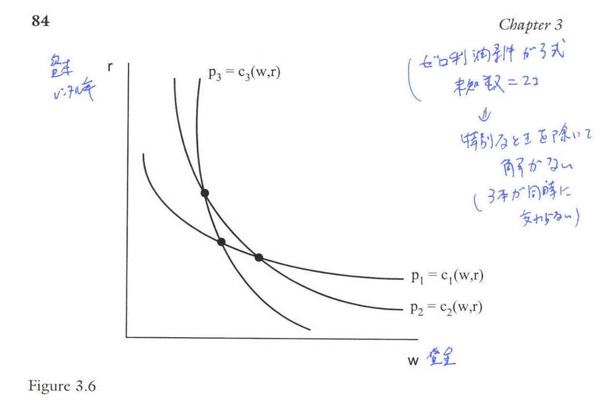
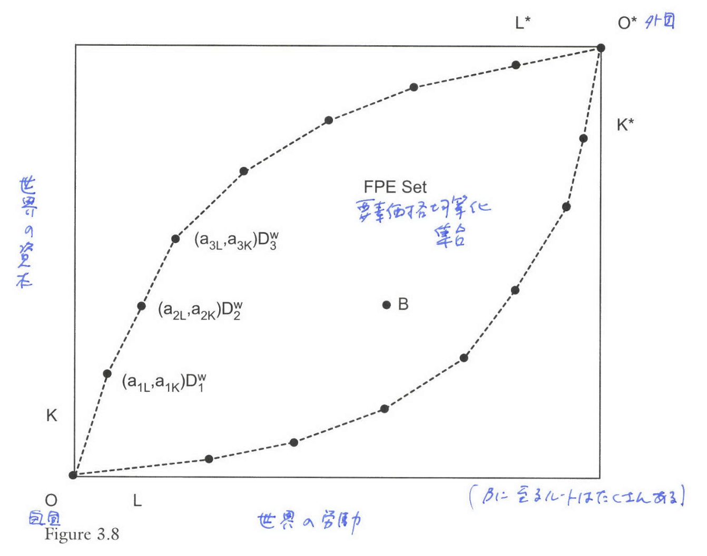

```{r setup, include=FALSE}
knitr::opts_chunk$set(echo = FALSE)
# install.packages("revealjs")
```


# 1. 財の数と要素の数が等しい場合 ($N = M$)


## 2x2モデルからの一般化

*   前章で学んだHOVモデルは多財・多要素を許容するが、その議論の多くは**要素価格均等化 (FPE)** の仮定を維持していた。
*   本章では、財の数 ($N$) と要素の数 ($M$) が等しい「**Even Case**」から始める。

## 要素価格均等化 (FPE)

*   $N=M$ の場合、FPE定理は2x2ケースから $N$ 財 $N$ 要素ケースに自然に一般化される。
*   ゼロ利潤条件 $p_i = c_i(w)$ (3.1) が、全ての財で生産が行われる限り、要素賦存量とは**独立に**、財価格 $p$ の関数として一意な要素価格 $w(p)$ の解を持つ。
*   両国が同一技術を持ち、自由貿易により同一価格 $p$ に直面し、かつすべての財を生産している場合、両国の要素価格は同一となる。
*   FPEが成立する賦存量の集合（FPEセット）は、$N$ 次元の超平行四辺形となる。


## ストルパー・サミュエルソン定理の一般化

*   財価格の小さな変化 $\hat{p}_i$ は、要素価格の変化 $\hat{w}_j$ の加重平均として表される。
$$
\hat{p}_i = \sum_{j=1}^M \theta_{ji} \hat{w}_j \tag{3.8}
$$

*   ここで $\theta_{ji}$ は、産業 $i$ における要素 $j$ のコストシェアである。
*   **定理の一般化:** 各財の価格変化に対し、**実質収益が増加する要素**と**実質収益が減少する要素**が必ず存在する。

## Jones and Scheinkman (1977) の定理


### Jones and Scheinkman (1977) の定理

$N=M$ で単位コスト行列 $A$ が非特異であれば、**各要素**について、その財の価格上昇が当該要素の**実質収益を低下させる財**が存在する。

*   この財を「**自然の敵 (natural enemy)**」と解釈できる。
*   しかし、一般的に $N \ge 2$ のケースでは、各要素に「**自然の友**」（価格上昇により実質収益が増加する財）が必ず存在するとは証明されていない。

## リブチンスキー定理の一般化

*   $N=M$ であれば、要素賦存量 $V_k$ の増加に対し、**生産が増加する財**と**生産が減少する財**が必ず存在する。
*   賦存量の増加に対する生産量の応答（リブチンスキー効果）は、以下のように表現できる:

$$
Y = A^{-1} V \tag{3.10'}
$$

*   Harrigan (1995) はOECD諸国のデータを用いて、産業生産量を要素賦存量に回帰させることで、この効果を実証的に再検証。


## Harrigan (1995) の研究デザイン


*   Leamer (1984) と同様の回帰分析を再検討したが、純貿易（Net Trade）ではなく、**産業生産量（Industry Outputs）**を被説明変数として使用。
*   産業生産量を**国別の要素賦存量**に回帰させ、リブチンスキー効果の係数（$Y=A^{-1}V$ の $A^{-1}$ の要素）を推定。
*   このアプローチは、$N=M$（財の数と要素の数が等しい）の構造を仮定。
*   1970年から1985年の**OECD諸国**のパネルデータを使用。
*   対象：**10の製造業部門**（財）と**4つの要素供給**（資本、熟練労働、非熟練労働、土地）。


## Harrigan (1995) の回帰モデルの定式化

- 従属変数は純貿易ではなく **産業別生産量**。
- 説明変数は **国の要素賦存量**。
-  **財の数($N=10$)**が要素の数($M=4$)を上回っている**

生産量$Y$と要素賦存量$V$の線形関係$Y = A^{-1} V$を以下のように定式化:

$$
y_{j}^{i} = \sum_{k=1}^{M} \beta_{jk} V_{k}^{i} \tag{3.10}
$$
$i = 1, \ldots, C$ （国を表す）、$j = 1, \ldots, N$ （財を表す）

$k = 1, \ldots, M$ （要素を表す）、$\beta_{jk}$ は $A^{-1}$ のエレメント


## Harrigan (1995) の主要な実証結果


*   **資本の影響:** **資本**は、**全ての10の回帰**において**正の係数**（リブチンスキー効果）を持っていた。これは、資本賦存量の増加が製造業の産出量を増加させることを示唆する。
*   **負の影響:** **各製造業**について、**少なくとも一つの要素**に**負のリブチンスキー効果**が見られた。これは、その賦存量の増加が製造業の産出量を減少させることを示す。
*   **負の影響を与える要素:** 負のリブチンスキー効果を持つ要素は、通常、**熟練または非熟練労働**であり、時には**土地**であった。
*   **国固有の差異:** **国別固定効果**が**非常に重要**であることが判明し、これは $Y=A^{-1}V$ という理論モデルでは捉えきれない**系統的な国ごとの差異**が存在することを示唆している。


# 2. 要素の数が財の数より多い場合 ($M > N$)

## 特殊要素モデル (Ricardo-Viner モデル)

*   要素の数が財の数より多い場合 ($M > N$)、要素価格は賦存量に依存するため、**FPEは成立しない**。
*   **特殊要素モデル**（specific factors model）は、この $M > N$ のケースを例示するもので、労働（$L$：産業間で移動可能）と、各産業に固定された資本 $K_1, K_2$（特殊要素）を想定する。

## 均衡と要素価格

*   総生産関数はGDP関数 $G(P, L, K_1, K_2)$ (3.11) で表される。

$$
G\left(p, L, K_{1}, K_{2}\right) \equiv \max _{L_{i} \geq 0} \sum_{i=1}^{2} p_{i} f_{i}\left(L_{i}, K_{i}\right) \quad \text { subject to } L_{1}+L_{2} \leq L \tag{3.11}
$$

*   労働は限界価値生産物 $p_i f_{Li}$ が等しくなるまで移動する。
*   資本 $K_1, K_2$ が固定されているため、同じ価格 $P$ に直面しても、**賦存量の異なる国々では要素価格は一致しない**。

## 価格変化と所得分配（ストルパー・サミュエルソンの修正）

*   特殊要素モデルでは、財1の価格 $p_1$ が上昇した場合、その変化率は次のような順序になる:

$$
\hat{p}_2 < \hat{w} < \hat{p}_1 < \hat{r}_1 < \hat{r}_2 \quad (\text{if } \hat{p}_2=0) \tag{3.14}
$$

*   **特殊要素の収益** ($\hat{r}_1$ や $\hat{r}_2$) は、財価格の変化率（$\hat{p}_1$）に対して**拡大効果**を持つ。
*   **移動可能要素（労働）の実質賃金** ($\hat{w}$) への影響は、労働者の消費構成に依存し、**曖昧になる**。これは $N=M$ の場合のJones and Scheinkmanの定理が適用されないことを示している。

## 賦存量変化の影響（リブチンスキー効果の修正）

*   **特殊要素**（例：$K_1$）が増加すると、その産業 $y_1$ の生産は増加し、他の産業 $y_2$ の生産は減少する。
*   **移動可能要素**（労働 $L$）が増加すると、両産業の生産 $y_1$ と $y_2$ は**共に増加する**。
*   したがって、移動可能要素の増加に対しては、2x2モデルで示された「生産が減少する財が存在する」というリブチンスキーの結果は成立しない。

# 3. 財の数が要素の数より多い場合 ($N > M$)

## 生産可能性フロンティア (PPF) と不確定性

*   $N>M$ の場合、要素の数よりも財の数が多いため、ゼロ利潤条件を満たす財価格は特殊な値に限られる。
*   図3.6は、$N=3$、$M=2$ の場合のゼロ利潤条件を示している。

## Figure 3.6: $N > M$ の場合のゼロ利潤条件

{width=90%}


## FPEの成立と生産の不確定性

*   技術が同一であるという強い仮定の下では、**広い範囲の要素賦存量**においてFPEが成立し続ける。
*   FPEが成立する範囲（FPEセット）は、Dixit and Norman (1980) によって構築され、図3.8のような領域となる。
*   このFPEセットの内部では、世界均衡を維持する生産量の組み合わせは**多数存在**し、各国の生産量は不確定である（**生産の不確定性**）。


## Figure 3.8: $N > M$ の場合の FPE セット

{width=90%}


## Bernstein and Weinstein (2002) の研究背景

### 生産の不確定性の実証テスト

**目的** 

財の数 ($N$) が要素の数 ($M$) より多い $N > M$ のケースにおいて発生する**生産の不確定性**を実証的にテストすること。

**理論的背景**

*   $N > M$ の場合、要素価格均等化（FPE）が成立すると、生産量 $Y$ は不確定となる。
*   もし $N=M$ であれば、生産量 $Y$ は要素賦存量 $V$ の逆行列 $A^{-1}$ を用いて $Y=A^{-1}V$ (3.10) と一意に定まる。

## Bernstein and Weinstein (2002) の研究デザイン

### 実証手法
*   Harrigan (1995) と同様に、産出量 $Y$ を賦存量 $V$ に回帰させる $Y=A^{-1}V$ (3.10) を推定する。
*   推定された係数行列 $B = A^{-1}$ を用い、理論的制約 $AB=I_M$ (3.27) がデータ上で成立するかをテストする。
*   この制約が失敗した場合、生産が不確定であると結論付けられる。

### データセット
*   1985年頃の**日本の47都道府県**にわたるクロスセクションデータ。
*   モデル構造は、**29の産業（財）**と**3つの要素**（大卒労働者、その他労働者、資本）であり、$N > M$ のケースを適用。

## Bernstein and Weinstein (2002) の主要な実証結果

*   都道府県レベルでの完全雇用条件 $AY^i=V^i$ （技術行列 $A$ を全国値として使用）は容易にパス。
*   しかし、回帰式 (3.10) を推定し、制約 (3.27) をテストしたところ、その仮説は**強く棄却された**。
*   **結論:** 日本の都道府県における生産のロケーションは、**賦存量のみによっては単純に説明できず**、生産の不確定性を示唆する証拠が得られた。


# 4. GDP関数の推定とHOVモデルの拡張

## トランスログ GDP 関数による推定

*   リブチンスキー効果やストルパー・サミュエルソン効果を推定する上で、Kohli (1978) は、GDP関数 $G(p, V)$ を**トランスログ関数** (3.15) でモデル化：

$$
\begin{aligned} \ln G=\alpha_{0}+\sum_{i=1}^{N} \alpha_{i} & \ln p_{i}+\sum_{k=1}^{M} \beta_{k} \ln V_{k}+\frac{1}{2} \sum_{i=1}^{N} \sum_{j=1}^{N} \gamma_{i j} \ln p_{i} \ln p_{j} \\ & +\frac{1}{2} \sum_{k=1}^{M} \sum_{\ell=1}^{M} \delta_{k \ell} \ln V_{k} \ln V_{\ell}+\sum_{i=1}^{N} \sum_{k=1}^{M} \varphi_{i k} \ln p_{i} \ln V_{k}\end{aligned}
$$

$p_{i}$: 製品の価格 ($i=1, \ldots, N$)、

$V_{k}$: 要素の賦存量 ($k=1, \ldots, M$)

## シェア方程式の導出

GDP関数を価格 $p_i$ や賦存量 $V_k$ で対数微分することで、**産出量シェア** $s_i$ (3.18) や**要素シェア** $s^*_k$ (3.19) に関する線形方程式系が得られる。


### 産出量シェア

$$
s_{i}=\alpha_{i}+\sum_{j=1}^{N} \gamma_{i j} \ln p_{j}+\sum_{k=1}^{M} \varphi_{i k} \ln V_{k}, i=1, \ldots, N \tag{3.18}
$$

### 要素シェア

$$
s_{k}=\beta_{k}+\sum_{\ell=1}^{M} \delta_{k \ell} \ln V_{\ell}+\sum_{i=1}^{N} \varphi_{i k} \ln p_{i}, k=1, \ldots, M \tag{3.19}
$$


## リブチンスキー弾力性とストルパー・サミュエルソン弾力性

これらのトランスログシェア方程式から推定された係数を用いて、リブチンスキー弾力性 (3.20) やストルパー・サミュエルソン弾力性 (3.21) を計算できる。

### リブチンスキー弾力性

$$
\frac{\partial \ln y_{i}}{\partial \ln V_{k}}=\frac{\varphi_{i k}}{s_{i}}+s_{k} \tag{3.20}
$$

### ストルパー・サミュエルソン弾力性

$$
\frac{\partial \ln w_{k}}{\partial \ln p_{i}}=\frac{\varphi_{i k}}{s_{k}}+s_{i} \tag{3.21}
$$ 

## 要素価格弾力性

さらに、$\ln w_{k}=\ln \left(s_{k} G / V_{k}\right)$を要素賦存量で微分することで、要素価格弾力性を得ることができる。

### 要素価格弾力性
$$
\frac{\partial \ln w_{k}}{\partial \ln V_{\ell}}=\left\{\begin{array}{ll}\frac{\delta_{k k}}{s_{k}}+s_{k}-1, & \text { if } k=\ell \\ \frac{\delta_{k \ell}}{s_{k}}+s_{\ell} & \text { if } k \neq \ell\end{array}\right. \tag{3.22}
$$


## 弾力性の検証

これらの弾力性は、「要素価格非感応性 (factor price insensitivity)」の仮説を検証するために使用できる。

これは、GDP関数が (3.7) の特別な形を取ることを意味する。

$$
G(p, V)=\sum_{j=1}^{M} w_{j}(p) V_{j} \tag{3.7}
$$

この関数形はトランスログGDP関数に対してグローバルに課すことはできないが、(3.22) がゼロであるかどうかをテストすることで局所的に評価できる。

つまり、$\delta_{k k}=s_{k}\left(1-s_{k}\right)$および$\delta_{k \ell}=-s_{k} s_{\ell}$をテストし、これはサンプルのある年（例：中間点）で実行できる。


## Kohliの研究結果

Kohliは、GDP関数をトランスログ関数形式で推定する手法を導入し、主にカナダや米国のデータに適用。

### 要素価格の非感応性（Factor Price Insensitivity

要素収益が要素賦存量に依存するかどうか（弾力性(3.22)がゼロか）を評価した結果、要素収益は賦存量に依存する（弾力性はゼロではない）ものの、その依存性は**弱い**ことが示された。

これは、「**財の数よりも要素の数が多い**」ことを示唆する証拠として解釈され得る。


## 生産性差異の導入 (Harrigan 1997)

*   従来のHOVモデルの検証の限界の一つは、技術が国間で同一であるという仮定であった。
*   Harrigan (1997) は、ヒックス中立的な生産性パラメータ $A_i$ を価格に掛けた $A_i p_i$ を用いてGDP関数をモデル化し、技術的差異を導入した (3.24)。

$$
G\left(A_{1} p_{1}, \ldots, A_{N} p_{N}, V\right) \equiv \max _{v_{i} \geq 0} \sum_{i=1}^{N} p_{i} A_{i} f_{i}\left(v_{i}\right) 
$$
$$
\text { subject to } \sum_{i=1}^{N} v_{i} \leq V \tag{3.24}
$$

ここで、$A_i$ は国 $i$ の技術レベルを表す。


## Harrigan (1997)のシェア方程式の修正


GDP関数にトランスログ関数を採用し、アウトプット・シェア方程式(3.18) は次のように修正される。

$$
s_{i}=\alpha_{i}+\sum_{j=1}^{N} \gamma_{i j} \ln \left(A_{j} p_{j}\right)+\sum_{k=1}^{M} \varphi_{i k} \ln V_{k},  \tag{3.25}
$$
$$
i=1, \ldots, N 
$$
つまり、各産業のアウトプット・シェアは、その価格と生産性（同じ係数が各産業に適用される）および要素賦存量に依存する。


## Harrigan (1997) の推定概要

シェア方程式 (3.25) をOECD諸国のパネルデータに適用し、リブチンスキー効果を推定。

- データ：OECD 10か国、1970–1988/90 のパネルデータ
- 製造業セクター（ISIC集計）：7分野
  - 食品、衣料、紙、化学、ガラス、金属、機械
- 要素賦存量：6要素
  - 資本：生産用耐久資本、非住宅建設
  - 労働：高学歴（高等教育以上）、中学歴（高校一部）、低学歴（高校未修了）
  - 耕作可能土地


このアプローチにより、OECD諸国間で産業の産出量シェアが生産性、価格、賦存量に依存することが示された。

## Rybczynski 弾性の計算

- 産出シェアと要素シェアが必要だが、要素シェアはデータなし
- 代わりに、シェア方程式（3.25）の推定係数 \(e_{jk}\) を報告（表3.1）
- 符号は期待通り

## Harrigan (1997) の実証結果

- 生産用耐久資本：7セクターすべてに正の影響
- 非住宅建設：ほとんどのセクターで負の係数
  - 理由：非貿易サービスが非住宅建設集約的で、製造業から資源を吸収
- 耕作可能土地：正の有意な効果は化学・金属のみ
- 労働：
  - 中学歴・低学歴：ほとんどのセクターで正の効果
  - 高学歴：ほとんどのセクターで負の効果
    - 理由：高学歴労働者は非貿易サービスで集中的に使用


結果は Leamer (1984) および Harrigan (1995) の知見と概ね一致


# 5. HOVモデルの拡張と再検証

## HOモデルと財の連続体 (DFS 1980)

*   Dornbusch, Fischer, and Samuelson (1980) は、HOモデルに**財の連続体**を導入した。
*   FPEセット外に賦存量がある場合、要素価格は均等化せず、生産の不確定性は解消される。
*   財は資本/労働比率 $a_K(z) / a_L(z)$ に基づいて順序付けられ、相対賃金 $w/r$ が低い国（労働豊富国）は、**労働集約的な財**（指数 $z$ が大きい）を輸出し、比較優位を持つ。
*   このフレームワークは、Davis and Weinstein (2001) によるHOVモデルの再検証に影響を与えた。

## HOVモデルの再検証 (Davis and Weinstein 2001)

Davis and Weinstein (2001) は、各国の技術行列 $A^i$ が、その国の相対要素賦存量 $(K/L)^i$ に系統的に依存するというモデル (3.37) を推定：

$$
\ln a_{j k}^{i}=\alpha^{i}+\beta_{j k}+\gamma_{k}\left(\frac{K^{i}}{L^{i}}\right)+\varepsilon_{j k}^{i} \tag{3.37}
$$
$i=1, \ldots, C$：国

$j=1, \ldots, N$：貿易財

$k=1, \ldots, M$：要素

$\left(K^{i} / L^{i}\right)$：相対的な資本/労働賦存量

$\varepsilon_{j k}^{i}$：ランダム誤差


## Davis and Weinstein (2001) の実証結果

*   この技術的差異のモデルを用いてHOV方程式を再推定し、HOVモデルの予測力を評価。
*   HOVのサインテストの成功率は、コイントスと大差なかった46%から、**92%** へと大幅に改善した。
*   これは、技術が国間で異なるという仮定、特に**賦存量に依存する技術的差異**の重要性を示している。


# 確認問題 (10問){-}

## 問1

$N=M$（財の数と要素の数が等しい）モデルにおけるJones and Scheinkman (1977) の定理について、最も適切な説明はどれか。

A. 各要素には、その価格上昇が実質収益を増加させる「自然の友」となる財が必ず存在する。

B. 各要素には、その価格上昇が実質収益を低下させる「**自然の敵**」となる財が必ず存在する。

C. 要素価格は財価格に依存せず、賦存量のみに依存する。

D. 各要素の実質収益の変化は、財価格の変化率を上回ることはない。

## 問2

N財N要素モデルにおいて、要素価格均等化（FPE）が成立するための条件として、2財2要素モデルから一般化される重要な概念はどれか。

A. すべての財が生産され、かつ単位コスト行列 $A$ が特異ではないこと（因子集約度の逆転が起きない条件を含む）。

B. 要素集約度の逆転が常に起こっていること。

C. 財の生産関数が線形であること。

D. 世界の要素賦存量が均等に配分されていること。

## 問3

特殊要素モデル（Ricardo-Vinerモデル）において、要素価格均等化（FPE）が成立しない主な理由として正しいものはどれか。

A. 要素賦存量が国によって異なるため、生産技術が異なってしまうから。

B. 財の数が要素の数より多いため、生産が不確定になるから。

C. 労働以外の特殊要素（資本や土地）が産業間で移動できないため、各国で賦存量に応じた要素価格が決定されるから。

D. 消費者の選好が各国で異なり、同一価格面が接しないから。

## 問4

特殊要素モデルにおいて、ある財の価格が上昇した際、移動可能な要素（労働）の名目賃金は上昇するが、その**実質賃金**に生じる影響として最も適切なものはどれか。

A. 必ず実質賃金は上昇する。

B. 必ず実質賃金は低下する。

C. 実質賃金への影響は曖昧であり、労働者の消費構成（価格が上昇した財を相対的に多く消費するかどうか）に依存する。

D. 名目賃金は固定されているため、実質賃金は変化しない。

## 問5

特殊要素モデルにおいて、移動可能な要素（労働）の賦存量が増加した場合、両産業の生産量に生じる影響として正しいものはどれか。

A. 労働集約的な産業の生産量が減少し、資本集約的な産業の生産量が増加する。

B. 労働の増加は限界生産物を低下させるが、両産業で労働が使用されるため、両産業の生産量が共に増加する。

C. 両産業の生産量が共に減少する。

D. 生産は変化せず、賃金のみが低下する。

## 問6

$N>M$（財の数が多い）モデルにおいて、FPEが成立する賦存量範囲内で発生する現象として最も重要なものはどれか。

A. 要素集約度の逆転 (FIR)。

B. 生産可能フロンティア (PPF) の凸性が失われる。

C. 生産（各財の生産量 $Y$）が不確定になる（生産の不確定性）。

D. 貿易の要素内容がゼロになる。

## 問7

GDP関数 $G(p, V)$ を用いた実証分析において、トランスログ関数 (3.15) の価格に関する対数偏微分 $\partial \ln G / \partial \ln p_i$ が表すものとして、GDPシェア $s_i$ を用いて表されるものはどれか。

A. ストルパー・サミュエルソン弾力性。

B. リブチンスキー弾力性。

C. 財 $i$ の生産量 $y_i$ 。

D. $\partial G / \partial p_i = y_i$ であるため、$\partial \ln G / \partial \ln p_i = (\partial G/\partial p_i)(p_i/G)$ は、財 $i$ のGDPにおけるシェア $s_i$ を表す。

## 問8

Dornbusch, Fischer, and Samuelson (1980) のHOモデルにおける財の連続体フレームワークでは、FPEが成立しない場合、生産の不確定性はどのように解決されるか。

A. 財は資本/労働比率に応じて順序付けられ、各国の相対的な要素価格とコスト比率に基づき、比較優位に従い生産が特定される。

B. 輸送コストが導入され、財価格が均等化しない。

C. 労働と資本が完全に国境を越えて移動する。

D. 消費者の選好が不均一になる。

## 問9

Davis and Weinstein (2001) がHOVモデルの適合性を改善するために行った、各国の技術行列 $A^i$ に関する重要な仮定はどれか。

A. 技術行列 $A^i$ は、世界平均の技術行列 $A^W$ と完全に同一である。

B. 技術行列 $A^i$ は、その国の相対的な要素賦存量 $(K/L)^i$ に系統的に依存する。

C. 技術行列 $A^i$ は、輸出国の技術ではなく、輸入国の技術を用いるべきである。

D. 技術的差異は無視できるほど小さい。

## 問10

Dornbusch, Fischer, and Samuelson (1977) のリカード・モデル（財の連続体）において、外国（貿易相手国）の**均一な**生産性成長 $g^*$ が本国の厚生 ($dU$) に与える影響について、最も適切な結論はどれか。

A. 外国が本国との競争力を高めるため、本国は必ず厚生を失う。

B. 外国の生産性向上は本国の輸入価格低下を通じて利益をもたらすが、相対賃金の上昇による損失がそれを上回り、結果は曖昧である。

C. 外国の生産性向上は、輸入価格の低下と本国の相対賃金上昇の両方を通じて、常に本国の厚生を増加させる。

D. 外国の均一な生産性成長は、相対賃金効果を考慮しても、常に本国に利益をもたらす（$dU > 0$）。


## 解答

| 問題番号 | 解答 |
| :------: | :--: |
| 問1      | B    |
| 問2      | A    |
| 問3      | C    |
| 問4      | C    |
| 問5      | B    |
| 問6      | C    |
| 問7      | D    |
| 問8      | A    |
| 問9      | B    |
| 問10     | D    |


# 解説{-}

## **問1. Jones and Scheinkman (1977) の定理 (N=M)**
**解答: B.**
Jones and Scheinkman (1977) の定理は、$N=M$（財の数と要素の数が等しい）の場合、**各要素**について、その財の価格上昇が当該要素の**実質収益を低下させる財**（「自然の敵」）が必ず存在することを証明。

## **問2. 要素価格均等化（FPE）の一般化 (N=M)**
**解答: A.**
$N=M$ の場合、FPEが成立するためには、両国が同一技術を持ち、自由貿易により同一価格に直面し、かつすべての財を生産していることが必要。

これは、ゼロ利潤条件 $p_i = c_i(w)$ が要素賦存量とは独立に一意な解 $w(p)$ を持つこと（単位コスト行列 $A$ が非特異であること、すなわち要素集約度の逆転が起こらないこと）に依存。

## **問3. FPEが成立しない主な理由 (M > N)**

**解答: C.**

要素の数が財の数より多い $M > N$ のケース（特殊要素モデル）では、労働以外の要素（特殊要素）は産業間で移動できない。

資本などの特殊要素が固定されているため、同じ価格に直面しても、**賦存量の異なる国々では要素価格は一致せず**、FPEは成立しない。

## **問4. 移動可能要素（労働）の実質賃金への影響 (M > N)**

**解答: C.**

特殊要素モデルにおいて財1の価格 $p_1$ が上昇した場合、名目賃金 $w$ は上昇するが、その上昇率 $\hat{w}$ は財価格の上昇率 $\hat{p}_1$ を下回る（$\hat{w} < \hat{p}_1$）。

これにより、財1の実質賃金 ($w/p_1$) は低下するが、価格が固定されている財2の実質賃金 ($w/p_2$) は上昇するため、労働者の**実質賃金への影響は、労働者の消費構成に依存し、曖昧になる**。


## **問5. 移動可能要素の賦存量変化の影響 (M > N)**

**解答: B.**

移動可能要素（労働 $L$）の賦存量が増加すると、図3.5に示すように、労働軸が拡大し、均衡賃金 $w$ は低下。しかし、その結果、**両産業 $y_1$ と $y_2$ の生産量は共に増加**。これは、2x2モデル（リブチンスキー定理）で見られたような「生産が減少する財が存在する」という結果が、移動可能要素の増加に対しては成立しないことを示す。

## **問6. N > M モデルにおける現象**

**解答: C.**

$N>M$（財の数が多い）の場合、完全雇用条件は生産量 $Y$ に対して複数の解を持ち、**生産量 $Y$ は不確定**となる（生産の不確定性）。

FPEは広い範囲の賦存量において成立するが、生産可能フロンティア（PPF）上には「均等な線分 (ruled segments)」が存在。

## **問7. トランスログ GDP 関数の対数偏微分**

**解答: D.**

GDP関数 $G(p, V)$ を価格 $p_i$ で対数偏微分した $\partial \ln G / \partial \ln p_i$ は、$(\partial G / \partial p_i)(p_i / G)$ となる。

エンベロープ定理により $\partial G / \partial p_i$ は財 $i$ の産出量 $y_i$ に等しいため、この式は $(y_i p_i) / G$、すなわち**財 $i$ のGDPにおけるシェア $s_i$** を表す。

## **問8. DFS (1980) HOモデルにおける生産の不確定性の解消**

**解答: A.**

HOモデルに財の連続体を導入した場合（DFS 1980）、要素賦存量がFPEセット外にあり要素価格が均等化しない場合、生産の不確定性は解消される。

財は**要素集約度（労働/資本比率 $a_L(z) / a_K(z)$）に応じて順序付けられ**、相対的に要素が豊富で賃金/レンタル比率が低い国は、その豊富要素をより集約的に使用する財（労働豊富国であれば労働集約財）を輸出することで、生産される財の範囲が特定される。

## **問9. Davis and Weinstein (2001) の技術行列の仮定**

**解答: B.**

Davis and Weinstein (2001) は、HOVモデルの適合性を高めるために、技術行列 $A^i$ が、その国の**相対的な要素賦存量 $(K/L)^i$ に系統的に依存する**というパースモニアスな（簡潔な）仮定 (3.37) を導入。

これによりサインテストの成功率が大幅に改善された。

## **問10. DFS (1977) リカードモデルにおける均一な外国生産性成長**

**解答: D.**

Dornbusch, Fischer, and Samuelson (1977) のリカード・モデル（財の連続体）において、外国の**均一な**生産性成長 $g^*(z)=g^*>0$ は、輸入財価格の低下を通じて本国に利益をもたらす。

賃金上昇による悪影響（交易条件の損失）があったとしても、均一な生産性成長の場合、その利益が損失を上回るため、**常に本国の厚生を増加させる**ことが示されている。


