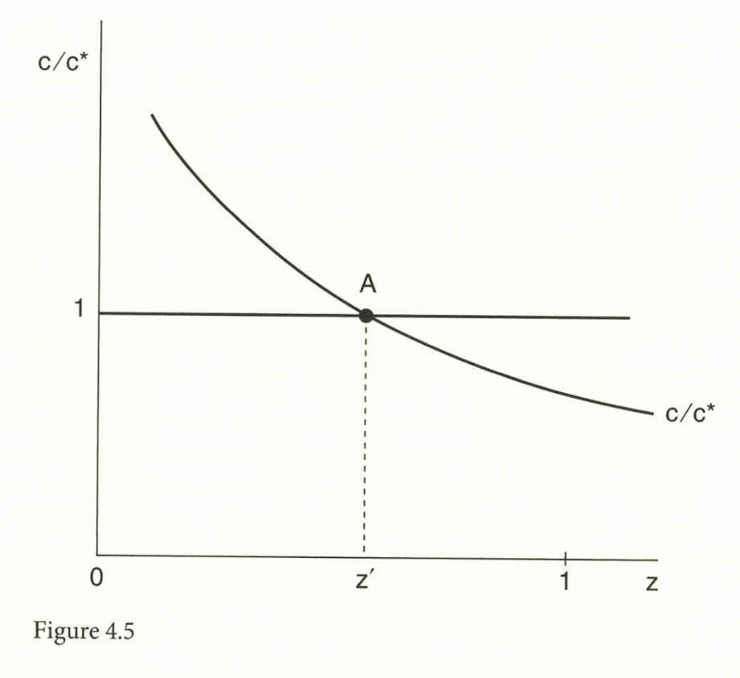
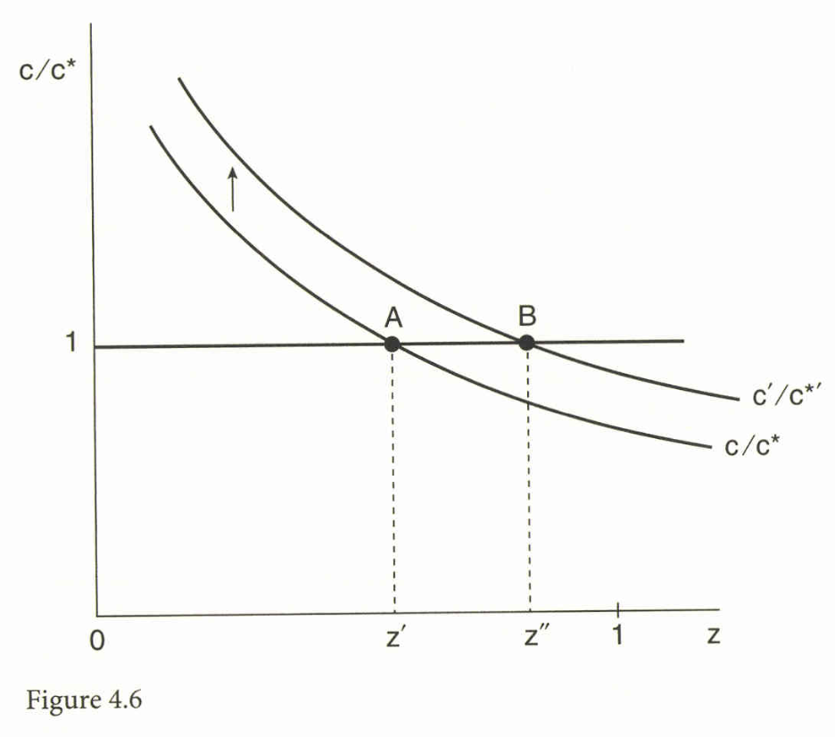
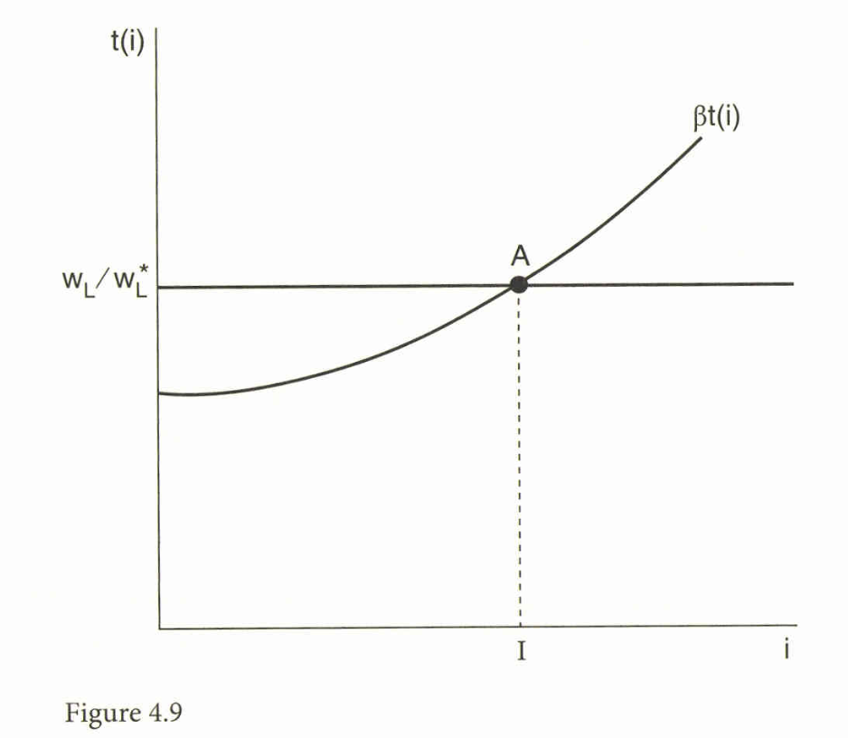

```{r setup, include=FALSE}
knitr::opts_chunk$set(echo = FALSE)
# install.packages("revealjs")
```


# 1. はじめに：貿易の第二の「黄金時代」

## 第二の「黄金時代」

*   **第1の黄金時代** (1890年代〜第一次世界大戦)：蒸気船や鉄道など輸送の劇的な改善により貿易が増加。ヘクシャー・オリーン (HO, Heckscher-Ohlin) モデルが発展。
*   **第2の黄金時代**：コンテナ船や無線通信などのコスト低下に依存している。

## グローバル化の新しい特徴
*   このコスト低下により、生産プロセスを分解し、異なる国で様々な段階を実行することが可能になった。これは「**生産のフラグメンテーション** (fragmentation)」、あるいは「**オフショアリング** (offshoring)」または「**外国アウトソーシング** (foreign outsourcing)」 と呼ばれる。
*   この新しいグローバル化の特徴は、技術の普及がHOの時代よりもさらに速いことを意味し、国内資源が国際貿易の制約とならない可能性を示唆している。
*   **課題:** HOモデルは、この新しい貿易の形態（オフショアリング）を理解するのに十分であるか。

# 2. 1980年代のアメリカ製造業からの証拠

## 1980年代の米国における賃金格差の拡大

*   1980年代、米国および他の多くの国で、**高スキル労働者**（非生産労働者/Nonproduction workers）の**相対賃金が上昇**し、**賃金格差が拡大**した。
*   これは、熟練労働者の相対供給が増加した1970年代の傾向（相対賃金低下）とは逆転している。
*   **労働市場の変化（1980年代）**：相対賃金の上昇にもかかわらず、高スキル労働者の相対雇用も増加した。
*   これは、熟練労働者に対する需要曲線が**外側にシフト**したことでのみ説明可能である。

## 従来のHOモデルに対する疑問

*   当初、多くの研究者は、この賃金変化の原因として国際貿易を否定し、**スキル偏向型技術変化（SBTC, Skill-Biased Technical Change）**を支持した。
*   彼らがHOモデルを否定した主な理由:
    1.  熟練労働者の需要増加の大部分が、**産業間シフト**ではなく、**産業内シフト**によって引き起こされていた。従来のHOモデルでは、比較優位に基づく産業間の生産シフトが賃金変化の主因と想定されていたため。
    2.  先進国間で、熟練労働者の相対賃金が**同じ方向**（上昇）に動いていた。HOモデルでは、要素価格均等化（FPE）を伴う自由貿易への移行により、両国の相対賃金は**逆方向**に動くことが期待される。

# 3. 「生産要素バイアス」対「技術変化のセクターバイアス」


## ゼロ利潤条件

### 産業 $i$ におけるゼロ利潤条件

製品価格 $p_i$ が、要素 $j$ の価格 $w_j$ とその要素の単位生産に必要な投入量 $a_{ij}$ を用いて計算される単位コストに等しいという条件:

$$
p_{i}=\sum_{j=1}^{M} a_{i j} w_{j},
$$
$$
i=1, \ldots, N
\tag{4.1}
$$


## ゼロ利潤条件の微分

ゼロ利潤条件を微分し、さらに要素投入量 $a_{ji}$ の外生的な変化（技術変化）を許容すると、以下の関係式が得られる:

$$\hat{p}_i = \sum_{j=1}^M \theta_{ji} \hat{w}_j + \sum_{j=1}^M \theta_{ji} \hat{a}_{ji} \tag{4.2}$$
ここで $\theta_{ji}$ は、産業 $i$ における要素 $j$ のコストシェア $\theta_{ji} = \frac{a_{ji} w_j}{ p_i}$ 

$\hat{a}_{ji}$ は要素投入量の変化率である。


## 全要素生産性（TFP）の成長率

### 全要素生産性（TFP）の成長率の定義

$TFP_i$は、産業 $i$ における全要素生産性（Total Factor Productivity, TFP）の成長率として定義される。

具体的には、$TFP_i$ は、要素投入量の変化にコストシェアを重み付けして合計したものに**負の符号**をつけたものとして定義される

$$TFP_i \equiv - \sum_{j=1}^M \theta_{ji} \hat{a}_{ji} \tag{4.3}$$

注：$TFP_i$は、レベルではなく成長率として議論されていることに注意。


## 規定された賃金方程式（Mandated Wage Equation）の導出

TFPの成長率の定義 (4.3) をゼロ利潤条件の微分式 (4.2) に代入し、項を整理することで、式 (4.4) が得られる：

$$
\hat{p}_i + TFP_i = \sum_{j=1}^M \theta_{ji} \hat{w}_j, \quad i=1,\ldots,N \tag{4.4}
$$

この式は「**Mandated Wage Equation（義務付けられた/価格変化に規定された賃金方程式）**」と呼ばれ、製品価格の変化 ($\hat{p}_i$) とTFP成長 ($TFP_i$) の合計が、要素価格の変化 ($\hat{w}_j$) のコストシェア加重平均によって表されることを示している。

# 4. Leamer vs. Krugman の論争

## Leamer (1994, 1998) の主張（小国ケース）

*   小国モデルでは、財価格（財価格の変化 $\hat{p}_i$） は不変であると仮定される。
*   この場合、**TFPのセクターバイアス** $TFP_i$ が要素価格の変化 $\hat{w}_j$ を決定する。
*   例えば、熟練労働集約的な産業で技術進歩があれば、その産業のゼロ利潤曲線はシフトし、熟練労働の賃金が上昇し、非熟練労働の賃金が低下する。

技術変化が特定の要素に偏向しているかどうか（ファクターバイアス）は関係ない。

## Krugman (2000) の反論（大国/世界経済ケース）

Krugman (2000) は、Leamer (1994, 1998) が提唱した「技術変化の影響を決定するのはセクターバイアスのみである」という結論が、世界価格が固定されている小国モデルにおいてのみ成立すると反論。

*   ヒックス中立的な技術進歩（すべての要素の生産性を均一に向上させる技術進歩）では、要素に対する相対需要が全く変化しない。そのため、要素価格に全く影響がない。
*   要素価格（賃金）を変化させるのは、特定の要素の需要をシフトさせる技術変化、すなわちファクターバイアス（要素偏向型技術変化）のみとなる。
*  例えば、スキル偏向型技術変化が発生した場合、熟練労働（高スキル労働）への相対需要が外側にシフトし、その結果、熟練労働者の相対賃金が上昇する。

## 規定された賃金方程式の推定の困難さ

*   式(4.4)の離散時間バージョンを推定する試み（規定された賃金方程式（Mandated Wage Equation））は、使用するデータセットや仕様に**非常に敏感**であり、1980年代の米国の**実際の賃金変化を再現できなかった**。

# 5. 中間財の貿易 (Feenstra & Hanson)


## Feenstra and Hanson (1996, 1997) モデルの構造

*   HOモデル（Heckscher-Ohlin model）を拡張し、生産プロセスを構成する多数の**中間投入物（活動）**の連続体 $z \in$ を想定する。
*   活動 $z$ は、必要とされる高スキル労働 $a_H(z)$ と低スキル労働 $a_L(z)$ の比率 $a_H(z)/a_L(z)$ の増加順に順序付けられている。

## 中間投入物の生産コスト関数

中間投入物 $x(z)$ の生産コスト関数は以下で与えられる（ホーム国）。

$$
c(w_L, w_H, r, z) = B [w_L a_L(z) + w_H a_H(z)]^\theta r^{1-\theta} \tag{4.8}
$$

ここで、$w_L, w_H$ は低スキルおよび高スキルの賃金、$r$ は資本のレンタルコストである。

各国はコストが最も低い場所から投入物を調達する。

国境活動 $z'$ は、両国の単位コストが等しくなる点で決定される。

## Figure 4.5

{width=70%}


## 図4.5 の説明

図4.5は、Feenstra and Hanson (1996, 1997) の中間投入物の貿易モデルにおける、**生産活動の専門化の境界**を示すグラフである。

*   **縦軸 ($c/c^*$)**: ホーム国（アスタリスクなし）の単位コストと外国（アスタリスクあり）の単位コストの**比率**を示す。
*   **横軸 ($z$)**: 生産活動の連続体を示し、$z \in$ で表される。活動 $z$ は、**低スキル集約的**な活動（$z$ が小さい）から、**高スキル集約的**な活動（$z$ が大きい）へと順序付けられている。

## 図4.5 の要点

*   **曲線 ($c/c^*$ スケジュール)**: グラフに描かれている曲線 $c/c^*$ は、高スキル集約度が増す（$z$ が増加する）につれて、**右下がり**になっている。
*   これは、ホーム国が熟練労働者豊富国（例：米国）であり、熟練労働者の相対賃金が外国よりも低いという仮定 (4.10) と、活動がスキル集約度の順に並べられているという仮定 に基づいている。
*   **高スキル集約的な活動**ほど、ホーム国（スキル豊富国）で生産することが相対的にコスト有利になるため、$c/c^*$ は低下する。
*   **境界活動 ($z'$)**: 曲線が $c/c^* = 1$（コストがホームと外国で等しい点）と交わる点が、**国境活動** $z'$ となる。

## 図4.5 における生産工程の分業

*   **外国生産（オフショアリング）**は、ホーム国のコストが相対的に高い範囲（$c/c^* > 1$）である区間 $[0, z')$ で行われる。この区間は、**低スキル集約的**な活動である。
*   **ホーム国生産**は、ホーム国のコストが相対的に低い範囲（$c/c^* < 1$）である区間 $(z', 1]$ で行われる。この区間は、**高スキル集約的**な活動である。


## オフショアリングの影響

ホーム国（米国のようなスキル豊富国）の相対賃金が外国よりも低いと仮定する。
$$ 
\frac{w_H}{w_L} < \frac{w_H^*}{w_L^*} \tag{4.10} 
$$

オフショアリングの増加（例：外国への資本移動や外国での技術進歩により、外国のコストが相対的に低下）は、国境活動 $z'$ をより高スキル集約的な活動 $z''$ へとシフトさせる（$z'' > z'$）。


## Figure 4.6

{width=70%}


## 図4.6：オフショアリング増加の影響

図4.6は、Feenstra and Hanson (1996, 1997) モデルにおいて、**オフショアリングが増加**した際の、ホーム国と外国の単位コスト比率の変化を示すグラフである。

*   **初期の均衡:** オフショアリング増加前の単位コスト比率は $c/c^*$ スケジュールで示され、国境活動 $z'$ で $c/c^* = 1$ と交わっている。この $z'$ より左側（低スキル集約的）が外国生産（オフショアリング）される活動であった。

## 図4.6：オフショアリング増加による変化

*   **要因:** オフショアリングが増加する要因として、例えば、**資本の外国への流出**（外国の資本レンタルコスト $r^*$ の低下とホーム国 $r$ の上昇）、または**外国での技術進歩**がホーム国を上回るペースで起こることなどが挙げられる。
*   **結果:** これらの要因により、ホーム国の相対的な生産コストが上昇するため、単位コスト比率のスケジュールは $c/c^*$ から $c'/c^{*'}$ へと**上方にシフト**する。
*   **新しい境界活動 ($z''$):** スケジュールが上方にシフトした結果、新しい国境活動は $z''$ となり、**$z'' > z'$** となる。

## 図4.6：経済的意味

このシフトは、**より多くの活動（$z'$ から $z''$ の範囲）**がホーム国から外国へとオフショアされることを意味する。ホーム国は、以前よりも平均して**さらに高スキル集約的な活動**に専門化することになる。

## オフショアリングの労働市場への影響

ホーム国からオフショアされる活動 ($z'$ から $z''$ の範囲) は、ホーム国に残る活動（$z''$ より高スキル集約的）よりも**低スキル集約的**である。

したがって、ホーム国に残された活動の平均スキル集約度が上がり、**両国で**高スキル労働への**相対需要が増加**する。

この結果は、1980年代に多くの国で熟練労働者の相対賃金が同時に上昇したという事実と整合する。


# 6. 規定された賃金方程式（Mandated Wage Equation）の実証分析

## 産業間賃金格差の導入

*   要素価格の変化 $\hat{w}_j$ を全ての産業で共通として扱う従来の規定された賃金方程式（Mandated Wage Equation） (4.4) は、産業間の賃金格差を無視している。
*   Feenstra and Hanson (1999) は、産業ごとの賃金 $w_{ij}$ を考慮し、ゼロ利潤条件を以下のように書き換える。

$$
\hat{p}_i + TFP_i = \sum_{j=1}^M \theta_{ij} \hat{w}_{ij}, \quad i=1,\ldots,N \tag{4.13}
$$

*   この式を、平均の要素価格変化 $\Delta \ln \bar{w}_j$ を用いて回帰すると、誤差項 $\epsilon_i$ が生じる。この誤差項は、産業ごとの賃金変化と平均の賃金変化の差を反映し、**産業間賃金格差**と関連付けられる。

## Effective TFPを用いた恒等式

*   Feenstra and Hansonは、**有効TFP** (Effective TFP, $ETFP_i$) を用いることで、平均的な要素価格の変化を正確に反映する回帰式を導出。

$$
\Delta \ln p_i + ETFP_i \equiv \sum_{j=1}^M \theta_{ij} \Delta \ln \bar{w}_j \tag{4.18}
$$

*   この式を推定すると、右辺の係数（$\Delta \ln \bar{w}_j$）は、経済全体の実際の平均要素価格変化と**正確に一致する**（恒等式となる）。

## オフショアリングと技術変化の貢献度の分解

*   Feenstra and Hanson (1999) は、この恒等式を利用した2段階推定法を提案し、賃金変化を構造変数（オフショアリングやハイテク機器の使用）によって分解した。
*   **実証結果 (1979-1990年)**：
    *   幅広い定義のオフショアリングは、非生産労働者の相対賃金上昇の**約 21〜27%**を説明。
    *   ハイテク資本の使用（資本ストックのシェアとして測定）は、この上昇の**約 30%**を説明。
    *   結論として、1980年代の米国製造業における熟練労働者需要のシフトは、**オフショアリングとハイテク機器の使用の両方**によって説明される。

# 7. 1990--2000年以降の新たな実証証拠

## 1990年代のパターン

*   1990年代から2000年代にかけても、米国製造業では非生産労働者の**相対賃金は上昇し続けた**。
*   しかし、対照的に、非生産労働者の**相対雇用は減少**した。
*   これは、1980年代に見られた（相対賃金・相対雇用の両方の上昇）というパターンとは異なっている。

## サービスオフショアリングの可能性

*   この新しいパターン（高スキル賃金上昇、雇用減少）は、非生産労働者の中でも**賃金の低い層**（定型的なサービス活動）がオフショアされた可能性を示唆する。
*   これにより、残存する非生産労働者の平均賃金が上昇し、同時に雇用が減少したと解釈される。


# 8. タスクの貿易 (Grossman & Rossi-Hansberg)

## Grossman and Rossi-Hansberg (2008) モデルの構造

*   生産プロセスを、労働者が実行する**タスク** $i \in$ の連続体として捉える。
*   タスクをオフショアする際のコストを $\beta f(i)$ でモデル化。これは、ホーム国での労働1単位と同じ成果を得るために外国で雇用する必要がある低スキル労働の単位数を示す。
*   均衡での国境タスク $I$ は、ホームでのコスト $w_L$ とオフショアするコスト $\beta f(I) w_L^*$ が等しくなる点で決定される。

$$
\beta f(I) w_L^* 
= w_L \rightarrow 
\beta f(I) = \frac{w_L}{ w_L^*} \tag{4.21}
$$

## Figure 4.9

{width=70%}


## 図4.9：タスクのオフショアリング均衡

図4.9は、Grossman and Rossi-Hansberg (2008) の**タスク貿易モデル**において、**低スキル労働タスク**のオフショアリングの均衡条件を示している。

*   **縦軸 ($\beta f(i)$):** 低スキル労働のタスク $i$ を外国で実行する際の**相対コスト**（外国でホーム国の労働1単位と同じ成果を得るために必要な外国の労働単位数）を示す。
*   **横軸 ($i$):** 低スキル労働によって実行されるタスクの連続体 $i \in$ を示す。タスク $i$ はオフショアリングコスト $\beta f(i)$ の増加順に順序付けられている。

## 図4.9 における均衡条件

*   **オフショアリングコスト曲線 ($\beta f(i)$):** この曲線はタスク $i$ の増加に伴い**上昇**している。
*   **均衡条件 (水平線 $w_L / w_L^*$):** ホーム国（$w_L$）と外国（$w_L^*$）の低スキル労働賃金の比率を示す。
*   **国境タスク ($I$):** 曲線 $\beta f(i)$ と水平線 $w_L / w_L^*$ が交わる点 $I$ が、オフショアされるタスクの**境界**となる。
$$
\beta f(I) = \frac{w_L}{w_L^*} \tag{4.21}
$$


## 図4.9 における生産工程の分業

*   **オフショアリング（外国生産）:** 境界 $I$ より左側のタスク（$i < I$）は $\beta f(i) < w_L / w_L^*$ を満たすため、外国で実行する方がコストが低い。
*   **ホーム国生産:** 境界 $I$ より右側のタスク（$i > I$）は $\beta f(i) > w_L / w_L^*$ を満たすため、ホーム国で実行する方がコストが低い。


## 低スキルタスクのオフショアリングの影響

オフショアリングコスト $\beta$ の減少（オフショアリングの増加）が起きる。

$\rightarrow$
オフショアリングは、低スキル労働を節約する技術革新（スキル偏向型技術変化の別形態）のように作用する。


## 小国モデルの場合 (Leamerの論理)

*   オフショアリングは、低スキル労働の**生産性を向上**させる（生産性効果）。
*   その結果、低スキル労働者の実質賃金および相対賃金が上昇するという、**直感に反する**予測が得られる。

## 大国モデルの場合 (Krugmanの論理)

*   オフショアリングによる低スキル労働の**有効賦存量増加**（生産性効果）は、リブチンスキー効果を通じて低スキル集約財の産出を拡大させ、世界市場でその財の相対価格を低下させる（価格効果）。
*   この**価格効果**は、ストルパー・サミュエルソン効果により、低スキル労働の相対賃金低下をもたらす。
*   価格効果が生産性効果を上回る（高スキル相対賃金が上昇する）ための条件として、生産における代替の弾力性 $\sigma_j$ が十分に小さいこと（$\sigma_j < 1$）などが示されている。

## 高スキルタスクのオフショアリング (1990年代の対応)

*   Grossman and Rossi-Hansbergモデルは、高スキル労働タスクのオフショアリングにも適用できる。
*   均衡条件は以下となる。
$$
 \beta f(I) w_H^* = w_H \tag{4.26}
$$
*   この場合、オフショアリングは高スキル労働を節約する技術革新のように作用する。
*   **結果**: 高スキルタスクのオフショアリングは、高スキル労働の相対賃金を上昇させ、**高スキル労働の需要を減少させる**。

これは、1990年代の米国で見られた「相対賃金上昇と相対雇用減少」のパターンと整合する。


# 9. 超モジュラリティ生産 (Costinot & Vogel)

## Kremer and Maskin (1996) の補完性

Kremer and Maskinは、生産関数が以下の特性を持つべきだと主張。

1.  異なるスキルの労働者が不完全な代替関係にある。
2.  企業内の異なるタスクが**補完的**である（**超モジュラリティ/Supermodularity**）。

この概念は、異なるスキルを持つ労働者間でタスクが補完的である場合に、賃金格差の拡大と労働者の企業間分離を説明できる。

## Costinot and Vogel (2010) の連続体モデル

Costinot and Vogelは、スキルの連続体 $s \in [\underline{s}, \bar{s}]$ とセクターの連続体 $z \in$ を想定し、HOモデルを大幅に一般化。

生産関数 $A(s, z)$ は、スキル $s$ とセクター $z$ の間で**対数超モジュラリティ (log-supermodularity)**を満たすと仮定。

$$
\ln A(s', z') + \ln A(s, z) > \ln A(s, z') + \ln A(s', z) 
$$
$$
\quad \text{for } s > s', z > z' \tag{4.31}
$$
（高いスキルを持つ労働者は、より高いインデックス $z$ のセクターで相対的に生産性が高いことを意味する）。

## 競争均衡の特徴

**マッチング関数**：競争均衡において、スキル $s$ とセクター $z$ を一対一で結びつける単調増加関数 $z = M(s)$ が存在する。

**賃金プロファイルの微分方程式**：賃金 $w(s)$ の勾配は、価格と技術の勾配によって決定される。

$$
\frac{d \ln w(s)}{d s} 
= \frac{A_s[s, M(s)]}{A[s, M(s)]}
$$

## スキル分布と賃金分布の関係

Costinot and Vogel (2010) のモデルでは、スキル分布の差異が賃金格差に影響を与える。例えば、南（低スキル労働者が相対的に多い）の経済は、北よりも**不平等な賃金分布**を持つ。

オフショアリングは、南の有効賦存量を均一に増加させ、世界的なスキル分布を左にシフトさせるため、**両国で**賃金分布をより不平等にするという結果も得られる。


# 10. 結論{-}

## オフショアリング研究の総括

### 1980年代

Feenstra and Hanson のモデルが適合。

* 貿易は**中間投入物（材料）のオフショアリング**が主。

* 比較優位に基づき、低スキル集約的な活動が海外へ。

* 結果、**産業内**で熟練労働者の相対需要が上昇（HOモデルの拡張）。


## 1990年代以降の展開

Grossman and Rossi-Hansberg のモデルが適合。

*   貿易は**タスク（サービス）のオフショアリング**が主。
*   オフショアリングコスト構造が豊かであるため、コストに応じて低スキルタスクまたは高スキルタスクのいずれも海外へ移転可能。
*   1990年代は、非生産労働者の中でも**定型的なタスク**（比較的賃金の低い高スキルタスク）がオフショアされ、高スキル労働の相対賃金上昇と相対雇用減少が同時に発生。


## 最新の進展

Costinot and Vogel (2010) は、単に平均的な要素賦存量だけでなく、**スキル分布全体**が貿易と賃金に影響を与えることを示し、北-北貿易の根拠も提供した。


## 参考文献

\footnotesize

*   Costinot, A., & Vogel, J. (2010). Matching and inequality in the world economy. *Journal of Political Economy*, *118*(4), 747–786.
*   Feenstra, R. C., & Hanson, G. H. (1997). Foreign direct investment and relative wages: Evidence from Mexico's maquiladoras. *Journal of International Economics*, *42*(3–4), 371–393.
*   Feenstra, R. C., & Hanson, G. H. (1999). The impact of outsourcing and high-technology capital on wages: Estimates for the United States, 1979–1990. *The Quarterly Journal of Economics*, *114*(3), 907–940.
*   Grossman, G. M., & Rossi-Hansberg, E. (2008). Trading tasks: A simple theory of offshoring. *American Economic Review*, *98*(5), 1978–1997.
*   Krugman, P. R. (2000). Technology, trade and factor prices. *Journal of International Economics*, *50*(1), 51–71.
*   Leamer, E. E. (1994). *Trade, wages and revolving door ideas*. National Bureau of Economic Research. (NBER Working Paper).
*   Leamer, E. E. (1998). In search of Stolper-Samuelson linkages between international trade and lower wages. In *Imports, Exports, and the American Worker* (pp. 141–214). Brookings Institution Press.


# 確認問題 (10問){-}

## 問1

Feenstra and Hanson (1996, 1997) の中間投入物モデルにおいて、オフショアリングの増加（国境活動 $z'$ がより高スキル集約的な $z''$ へシフト）が、ホーム国（オフショアする側）および外国（受け入れる側）の**両方**の熟練労働者の相対需要に与える影響として、最も適切なものはどれか。

A. ホーム国では相対需要が減少し、外国では増加する。

B. 両国で相対需要が減少する。

C. 両国で相対需要が増加する。

D. ホーム国では相対需要が増加し、外国では変化しない。

## 問2

Leamer (1998) が、価格不変の**小国**モデルにおいて、技術変化が賃金に与える影響を決定づける要因として重要であると主張したのはどれか。

A. 技術変化のファクターバイアス（特定の要素への偏向）。

B. 技術変化のセクターバイアス（特定の産業でのTFP成長）。

C. 要素賦存量の変化率。

D. 中間投入物の価格変化。

## 問3

規定された賃金方程式（Mandated Wage Equation） (4.4)の推定において、Feenstra and Hanson (1999) が従来の推定の失敗を解決するために導入した重要な概念は何か。

A. 輸送コストを考慮した。

B. 産業間賃金格差 (Inter-industry wage differentials) を反映する誤差項を特定し、有効TFP（ETFP）を用いた恒等式 (4.18) を利用した。

C. 財の連続体ではなく、離散的な財を仮定した。

D. 選好がコブ＝ダグラス型であると仮定した。

## 問4

1990年代の米国製造業における労働市場の傾向として、1980年代と最も対照的であった点は何か。

A. 低スキル労働者の名目賃金が大幅に低下した。

B. 熟練労働者の相対賃金が初めて低下に転じた。

C. 熟練労働者（非生産労働者）の相対賃金は上昇したが、その相対雇用量は減少した。

D. 労働需要のシフトが産業間シフトに限定された。

## 問5

Grossman and Rossi-Hansberg (2008) のタスク貿易モデルにおいて、低スキルタスクのオフショアリングコストが減少した結果、**小国**モデルの枠組みで発生すると予測される現象はどれか。

A. 高スキル労働の相対賃金が必ず低下する。

B. 価格効果が生産性効果を上回り、低スキル労働の相対賃金が低下する。

C. オフショアリングが低スキル労働の生産性向上として作用し、低スキル労働の相対賃金が上昇する。

D. 要素価格均等化が必ず成立するようになる。

## 問6

Grossman and Rossi-Hansberg モデルにおいて、高スキル労働タスクのオフショアリング（サービスオフショアリング）は、ゼロ利潤条件においてどのように作用するか。

A. 低スキル労働を節約する技術革新。

B. 高スキル労働を節約する技術革新。

C. 資本を節約する技術革新。

D. 資本と低スキル労働の両方を節約する技術革新。

## 問7

Feenstra (2010a) の定理によれば、大国モデルにおいて、低スキルタスクのオフショアリングによる**価格効果**が**生産性効果**を上回り、高スキル労働の相対賃金が上昇するために必要な条件の一つは何か。

A. 貿易相手国の生産性がホーム国よりも高いこと。

B. 生産における代替の弾力性 $\sigma_j$ が十分に1より小さいこと ($\sigma_j < 1$)。

C. 消費者の選好がCES型であること。

D. オフショアリングが均一な生産性向上ではないこと。

## 問8

Feenstra and Hanson (1996, 1997) モデルにおいて、中間投入物 $z \in$ を順序付けるために使用される基準はどれか。

A. 各投入物の市場価格。

B. 投入物生産に必要な高スキル労働と低スキル労働の比率 $a_H(z)/a_L(z)$。

C. 資本ストックに対する投入物のシェア。

D. 投入物が生み出す最終財のTFP成長率。

## 問9

Costinot and Vogel (2010) の超モジュラー生産モデルにおいて、高いスキル $s$ を持つ労働者が、より高いインデックス $z$ のセクターで相対的に生産性が高いことを示す数学的特性は何か。

A. FPEセットの凸性。

B. グローバルな要素価格の非感応性。

C. 対数超モジュラリティ (Log-supermodularity)。

D. コブ＝ダグラス選好。

## 問10

Feenstra and Hanson (1999) の実証結果に基づき、1979年から1990年の米国製造業における非生産労働者の相対賃金上昇（賃金格差拡大）に最も大きく寄与した要因として、最も適切なものはどれか。

A. 労働組合の弱体化。

B. 資本賦存量の減少。

C. ハイテク機器の使用の増加、およびオフショアリング。

D. 労働力の移民による供給増加。

## 解答

| 問題番号 | 解答 |
| :------: | :--: |
| 問1 | C |
| 問2 | B |
| 問3 | B |
| 問4 | C |
| 問5 | C |
| 問6 | B |
| 問7 | B |
| 問8 | B |
| 問9 | C |
| 問10 | C |


# 解説{-}

## 問1. Feenstra and Hanson モデルにおけるオフショアリングの影響

**解答: C. 両国で相対需要が増加する。**

**解説:** Feenstra and Hansonモデルは、生産活動をスキルの集約度に応じて順序付けている。ホーム国（スキル豊富国）からオフショアされる活動は、ホーム国に残る活動よりも**低スキル集約的**である。したがって、オフショアリングが増加すると、ホーム国に残された活動の平均スキル集約度が上がり、熟練労働者の相対需要が増加する。一方、外国側（受け入れ側）では、新しくオフショアされた活動（以前から行っていた活動よりスキル集約的）により、同様に熟練労働者の相対需要が**増加する**。この結果は、1980年代に多くの国で熟練労働者の相対賃金が同時に上昇したという事実と整合する。

## 問2. Leamer (1998) の小国モデルにおける技術変化の影響

**解答: B. 技術変化のセクターバイアス（特定の産業でのTFP成長）。**

**解説:** Leamer (1994, 1998) は、価格が固定されている**小国**を想定した場合、ゼロ利潤条件 (4.4) から、要素価格の変化 ($\hat{w}_j$) は、技術変化の**セクターバイアス**（全要素生産性 TFP$_i$ の成長）によって決定されると主張した。技術変化が特定の要素に偏向しているかどうか（ファクターバイアス）は、小国モデルでは関係がない。

## 問3. 規定された賃金方程式（Mandated Wage Equation） の推定における Feenstra and Hanson (1999) の貢献

**解答: B. 産業間賃金格差 (Inter-industry wage differentials) を反映する誤差項を特定し、有効TFP（ETFP）を用いた恒等式 (4.18) を利用した。**

**解説:** 従来の規定された賃金方程式（Mandated Wage Equation） (4.14) は、産業間の賃金格差を無視していた。Feenstra and Hanson (1999) は、この賃金格差が誤差項 $\epsilon_i$ (4.15) となり、コストシェアと相関するため、従来のOLS推定が不偏でないことを指摘した。彼らは、**有効TFP** ($ETFP_i$) (4.17) を用いた回帰式 (4.18) が、経済全体の平均要素価格変化と**正確に一致する恒等式**となることを示し、正確な推定を可能とした。

## 問4. 1990年代の米国製造業の労働市場の傾向

**解答: C. 熟練労働者（非生産労働者）の相対賃金は上昇したが、その相対雇用量は減少した。**

**解説:** 1980年代には熟練労働者（非生産労働者）の相対賃金と相対雇用の**両方**が上昇したが、1990年から2000年にかけては、**相対賃金は引き続き上昇**した一方で、**相対雇用量が減少した**。このパターンは、非生産労働者の中でも比較的賃金の低い層（定型的なサービス活動）がオフショアされた可能性を示唆している。

## 問5. Grossman and Rossi-Hansberg モデルにおける低スキルタスクのオフショアリング（小国モデル）

**解答: C. オフショアリングが低スキル労働の生産性向上として作用し、低スキル労働の相対賃金が上昇する。**

**解説:** Grossman and Rossi-Hansbergモデルを小国ケースに適用すると、オフショアリングはゼロ利潤条件において、低スキル労働を節約する技術革新のように作用する。価格が固定されているため、この**生産性効果**により低スキル労働の生産性が高まり、その**実質賃金および相対賃金が上昇する**という予測が導かれる。これはLeamerの小国論理をタスク貿易に適用したものに相当する。

## 問6. Grossman and Rossi-Hansberg モデルにおける高スキルタスクのオフショアリングの作用

**解答: B. 高スキル労働を節約する技術革新。**

**解説:** 高スキル労働タスクのオフショアリング（サービスオフショアリング）が起こる場合、ゼロ利潤条件 (4.28) から、オフショアリングは**高スキル労働を節約する**技術革新のように作用する。これにより、高スキル労働への需要が減少し、1990年代の米国に見られた「相対賃金上昇と相対雇用減少」のパターンを説明できる。

## 問7. Feenstra (2010a) の定理：大国モデルで高スキル相対賃金が上昇する条件

**解答: B. 生産における代替の弾力性 $\sigma_j$ が十分に1より小さいこと ($\sigma_j < 1$)。**

**解説:** Grossman and Rossi-Hansbergモデルを大国モデルに拡張した場合、低スキルタスクのオフショアリングは、低スキル賦存量の有効な増加（生産性効果）と、低スキル集約財の価格低下（価格効果）の両方を引き起こす。高スキル労働の相対賃金が上昇するためには、価格効果が生産性効果を上回る必要があり、定理 (Feenstra 2010a) によれば、**生産における代替の弾力性 $\sigma_j$ が十分に1より小さい**こと ($\sigma_j < 1$) が必要条件である。

## 問8. Feenstra and Hanson モデルにおける中間投入物の順序付け基準

**解答: B. 投入物生産に必要な高スキル労働と低スキル労働の比率 $a_H(z)/a_L(z)$。**

**解説:** Feenstra and Hanson (1996, 1997) は、生産活動 $z \in$ を、その活動の生産に必要な**高スキル労働 $a_H(z)$ と低スキル労働 $a_L(z)$ の比率 $a_H(z)/a_L(z)$ が非減少となる順**に順序付けている。この順序に基づき、国境活動 $z'$ が決定される。

## 問9. Costinot and Vogel (2010) モデルの核となる数学的特性

**解答: C. 対数超モジュラリティ (Log-supermodularity)。**

**解説:** Costinot and Vogel (2010) は、スキル $s$ とセクター $z$ の間で、生産関数 $A(s, z)$ が**対数超モジュラリティ** (log-supermodularity) (4.31) を満たすことを仮定している。これは、より高いスキルを持つ労働者が、より高いインデックス（スキル集約度）を持つセクターで相対的に生産性が高いという**補完性**を示している。

## 問10. Feenstra and Hanson (1999) による1979-1990年の賃金格差拡大への貢献度

**解答: C. ハイテク機器の使用の増加、およびオフショアリング。**

**解説:** Feenstra and Hanson (1999) の実証結果 (表4.2) によれば、1980年代の米国製造業における非生産労働者の相対賃金上昇は、**幅広い定義のオフショアリング**によって約21〜27%が、**ハイテク資本の使用**によって約30%が説明される。したがって、熟練労働者需要のシフトは、オフショアリングとハイテク機器の使用の**両方**によって重要に説明されるという結論であった。
