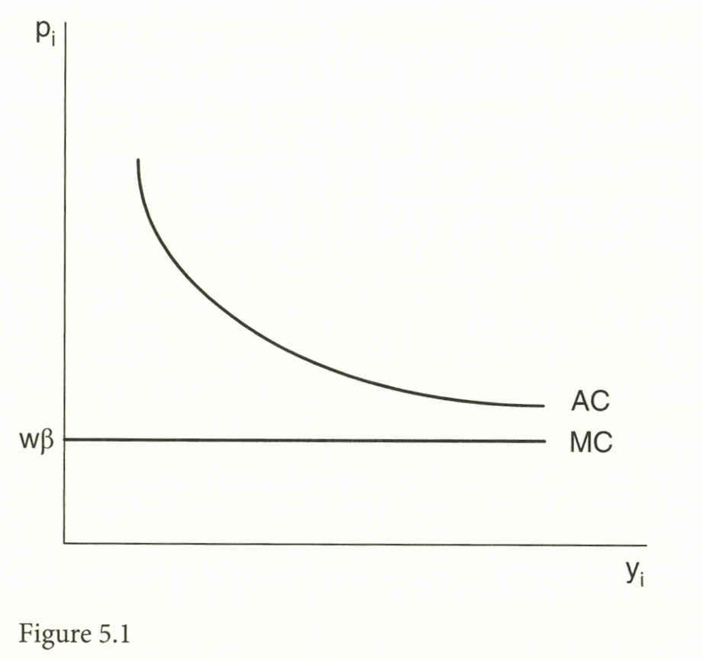
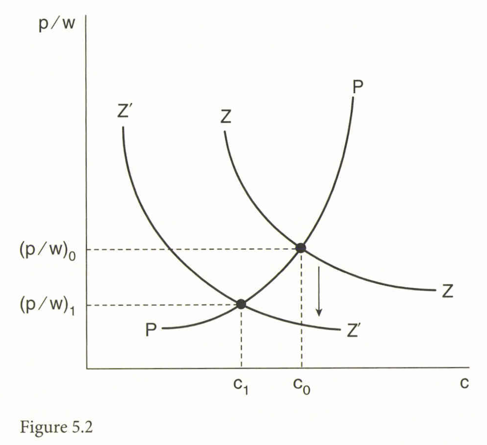
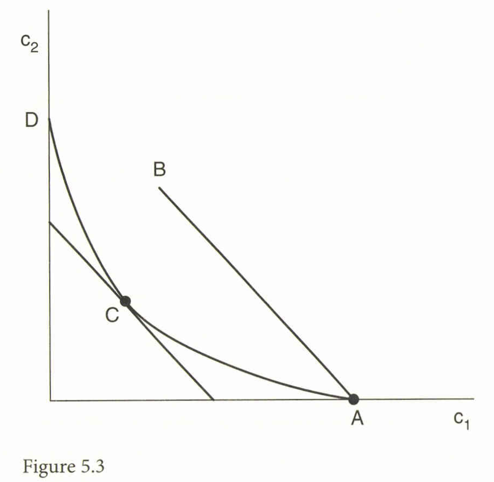

```{r setup, include=FALSE}
knitr::opts_chunk$set(echo = FALSE)
# install.packages("revealjs")
```

# 1. はじめに：規模の経済と貿易

## 増加する収穫と貿易のパズル

*   これまでの貿易モデル（HOモデルなど）と異なり、本章では**内部的な規模の経済**（Increasing Returns to Scale, IRTS）を考慮する。
*   IRTSは、Bertil Ohlin (1933) や Frank Graham (1923) 以来、貿易の理由として認識されてきた。
*   **例：カナダ・米国自由貿易協定 (FTA)**
    *   カナダ企業は、国内市場が小さすぎ、効率的な最小規模（Minimum Efficient Scale）で操業できないと考えられていた。
    *   FTAにより米国市場にアクセスすることで、**平均費用曲線 (AC) を下がり、効率性が向上する**ことが期待された。

## 独占的競争モデル

*  企業が市場拡大により生産量を増やすと、その分、誰かが買うことになるが、国内市場の企業すべてが生産を拡大できるわけではない。そのため、**一部の企業は市場から退出（Exit）する**必要が生じる。
*   これらの効果（規模の拡大と企業の退出）を整理するため、**独占的競争 (Monopolistic Competition)** モデルを導入する。

## 独占的競争モデルの発展

*   独占的競争の概念は、Edward Chamberlin (1936) や Joan Robinson (1933) に遡る。
*   このモデルが国際貿易に広く適用されるようになったのは、Lancaster (1975, 1979)、Spence (1976)、そして**Dixit and Stiglitz (1977)**による数学的定式化を待つ必要があった。
*   **Krugman (1979, 1980)** は、Dixit and Stiglitzの「**多様性愛好 (love of variety)**」アプローチを国際貿易に適用した。


# 2. 独占的競争モデル

## 消費者の効用関数と需要

*   $N$ 種類の製品バラエティがあり、消費者は各バラエティ $c_i$ の消費から以下の効用を得る:

$$
    U = \sum_{i=1}^N v(c_i), \quad v' > 0, v'' < 0 \tag{5.1}
$$

*   予算制約 $\sum_{i=1}^N p_i c_i = I \cdot w$ の下で効用を最大化する。

## 需要の弾力性
*   価格変化が所得の限界効用 ($\lambda$) に与える影響を無視できる（バラエティが非常に多い場合）と仮定すると、バラエティ $i$ の需要の弾力性は以下で定義される:

$$
    \eta_i = - \left( \frac{v'(c_i)}{c_i v''(c_i)} \right) > 0 \tag{5.4}
$$

*   本モデルでは、$\frac{d\eta_i}{dc_i} < 0$ を仮定する（消費が減少すると（需要曲線が上方に移動すると）、弾力性は上昇する）。


## 生産と費用

*   労働 ($L$) のみが投入要素であり、賃金は $w$ である。生産量 $y_i$ に必要な労働投入量は以下で与えられる（$\alpha$: 固定労働投入、$\beta$: 限界労働投入）。

$$
    L_i = \alpha + \beta y_i \tag{5.5}
$$

*   **平均費用 (AC)** は $AC_i = \frac{w\alpha}{y_i} + w\beta$、**限界費用 (MC)** は $MC_i = w\beta$ となる。

## 図5.1: 独占的競争企業の平均費用と限界費用

{width=70% }


## 図5.1 の説明

グラフは企業の平均費用曲線 (AC) と限界費用曲線 (MC) を示している。

固定労働投入 $\alpha$ の存在により、ACは生産量 $y$ の増加に伴い低下する（**規模の経済**）。


MCは一定である ($w\beta$)。


## 均衡条件

*   独占的競争の均衡は、以下の2つの主要な条件で決定される。

1.  **利潤最大化 (MR=MC):** 限界収入が限界費用に等しい。対称性 ($\eta_i = \eta$) を仮定すると:
$$
 \frac{p}{w} = \frac{\eta \beta}{\eta - 1}, \quad \text{or } \eta = \frac{p}{p - w\beta} \tag{5.6}
$$
2.  **ゼロ利潤 (P=AC):** 経済的利潤がゼロとなるように企業が参入・退出する。

$$
  p = w \left( \frac{\alpha}{y} + \beta \right), \quad \text{or } \frac{p}{w} = \frac{\alpha}{Lc} + \beta \tag{5.7}
$$

ここで $y=Lc$ (生産量 $y$ は人口 $L$ と一人当たり消費 $c$ の積に等しい) を使用。


## 図5.2: 独占的競争均衡の決定

{width=70% }


## 図5.2 の説明

*   PP曲線 (式 5.6) は、$\frac{d\eta}{dc} < 0$ の仮定により**右上がり**となる。
*   ZZ曲線 (式 5.7) は企業の平均費用曲線であり、**右下がり**となる。
*   これらの交点により、均衡価格/賃金比率 $\left(\frac{p}{w}\right)$ と一人当たり消費量 $c$ が決定される。

## 均衡製品バラエティ数

*   経済全体の完全雇用条件 ($L = N(\alpha + \beta y)$) より、均衡バラエティ数 $N$ は決定される。

$$
 N = \frac{L}{\alpha + \beta y} = \frac{L}{\alpha + \beta L c} \tag{5.9}
$$


## 貿易の導入と利益

*   **同じ規模の2国間**で自由貿易が始まると、各国の人口 $L$ が実質的に2倍になるのと同等になる。
*   この人口の増加は、PP曲線（式 5.6）には影響を与えないが、ZZ曲線（式 5.7、分母に $L$ がある）を**下方にシフト**させる。
*   結果として、一人当たりの消費 $c$ は $c_0$ から $c_1$ へと**減少し**、実質賃金 $\left(\frac{w}{p}\right)$ は**上昇する**。

## 貿易による利益の源泉

1.  **競争効果 (Pro-competitive effect):** 競争の増加により需要の弾力性が上昇し、均衡価格が低下し、実質賃金が上昇する。
2.  **バラエティ効果 (Variety effect):** $L$ が増加し、$c$ が減少するため、式 (5.9) より、世界全体での総製品バラエティ $N$ は**増加する**。
*   ただし、各国内で生産されるバラエティの数 $N^i$ は、企業の生産量 $y$ が増加し、完全雇用条件（$L = N^i (\alpha + \beta y)$）が満たされる必要があるため、**必然的に減少する**。
*   貿易開放は各国で**企業の退出 (Exit)** を引き起こすが、残った企業は生産を拡大し、規模の経済を享受する。


# 3. 米国カナダFTAからの証拠

## 規模効果 (Scale Effect) 対 淘汰効果 (Selection Effect)

*   Krugmanモデルの予測には、**生き残った企業が生産を拡大する規模効果**と、**非効率な企業が退出する淘汰効果**が含まれる。
*   **規模効果の検証:**
    *   Head and Ries (1999) は、カナダの230産業の工場レベルデータを用いて、米国の関税削減はカナダの工場規模を平均で約10%増加させたが、カナダの関税削減による8.5%の減少と相殺され、**全体としての規模への影響は小さかった**と報告している。
    *   この結果は、自由化後の輸入競合産業において平均企業規模が縮小またはわずかに拡大したという、途上国での証拠とも一致する。


## 淘汰効果の検証

*   Melitz (2003) のモデルなど（次章で詳述）、企業間の効率性の違いを許容する独占的競争モデルでは、自由化後に**最も非効率な企業が退出する**ことで、産業の平均生産性が上昇するという淘汰効果が予測される。
*   Trefler (2004) は、カナダ・米国FTAがカナダの生産性に与えた影響を包括的に評価し、**生産性向上の強力な証拠**を発見した。
*   カナダの関税削減を深く経験した産業では、**低生産性工場の縮小/退出**により、産業レベルの労働生産性が**15%上昇**した。


## まとめ

カナダの生産性向上は、**規模効果ではなく、淘汰効果**によるものであった。

チリの貿易自由化に関するPavcnik (2002b) の研究も、生産性向上の大部分が資源の再配分（淘汰効果）によるものであることを示している。


# 4. CES効用関数と規模効果の消失

## CES効用関数の導入

**CES (Constant Elasticity of Substitution) 効用関数**は、Krugman (1980) が使用したものであり、製品バラエティ間の代替の弾力性が一定であるという特徴を持つ。

$$
 U = \left[ \sum_{i=1}^N c_i^{(\sigma-1)/\sigma} \right]^{\sigma/(\sigma-1)}, \quad \sigma > 1 \tag{5.10}
$$

## CES関数の特徴
*   CES関数では、需要の弾力性 $\eta$ は定数 $\sigma$ に等しくなり（$N$ が大きい場合）、結果として、価格に対する限界費用のマークアップは**一定**になる。


*   この最適価格をゼロ利潤条件に代入すると、企業の均衡生産量 $y$ は以下のように固定される。

$$
 y = \frac{(\sigma - 1) \alpha}{\beta} \tag{5.12}
$$

## CESモデルにおける規模効果と淘汰効果の不在

*   **CESモデルの特徴:** 均衡生産量 $y$ は、国境コストや貿易自由化の影響を受けず**固定される**。
    *   **規模効果は存在しない (No scale effect)**。
    *   各国内で生産されるバラエティ数 $N$ も変化しないため、**淘汰効果も存在しない (No selection effect)**。
*   CESモデルの利点は、その**同次性 (Homothetic)** にあるため、特殊な性質を持つにもかかわらず、独占的競争の文献で広く使用されている。


# 5. 輸入バラエティからの利益

## バラエティ利益の測定：Feenstraの定理

*   新しい輸入バラエティからの利益を測定することは、「**新製品問題 (new goods problem)**」と同等である。
*   Hicks (1940) は、製品が登場する前の関連価格として、需要がゼロとなる**「留保価格 (reservation price)」**を使用することを提案した。
*   CES効用関数 (5.13) を用いると、ある期間における効用の増加は、**生活費指数の変化の逆数**によって測定される。
*   利用可能な財の集合が時間とともに変化する場合（$I_{t-1} \neq I_t$）、Feenstra (1994) の定理は、効用変化（生活費指数の逆数）を測定する方法を提供する。

## Feenstraの定理
### Feenstra (1994) の定理

$\sigma > 1$ の場合、生活費指数の比率は、価格指数（Sato-Vartia指数）と、新旧バラエティの支出シェアを用いた調整項によって測定される。

$$
\frac{e(p_t, I_t)}{e(p_{t-1}, I_{t-1})} = \frac{e(p_t, I)}{e(p_{t-1}, I)} \times \left[ \frac{\lambda_t(I)}{\lambda_{t-1}(I)} \right]^{\frac{1}{\sigma-1}} \tag{5.17}
$$

ここで $I \subset I_{t-1} \cap I_t$ は両期間で共通の財の集合。

$\lambda_t(I)$ は期間 $t$ における**共通の財**への支出シェア（全支出に対する比率）であり、これは $1$ から期間 $t$ における**新製品**への支出シェアを引いたものとして解釈される。

## 図5.3: 代替弾力性と生活費の低下

{width=70%}

## 図5.3 の説明

消費者が無差別曲線 AD 上の効用を達成するために支出を最小化する場合を示す。

*   初期に財 1 のみが利用可能（予算線 AB、点 A）だったとする。
*   財 2 が利用可能になると、同じ効用を点 C でより少ない支出で達成できる。
*   生活費の低下（予算線の内側への移動）は、無差別曲線の**凸度、すなわち代替の弾力性 ($\sigma$)** に依存する。$\sigma$ が大きいほど（無差別曲線が平坦なほど）、新製品導入による生活費の低下は大きくなる。

## 輸入バラエティ利益の実証結果

*   Broda and Weinstein (2006) は、米国について1972年から2001年の間に輸入バラエティの増加による利益を推定した。
*   彼らは、HS 10桁レベルの「財」に対して、様々な供給国からの輸入を「バラエティ」と定義し、それぞれの財について代替の弾力性 $\sigma$ を推定した。

## 実証結果 (Broda and Weinstein 2006)

*   1972年から2001年までの輸入バラエティ拡大による利益は、**年間 1.2% ポイント**ずつ増加し、2001年には輸入支出の**合計 28%** に達した。
*   GDPに対する利益として換算すると、2001年時点で**約 2.6%** となる。これは、閉鎖経済（貿易がない状態）と比較した総利益ではなく、**バラエティ増加による追加的な利益**である。

## 閉鎖経済と比較した総利益 (Ossa 2015)

*   Ossa (2015) は、Feenstraの式 (5.17) を用いて、閉鎖経済と比較した場合の総利益を推定した。
*   財 $n$ のサブ効用関数にCESを仮定し、財全体の効用関数にコブ＝ダグラスを仮定すると、閉鎖経済と比較した効用の増加（リアルウェルビーイングの増加）は、以下の幾何平均で与えられる。

$$
\text{Rise in utility relative to autarky} = \prod_n \left( \lambda_n^{W} \right)^{\frac{\alpha_n}{\sigma_n - 1}} \tag{5.18}
$$

ここで $\lambda_n^{W}$ は財 $n$ の国内支出シェア（$= 1 - \text{輸入シェア}$）。


## 実証結果 (Ossa 2015)

*   米国について、閉鎖経済と比較した貿易からの利益は、GDPの**23.5%** と推定された。これは Broda and Weinstein の増分利益（2.6%）よりも遥かに大きい。
*   ハンガリー (117.6%)、平均 (47.1%) など、他の国ではさらに大きな利益が見積もられている。
*   Ossa (2015) の定理によれば、代替の弾力性が財によって異なる場合、総利益を計算する際には、輸入加重平均弾力性 ($\bar{\sigma}$) ではなく、**加重調和平均 ($H$)** を用いる必要がある。調和平均を用いることで、貿易利益は $\lambda^{W} \times \frac{1}{H}$ で近似され、より大きな利益が示される。


# 6. 重力方程式

## 重力方程式とは

独占的競争モデルでは、各国が異なるバラエティの製品に完全に特化し、バラエティ間の貿易（**産業内貿易, intra-industry trade**）が行われる。

このような貿易パターンは、「**重力方程式 (Gravity Equation)**」と呼ばれる驚くほどシンプルな式で記述できる。

重力方程式は、Tinbergen (1962) によって初めて提唱された。

重力方程式の考え方は、ニュートンの万有引力の法則に類似している。

## 重力方程式の起源

重力方程式は、2国間の二国間貿易が、両国のGDPの積に正比例し、距離に反比例するというもの：

$$
X_{ij} = A \frac{Y_i Y_j}{d_{ij}^\rho} \tag{5.19}
$$

ここで $X_{ij}$ は $i$ から $j$ への貿易量、$Y_i$ と $Y_j$ はそれぞれの国のGDP、$d_{ij}$ は距離である。

## 重力方程式の理論的基礎

*   初期の理論的基礎付けは Anderson (1979) に遡り、Bergstrand (1985, 1989) や Helpman (1987) が続いた。
*   重力方程式は、**各国が異なる財を生産している**という共通の特徴を持つモデル（独占的競争モデル、または財の連続体を持つHOモデルなど）から導出される。


#  7. 重力モデルにおける国境効果

## CES関数に基づく重力方程式の導出

*   輸送コストや関税などの**国境効果**を導入すると、価格が国境間で均等化されなくなるため、貿易パターンはより複雑になる。
*   ここでは、CES効用関数 (5.22) と、**氷塊型輸送コスト** (Iceberg Transport Costs) を仮定する。氷塊型輸送コストは、国 $i$ から国 $j$ に $t_{ij} \geq 1$ 単位送ることで、1単位が $j$ に到着するというモデルである。


## モデルの設定

*   国 $j$ の代表的消費者は、総支出 $Y_j$ の下で効用最大化を行い、バラエティ $i$ の製品に対する需要 $c_{ij}$ は以下のようになる。

$$
 c_{ij} = \frac{Y_j}{P_j} \left[ \frac{(\tau_{ij} p_i)}{P_j} \right]^{-\sigma} \tag{5.24}
$$

ここで $p_i$ は $i$ での生産者価格、$P_j$ は国 $j$ の**全体的な価格指数**（多国間抵抗項, Multilateral Resistance Term）である。

## 輸出総額の式
*   国 $i$ から国 $j$ への輸出総額 $X_{ij}$ は、バラエティ数 $N^i$ を用いて以下で与えられる。

$$
  X_{ij} = N^i p_{ij} c_{ij} = N^i \frac{Y_j}{P_j} \left( \frac{\tau_{ij} p_i}{P_j} \right)^{1-\sigma} \tag{5.26}
$$

## Anderson and van Wincoopの定理

*   Anderson and van Wincoop (2003) は、市場清算条件を用いて、価格指数 $P_i$ を輸送コスト $\tau_{ij}$ の関数として**内生的に解く**方法を提示した。
*   輸送コストが対称的 $\tau_{ij} = \tau_{ji}$ であると仮定すると、二国間貿易 $X_{ij}$ は以下のシンプルな式で表される。

$$
 X_{ij} = \frac{Y_i Y_j}{Y^W} (\tau_{ij} P_i P_j)^{1-\sigma} \tag{5.35}
$$

ここで $Y^W$ は世界のGDPであり、$P_i$ と $P_j$ は、**多国間抵抗指数 (indexes of multilateral resistance)** と呼ばれる項であり、これは両国が全ての貿易相手国と直面する貿易障壁の平均の難しさを示す。

## 重力方程式の対数線形化

式 (5.35) の対数を取り、GDP項を左辺に移し、輸送コスト $\tau_{ij}$ に距離や国境効果 $\delta_{ij}$ を代入することで、以下の推定式が得られる。

$$
\ln\left(\frac{X_{ij}}{Y_i Y_j}\right) 
= 
\underbrace{\rho(1-\sigma) \ln d^{i j}+(1-\sigma) \delta^{i j}}_{\ln(\tau{ij})^{1-\sigma}}
$$
$$
+ \ln(P_i)^{\sigma-1} + \ln(P_j)^{\sigma-1} 
+ (1-\sigma)\epsilon_{ij} \tag{5.37}
$$

## カナダ・米国国境効果の推定

*   McCallum (1995) は、国境ダミー変数 $\delta^C$ (カナダ州間貿易で 1) の係数が非常に大きく (3.09 または 2.75)、**カナダ国内の貿易は国境を越えた貿易よりも15〜22倍も大きい**と推定した。
*   Anderson and van Wincoop (2003) は、この結果は**小国（カナダ）において国境効果を過大評価している**と指摘した（「国境のパズル」）。

## 国境効果の修正推定

Anderson and van Wincoop (2003)の多国間抵抗項を考慮した推定 (5.37) によると:

*   カナダ州内貿易は国境がない場合に比べて 4.3倍大きい。
*   米国州内貿易は国境がない場合に比べて 1.05倍大きい。
*   結果として、カナダ州内貿易は国境を越えた貿易より **10.5倍** 高く、米国州内貿易は **2.6倍** 高いと推定された。
    *   これは、**小国ほど国境効果の影響が大きく現れる**という理論的洞察と一致する。

## 固定効果を用いた推定

Anderson and van Wincoopの方法は計算が複雑であるため、代替として**固定効果 (Fixed Effects)** を用いる方法がある。

この方法では、多国間抵抗指数 $P_i$ の項を、輸出国固定効果 $\delta_i$ と輸入国固定効果 $\delta_j$ で推定する。

$$
\ln\left(\frac{X_{ij}}{Y_i Y_j}\right) 
= \alpha \ln d_{ij} + \gamma (1 - \delta_{ij}) 
+ \beta_i \delta_i + \beta_j \delta_j
+ (1-\sigma)\epsilon_{ij} \tag{5.39}
$$


固定効果法による平均国境効果の推定値 (4.7) は、Anderson and van Wincoopによる推定値の平均 (5.2) に**非常に近い**ことが示されている。

これは、固定効果法が平均的な国境効果の**一致性のある推定値**を与えることを示唆する。


# 8. 自国市場効果

## モデルの設定

*   **Krugman (1980) の自国市場効果モデル**は、2つの産業（**同質財**と**差別化された独占的競争財**）と、労働のみを生産要素として仮定する。
*   同質財に輸送コストがなく、両国で生産される限り、賃金 $w$ は均等化され、基準財（numeraire）として $w=1$ と仮定できる。
*   差別化財への支出シェア $\gamma$ は固定されている。企業の均衡生産量 $y$ はCES効用関数により**固定**される。

## 自国市場効果のメカニズム

*   国 $i$ での製品数 $N^i$ は、国 $i$ の市場清算条件から決定される。
*   ある国（例：国 1）の市場規模 $Y_1$ が増加した場合 ($\hat{Y}_1 > 0$)、すべてのバラエティの一人当たり消費 $c_{ij}$ が固定されていると仮定すると、価格指数 $P_j$ は所得の増加に反比例して低下する。
*   製品数 $N^i$ の変化率と所得 $Y^i$ の変化率の関係を解くと、以下のようになる。

$$
  \hat{N}_1 = \frac{\lambda_{22}}{|A|} \hat{L}_1 > \hat{L}_1 > 0 \quad \text{and } \hat{N}_2 = - \frac{\lambda_{21}}{|A|} \hat{L}_1 < 0 \tag{5.47}
$$

  (ここで $\hat{L}_1$ は国 1 の労働賦存量の変化率、$\lambda_{ij}$ は支出シェアに関連する項)。

## Krugman (1980) の定理

*   市場規模がより大きい国（国 1）では、製品バラエティの数 $N_1$ は**市場規模の増加率以上に成長**し、小さな国（国 2）では**製品数が減少する**。
*   その結果、より大きな市場を持つ国が、差別化財の**純輸出国**となる。
*   これを**自国市場効果 (Home Market Effect)** と呼ぶ。

## 実証証拠

*   **Davis and Weinstein (1996, 1999) の検証:** OECD諸国を対象に、高い国内需要を持つ国がその財の輸出国となることを示し、自国市場効果を裏付けた。
*   **Feenstra, Markusen, and Rose (2001) の検証:** 重力方程式において、差別化財について輸出国GDPの係数が 1 を超え、輸入国GDPの係数が 1 未満となることを発見し、自国市場効果と整合的であることを示した。


# 9. 結論{-}

## 独占的競争モデルと重力方程式

*   独占的競争モデル（内部的規模の経済とバラエティ愛好に基づく）は、**産業内貿易**の存在と、**重力方程式**の理論的基盤を提供する。
*   CESモデルでは、貿易の利益は主に**バラエティの拡大**から生じる。Broda and Weinstein (2006) や Ossa (2015) の研究は、このバラエティからの利益が非常に大きいことを示した。
*   **重力方程式の推定**において、Anderson and van Wincoop (2003) が導入した多国間抵抗項 (Multilateral Resistance) の重要性が認識され、**固定効果法**がその平均的影響を一致推定するための簡便な方法として推奨される。
*   **自国市場効果**の証拠（大きな市場がより多くの企業を引き付け、純輸出国となる傾向）は、独占的競争モデルの重要な予測であり、このモデルが国際的な特化パターンを説明することを示唆している。

## モデルの発展

*   Krugmanモデルは企業の**対称性**を仮定しているため、生産性向上における**淘汰効果**を説明できない。
*   **Melitz (2003) モデル**は、企業が異なる生産性を持つことを許容し、貿易が非効率な企業の退出（淘汰効果）を通じて産業全体の生産性を向上させるメカニズムを説明する。これは、カナダ・米国FTAの経験的証拠とも整合的である。

## 参考文献1

\footnotesize

*   Anderson, J. A., & van Wincoop, E. (2003). Gravity with gravitas: A solution to the border puzzle. *American Economic Review*, *93*(1), 170–192.
*   Broda, C., & Weinstein, D. E. (2006). Globalization and the gains from variety. *Quarterly Journal of Economics*, *121*(2), 541–585.
*   Dixit, A. K., & Stiglitz, J. E. (1977). Monopolistic competition and optimum product diversity. *American Economic Review*, *67*(3), 297–308.
*   Feenstra, R. C. (1994). New product varieties and the measurement of international prices. *American Economic Review*, *84*(4), 157–177.
*   Krugman, P. R. (1979). Increasing returns, monopolistic competition, and international trade. *Journal of International Economics*, *9*, 469–479.
*   Krugman, P. R. (1980). Scale economies, product differentiation, and the pattern of trade. *American Economic Review*, *70*, 950–959.


## 参考文献2

\footnotesize

*   McCallum, J. (1995). National borders matter: Canada-US regional trade patterns. *American Economic Review*, 85(3), 615-623.

*   Melitz, M. J. (2003). The impact of trade on intra-industry reallocations and aggregate industry productivity. *Econometrica*, *71*(6), 1695–1725.
*   Ossa, R. (2015). Why trade matters after all. *Journal of International Economics*, 97(2), 266-277.
*   Tinbergen, J. (1962). *Shaping the world economy*. Twentieth Century Fund.
*   Trefler, D. (2004). The long and short of the Canada-U.S. Free Trade Agreement. *American Economic Review*, *94*, 870–895.


# 確認問題 (10問){-}

## 問1

Krugman (1979) の独占的競争モデルにおける**内部的規模の経済 (Internal Increasing Returns to Scale)** の源泉として、最も適切にモデル化されているものは何か。

A. 企業の賃金率が生産量とともに上昇すること。

B. 企業の限界費用が生産量とともに低下すること。

C. 企業の生産に必要な固定労働投入 ($\alpha$) が存在すること。

D. 産業全体にわたる知識の波及効果 (spillover) が存在すること。

## 問2

独占的競争モデルの長期均衡条件について、正しいものはどれか。

A. 限界収入 (MR) = 限界費用 (MC)、かつ価格 (P) = 固定費用 (FC)。

B. 限界収入 (MR) = 固定費用 (FC)、かつ価格 (P) = 平均費用 (AC)。

C. 限界収入 (MR) = 限界費用 (MC)、かつ価格 (P) = 平均費用 (AC)。

D. 限界収入 (MR) = 平均費用 (AC)、かつ価格 (P) = 限界費用 (MC)。

## 問3

Krugman (1979) の独占的競争モデルにおいて、同じ規模の2国間で自由貿易が開始された際に、各国**国内**の製品バラエティ数 ($N$) と、各企業の生産量 ($y$) に起こる変化として、最も適切なものはどれか。

A. $N$ は増加し、$y$ は減少する。

B. $N$ は減少し、$y$ は増加する。

C. $N$ と $y$ の両方が増加する。

D. $N$ と $y$ の両方が減少する。

## 問4

カナダ・米国自由貿易協定 (FTA) の影響に関する実証研究（Trefler, 2004など）において、貿易自由化による産業レベルの生産性向上に最も大きく寄与した主要なメカニズムはどれか。

A. 企業の生産規模が大幅に拡大した**規模効果 (Scale Effect)**。

B. 非効率な企業が市場から退出した**淘汰効果 (Selection Effect)**。

C. 消費者が代替弾力性の低い財へと選好を移行させたこと。

D. 貿易相手国からの資本流入による技術進歩。

## 問5

Krugman (1980) が使用した**CES (Constant Elasticity of Substitution) 効用関数**に基づく独占的競争モデルの特有な性質として、正しいものはどれか。

A. 企業の均衡生産量 ($y$) が、貿易コストや市場規模の変化によって大きく変動する。

B. 企業の均衡生産量 ($y$) が、貿易や関税削減の影響を受けず固定される。

C. 需要の弾力性が消費量に依存して変化する。

D. 企業の長期的な経済的利潤が常に負である。

## 問6

Feenstra (1994) の定理に基づき、輸入バラエティの増加による消費者利益（生活費指数の低下）を推定する際、その低下の大きさを決定する上で最も重要なパラメータはどれか。

A. 企業の固定費用 ($\alpha$)。

B. バラエティ間の代替の弾力性 ($\sigma$)。

C. 労働者の総人口 ($L$)。

D. 限界費用 ($\beta$)。

## 問7

Tinbergen (1962) が提唱した**重力方程式**において、2国間の貿易量 ($X_{ij}$) を説明する上で中心的な役割を果たす要因は何か。

A. 両国の要素賦存量の差と技術力の差。

B. 輸出国と輸入国のGDP（経済規模）の積と、距離。

C. 両国の関税率の差と為替レートの変動。

D. 輸出国が生産するバラエティの数と、輸入国の平均消費。

## 問8

Anderson and van Wincoop (2003) が重力方程式の推定において導入した「**多国間抵抗指数 (Multilateral Resistance)**」$P_i$ は、経済的に何を意味するか。

A. 国 $i$ が直面する特定の貿易相手国 $j$ との二国間関税。

B. 国 $i$ の特定の輸出品の価格の変動性。

C. 国 $i$ が全ての貿易相手国と直面する貿易障壁の平均の難しさ。

D. 国 $i$ の国内市場における価格弾力性の逆数。

## 問9

Krugman (1980) の**自国市場効果**が予測する、市場規模（所得）の増加が差別化財の生産に与える影響として正しいものはどれか。

A. 市場規模の大きい国は、差別化財の輸入が増加する（純輸入国となる）。

B. 市場規模の大きい国は、自国市場の需要を満たすために同質財の生産に特化する。

C. 市場規模の大きい国は、より多くの企業を引き付け、差別化財の純輸出国となる。

D. 企業は市場規模に関係なく均一に分散して立地する。

## 問10

Melitz (2003) モデルがKrugmanのCESモデルと比較して持つ、国際貿易の分析における重要な進展は何か。

A. 消費者の効用関数を対数線形に拡張したこと。

B. 企業間に異なる生産性や効率性の分布を許容し、貿易が淘汰効果を引き起こすことを示した。

C. 貿易コストをゼロと仮定し、完全な要素価格均等化を達成したこと。

D. 労働と資本に加え、天然資源を生産要素として導入したこと。


## 解答

| 問題番号 | 解答 |
| :------: | :--: |
| 問1 | C |
| 問2 | C |
| 問3 | B |
| 問4 | B |
| 問5 | B |
| 問6 | B |
| 問7 | B |
| 問8 | C |
| 問9 | C |
| 問10 | B |


# 解説{-}

## 問1. 独占的競争モデルにおける内部的規模の経済の源泉

**解答: C. 企業の生産に必要な固定労働投入 ($\alpha$) が存在すること。**

**解説:** 独占的競争モデルにおいて、企業の生産 $y_i$ に必要な労働投入量は $L_i = \alpha + \beta y_i$ (5.5) で与えられる。ここで $\alpha$ は固定労働投入であり、これが存在することにより、企業の平均費用 (AC) は生産量が増加するにつれて低下する。この平均費用の低下が、**内部的規模の経済（Increasing Returns to Scale）**の源泉である。

## 問2. 独占的競争均衡の長期条件

**解答: C. 限界収入 (MR) = 限界費用 (MC)、かつ価格 (P) = 平均費用 (AC)。**

**解説:** 独占的競争モデルには2つの主要な均衡条件がある。
1. 各企業は自己の利潤を最大化する（**利潤最大化条件**）：限界収入が限界費用に等しい ($MR = MC$) (5.6)。
2. 経済的利潤が正である限り新規参入が自由であるため、長期均衡では利潤がゼロとなる（**ゼロ利潤条件**）：価格が平均費用に等しい ($P = AC$) (5.7)。

## 問3. 貿易による各国国内の製品バラエティ数と生産量の変化 (Krugman 1979)

**解答: B. $N$ は減少し、$y$ は増加する。**

**解説:** 同一規模の2国間で貿易が始まると、市場規模が実質的に倍増する。この市場拡大により、生き残った企業は生産を拡大し、規模の経済を享受する（$y$ が増加する）。しかし、各経済の完全雇用条件 $L = N(\alpha + \beta y)$ (5.8) において、労働投入 $L$ が固定され、生産量 $y$ が増加するため、各国で生産されるバラエティの数 $N$ は**必然的に減少する**。これは、一部の企業が市場から退出（Exit）することを意味する。

## 問4. カナダ・米国FTAからの生産性向上に関する実証証拠

**解答: B. 非効率な企業が市場から退出した**淘汰効果 (Selection Effect)**。**

**解説:** カナダ・米国FTA後の生産性向上を検証したTrefler (2004) の研究は、生産性向上に関する**強力な証拠**を発見したが、これは**規模効果**によるものではないことが示された。むしろ、最も深い関税削減を経験した産業では、**低生産性工場の縮小/退出**により、産業レベルの労働生産性が15%上昇した。これは、**淘汰効果（Selection Effect）**が生産性向上に最も寄与したことを示している。

## 問5. CES効用関数に基づく独占的競争モデルの特性

**解答: B. 企業の均衡生産量 ($y$) が、貿易や関税削減の影響を受けず固定される。**

**解説:** Krugman (1980) が用いたCES効用関数 (5.10) では、製品バラエティ間の代替の弾力性 $\sigma$ が一定であるため、価格に対する限界費用のマークアップが固定される。その結果、ゼロ利潤条件から導かれる企業の均衡生産量 $y$ は $y = (\sigma - 1)\alpha / \beta$ (5.12) のように固定値となり、**貿易自由化や関税の影響を受けない**。このモデルでは、**規模効果（Scale Effect）は存在しない**。

## 問6. 輸入バラエティからの利益の測定における重要パラメータ

**解答: B. バラエティ間の代替の弾力性 ($\sigma$)。**

**解説:** Feenstra (1994) の定理 (5.17) は、新製品（輸入バラエティ）の出現による生活費指数の低下（すなわち、消費者利益）を測定する方法を提供する。この利益の大きさは、代替の弾力性 $\sigma$ に依存する。具体的には、効用の増加は $\lambda_t(I) / \lambda_{t-1}(I)$ の $(\sigma - 1)^{-1}$ 乗に比例し、この弾力性 $\sigma$ が大きいほど、新製品導入による生活費の低下は大きくなる。

## 問7. 重力方程式の基本要素

**解答: B. 輸出国と輸入国のGDP（経済規模）の積と、距離。**

**解説:** Tinbergen (1962) によって提唱された**重力方程式**の最も単純な形式 (5.19) は、2国間の二国間貿易量 $X_{ij}$ が、両国のGDP $Y_i$ と $Y_j$ の積に正比例し、距離 $d_{ij}$ に反比例するというものである。これは、ニュートンの万有引力の法則に類似している。

## 問8. 多国間抵抗指数 ($P_i$) の経済的意味 (Anderson and van Wincoop)

**解答: C. 国 $i$ が**全ての貿易相手国**と直面する貿易障壁の平均の難しさ。**

**解説:** Anderson and van Wincoop (2003) の定理 (5.35) に登場する $P_i$ は、国 $j$ の**全体的な価格指数** (5.25) を示し、彼らはこれを「**多国間抵抗指数 (indexes of multilateral resistance)**」と呼んでいる。これは、輸送コスト $\tau_{ij}$ の関数として内生的に決定され (5.32)、両国が**全ての貿易相手国**と直面する貿易障壁の平均的な難しさを反映している。

## 問9. 自国市場効果 (Home Market Effect) の予測

**解答: C. 市場規模の大きい国は、より多くの企業を引き付け、差別化財の純輸出国となる。**

**解説:** Krugman (1980) の自国市場効果の定理によれば、2国間で貿易が行われる場合、市場規模が大きい国は、製品バラエティの数 $N_1$ が市場規模の増加率以上に成長し、小さな国では製品数が減少する。その結果、大きな市場を持つ国が**より多くの企業を引き付け**、差別化財の**純輸出国**となる。

## 問10. Melitz (2003) モデルの重要な進展

**解答: B. 企業間に異なる生産性や効率性の分布を許容し、貿易が淘汰効果を引き起こすことを示した。**

**解説:** 従来のKrugmanモデルは、すべての企業が同じ規模と効率を持つという「対称性」を仮定していた。Melitz (2003) は、この仮定を緩め、**生産性の異なる企業**が市場に存在することを許容する独占的競争モデルを提示した。これにより、貿易自由化後に最も非効率な企業が退出する**淘汰効果 (Selection Effect)**が予測されるようになり、これはカナダ・米国FTAなどの実証証拠とも整合的である。


