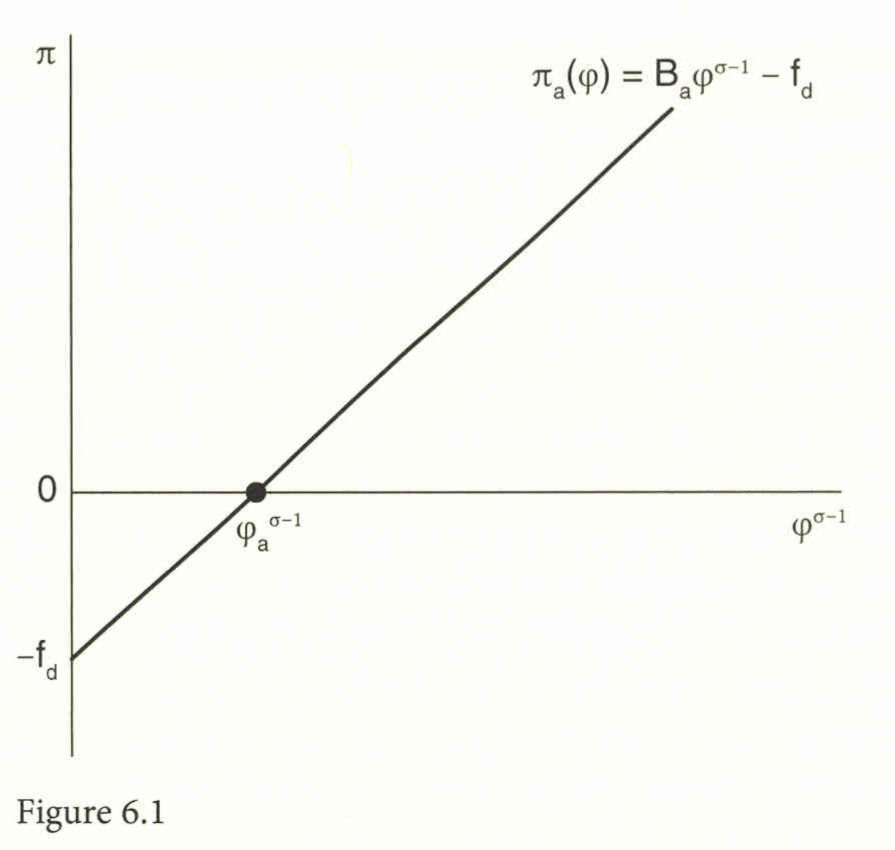
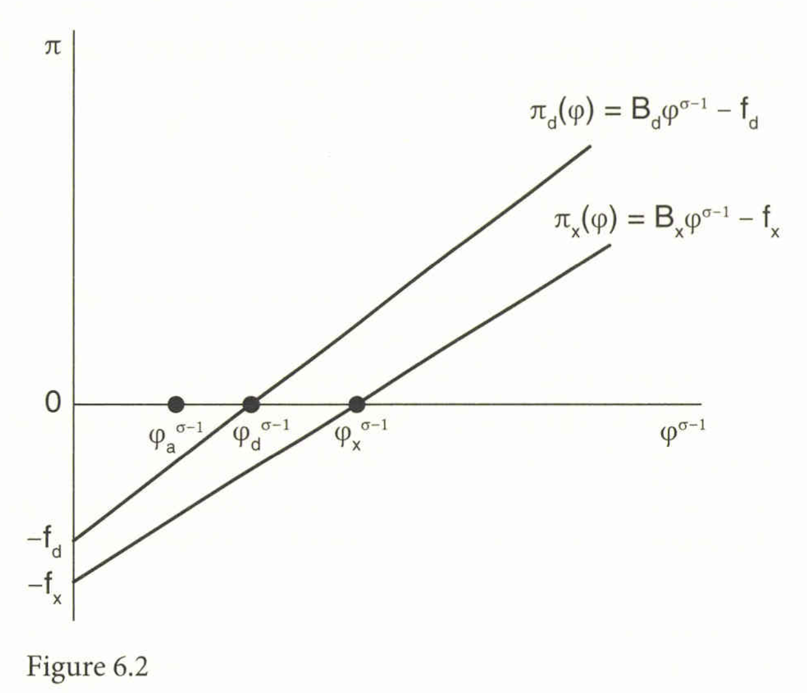

```{r setup, include=FALSE}
knitr::opts_chunk$set(echo = FALSE)
# install.packages("revealjs")
```


# 1. 異質な企業の存在する独占的競争モデルの導入

## 異質な企業の存在する独占的競争モデル

*   前章（第5章）では、Krugman (1979, 1980) のモデルに代表される、すべての企業が**同質**である（対称な）独占的競争モデルを分析した。
*   本章では、企業が**生産性に関して異質**であることを許容する**Melitz (2003) モデル**を議論する。
*   このモデルは、業界内に幅広い能力を持つ企業が存在し、そのうち**一部の企業のみが輸出企業である**という現実的な観察と整合的である。
*   異質な企業を許容することにより、従来のモデルが抱えていた、生産性の異なる企業が存在する中でどのようにゼロ利潤均衡を課すかという、深刻な概念的課題が解決される。
*   企業の生産性は $\varphi$ で示され、賃金 $w$ を1に正規化すると、限界労働コストは $1/\varphi$ で与えられる。

## 貿易開放が予測する効果

*   貿易開放の結果として、このモデルは2つの重要な効果を予測する:
    1.  **淘汰効果 (Selection Effect):** **最も非効率な企業が退出（Exit）**する。
    2.  **規模効果 (Scale Effect):** **最も効率的な企業が輸出のために生産を拡大**する。
*   このモデルでは、国内生産のための固定費用 $f_d$ と、輸出生産のための固定費用 $f_x$ が仮定される。

## 消費者の効用関数と需要

*   製品バラエティ $\omega \in \Omega$ の連続体に対する**CES (Constant Elasticity of Substitution) 効用関数**を使用する:
$$
U = \left[ \int_{\omega \in \Omega} c(\omega)^{(\sigma-1)/\sigma} d\omega \right]^{\sigma/(\sigma-1)}, \quad \sigma > 1 \tag{6.1}
$$
*   ここで $c(\omega)$ はバラエティ $\omega$ の消費量である。
*   各製品の需要 $c(\omega)$ は、総支出 $wL$ と価格指数 $P$ に依存する:
$$
c(\omega) = \frac{w L}{P} \left[ \frac{p(\omega)}{P} \right]^{-\sigma} \tag{6.2}
$$
*   各製品に対する需要の弾力性 $\eta$ は定数 $\sigma$ に等しくなる。

# 2. 閉鎖経済均衡と閾値生産性

## 企業の利潤とZCP条件

*   賃金 $w=1$ の下で、生産性 $\varphi$ を持つ企業が得る国内市場からの利潤 $\pi_d(\varphi)$ は、以下のように書かれる:
$$
\pi_d(\varphi) = \frac{1}{\sigma} B_d \varphi^{\sigma-1} - f_d \tag{6.3}
$$
*   ここで $B_d$ は需要に関連する項であり、利潤は生産性 $\varphi$ の変換 $\varphi^{\sigma-1}$ に対して線形に増加する。
*   **ゼロ・カットオフ・プロフィット (ZCP) 条件**は、利潤がゼロになる最低限の生産性 $\varphi_d$ を決定する。
$$
\pi_d(\varphi_d) = B_d \varphi_d^{\sigma-1} - \sigma f_d = 0 \quad \Rightarrow \quad \varphi_d^{\sigma-1} = \frac{\sigma f_d}{B_d} \tag{6.4}
$$
*   生産性 $\varphi < \varphi_d$ の企業は負の利潤を被るため、生産を行わず市場から**退出 (Exit)** する。


## Figure 6.1: ZCP水準と利潤

{ width=70% }

## Figure 6.1: 図の説明

*   Figure 6.1は、企業の利潤 $\pi_d(\varphi)$（賃金で除算した値）が、生産性 $\varphi$ の変換 $\varphi^{\sigma-1}$ の増加に伴い、**線形に増加する**関係を示している。
*   生産性がゼロに近い企業の利潤は、負の固定費用 $-f_d$ に等しい点から出発する。
*   利潤がちょうどゼロになる点（横軸との交点）が**ゼロ・カットオフ・プロフィット水準 $\varphi_d^{\sigma-1}$** である。この水準よりも生産性が低い企業は生産を停止し、市場から退出する。

## 自由参入 (FE) 条件

*   企業が市場に参入するためには、生産性 $\varphi$ のドローを受ける前に、**サンクコスト**（埋没費用）$f_e$ を支払う必要がある。
*   **自由参入 (FE) 条件**は、新規参入者が期待する利潤の期待値が、参入コスト $f_e$ に等しいことを要求する。
$$
E[\text{Profits}] = \int_{\varphi_d}^\infty \pi_d(\varphi) g(\varphi) d\varphi = f_e \tag{6.6}
$$
*   ZCP条件 (6.4) を利用して利潤を $\varphi_d$ の関数として書き換えることで、FE条件は以下のように表される:
$$
f_e = f_d \int_{\varphi_d}^\infty [(\varphi/\varphi_d)^{\sigma-1} - 1] g(\varphi) d\varphi \tag{6.7}
$$
*   このZCP条件とFE条件の組み合わせにより、均衡における閾値生産性 $\varphi_d$ が**一意に決定される**。

# 3. 貿易均衡と淘汰効果

## 国内閾値と輸出閾値

*   貿易導入後、企業は国内市場と輸出市場の2つの市場に直面する。輸出には氷塊型輸送コスト $\tau$ ($\tau>1$) と固定輸出費用 $f_x$ が必要である。
*   **国内販売閾値 $\varphi_d$** は、貿易開放後の新しい価格指数 $P_t$ を用いて引き続き (6.4') に従って定義される:
$$
\pi_d(\varphi_d) = B_d \varphi_d^{\sigma-1} - f_d = 0 \tag{6.5'}
$$
*   **輸出閾値 $\varphi_x$** は、輸出市場からの利潤 $\pi_x(\varphi)$ をゼロにするZCP条件によって決定される:
$$
\pi_{x}(\varphi_x) = B_x \varphi_x^{\sigma-1} - f_x = 0 \quad \Rightarrow \quad \varphi_x^{\sigma-1} = \frac{f_x}{B_x} \tag{6.12}
$$
*   輸送コスト $\tau$ と固定費用 $f_x$ が十分大きい場合、**$\varphi_x > \varphi_d$** となり、より生産性の高い企業のみが輸出を行う。

## Figure 6.2: 貿易均衡における閾値生産性

{ width=70% }

## Figure 6.2: 図の説明

*   Figure 6.2は、国内市場販売による利潤 $\pi_d(\varphi)$ と輸出市場販売による利潤 $\pi_x(\varphi)$ が、生産性 $\varphi^{\sigma-1}$ に対してどのように増加するかを示している。
*   貿易導入により競争が激化し、国内販売の閾値 $\varphi_d$ は、閉鎖経済の閾値 $\varphi_a$ よりも**上昇する** ($\varphi_d > \varphi_a$)。これは、輸入競争により非効率な国内企業が退出した結果である。
*   輸出販売の閾値 $\varphi_x$ は $\varphi_d$ よりもさらに高く、$\varphi_d$ と $\varphi_x$ の間の生産性を持つ企業は国内でのみ販売し、$\varphi_x$ 以上の企業が輸出も行う。この淘汰効果は平均生産性の上昇をもたらす。

## 貿易均衡における自由参入条件と厚生

*   貿易均衡におけるFE条件は、国内市場と輸出市場の両方からの期待利潤が参入コスト $f_e$ に等しいことを要求する:
$$
\int_{\varphi_d}^\infty \pi_d(\varphi) g(\varphi) d\varphi + \int_{\varphi_x}^\infty \pi_x(\varphi) g(\varphi) d\varphi = f_e \tag{6.14}
$$
*   国内閾値 $\varphi_d$ は閉鎖経済時の $\varphi_a$ よりも上昇する。この閾値の上昇は価格指数 $P$ の低下を意味し、賃金を1に正規化しているため、**実質賃金 $w/P$ が上昇し、貿易による厚生が増加する**。

# 4. Melitz-Chaneyモデルと貿易からの利益

## パレート分布と淘汰効果の純粋な利益

*   Chaney (2008) は、企業の生産性の分布が**パレート分布**に従うと仮定した（Melitz-Chaneyモデル）。
$$
G(\varphi) = 1 - \varphi^{-\theta} \quad \text{for } \varphi \ge 1, \quad \text{and } \theta > \sigma - 1 > 0 \tag{6.15}
$$
*   このモデルでは、国内閾値 $\varphi_d$ の上昇により、国内生存企業数 $M_d$ は貿易開放によって**減少する**。
*   貿易による厚生の増加には、輸入バラエティの増加（正の効果）、国内バラエティの減少（負の効果）、および淘汰効果による平均価格の低下（正の効果）の3つが寄与する。
*   パレート分布を仮定すると、**国内バラエティの減少による損失が、新しい輸入バラエティによる利益と厳密に相殺される**ことが示される。
*   したがって、Melitz-Chaneyモデルにおいて貿易からもたらされる**唯一の純粋な利益の源泉**は、非効率な企業が退出することによる**淘汰効果**（平均生産性の上昇と価格の低下）となる。

## ACRの定理による厚生の測定

*   Arkolakis, Costinot, and Rodriguez-Clare (ACR, 2012) の定理によれば、貿易後の消費者の厚生 $Welfare_t$ と閉鎖経済時の厚生 $Welfare_a$ の比率は、国内支出シェア $\lambda_{ii}$ とパレート・パラメータ $\theta$ を用いて、以下のシンプルな式で与えられる:
$$
\frac{Welfare_t}{Welfare_a} = \left( \lambda_{ii} \right)^{-\frac{1}{\theta}} \tag{6.23}
$$
*   この結果は、CESモデルにおける利益の式 $\lambda_{ii}^{-1/(\sigma-1)}$ と形式は似ているが、指数部が代替の弾力性 $\sigma$ ではなく**パレート・パラメータ $\theta$** に依存している点で異なる。
*   Melitz and Redding (2014a) は、異質な企業モデル（Melitz-Chaney）の方が、同質な企業モデル（Krugman CES）よりも、**貿易からの利益が一般に大きい**ことを示している。

# 5. 重力方程式の理論的基礎

## 重力方程式の一般形式

*   独占的競争モデル（Melitz-Chaneyを含む）は、**重力方程式**を導出するための理論的基礎を提供する。
*   Head and Mayer (2014) によって一般化された重力方程式の特殊形式は以下である:

$$
X^{i j}=\frac{Y^{i}}{R^{i}} \cdot \frac{X^{j}}{R^{j}} T^{i j} \tag{6.24}
$$

* $X^{i j}$は、国$i$から国$j$への輸出額。国 $i$ から国 $i$ への自国向け販売額（$X^{i i}$ ）も含む。
* $Y^{i}=\sum_{j} X^{i j}$は国$i$の総生産額。$X^{j}=\sum_{i} X^{i j}$は国$j$の総支出額。$T^{i j}$は国$i$と$j$間の貿易障壁の指標。
* $R^j$ と $R^i$ は、国が全ての貿易相手国と直面する貿易障壁の平均の難しさを反映した**多国間抵抗項 (Multilateral Resistance)** 。

## Melitz-Chaneyモデルにおける係数

*   Melitz-Chaneyモデルに基づくと、重力方程式の対数を取った際の氷塊型輸送コスト $\tau_{ij}$ の係数として**$-\theta$**（パレート・パラメータの負）が現れる。
*   これは、Krugman (1980) のCESモデルで輸送コストの係数が $1-\sigma$ であったこととは異なり、貿易コストの影響を決定するのはパレート分布のパラメータである。

## Eaton-Kortum (EK) モデル

*   Eaton and Kortum (2002) モデルは、生産性が**フレシェ分布**に従うことを仮定した**完全競争**の貿易モデルである。
$$
F(\varphi) = \exp(-S^i \varphi^{-\theta}) \tag{6.33}
$$
*   このモデルから導かれる輸出シェア $X_{ij}/X_j$ はMelitz-Chaneyモデルと形式的に類似しており:
$$
\frac{X_{ij}}{X_j} = \frac{S^i (w^i \tau^{ij})^{-\theta}}{\sum_k S^k (w^k \tau^{kj})^{-\theta}} \tag{6.36'}
$$
*   この重力方程式でも、氷塊型輸送コストの係数として**$-\theta$**（フレシェ・パラメータの負の値）が現れる。これは、ACRの定理が示す通り、貿易コストの係数が貿易からの利益の指数部を決定することを裏付けるものである。

# 6. ゼロ貿易値と推定方法

## ゼロ貿易値の課題と対処

*   非集計貿易データでは、多くの国ペア間で**ゼロ貿易値**が観察される。これは、Melitz-Chaneyモデルにおいては、非効率な企業が輸出固定費用 $f_x$ を賄えない場合に発生する。
*   従来のOLSによる対数線形化重力方程式 $\ln(X_{ij})$ は、ゼロ貿易値を処理できないため、そのデータを省略してしまうという問題がある。
*   また、OLS推定では**不均一分散性**（誤差項の分散が貿易額のレベルに依存する問題）が発生する。

## ポアソン疑似最尤推定量 (PPML)

*   Santos Silva and Tenreyro (2006) は、ゼロ貿易値と不均一分散性の両方に対処するため、**ポアソン疑似最尤推定量 (PPML, Poisson Pseudo-Maximum Likelihood)** を提案した。
*   実証結果の比較では、OLSやガンマPMLが不均一分散性のRESETテストで棄却される傾向があるのに対し、PPMLは不均一分散性の仮説を棄却しないことが示されている (Table 6.2)。


## Table 6.2: 重力方程式の推定結果

Santos Silva and Tenreyro (2006) が提供した1990年における136カ国間の二国間貿易データ（48%がゼロ輸出である）を用いた重力方程式の推定結果。

標準誤差は括弧内に示されている。

すべての回帰には、輸出国および輸入国の固定効果が含まれている。

RESETテストは、不均一分散性に関する帰無仮説（不均一分散性がないこと）を検定。

## Table 6.2: 136カ国間の重力方程式の推定結果, 1990年

従属変数：国ペア間の輸出額

\footnotesize

| 変数 | OLS | PPML | PPML |
| :--- | :---: | :---: | :---: |
| | **$\ln(X_{ij}), X_{ij} > 0$** | **$X_{ij} > 0$** | **$X_{ij}$ (ゼロを含む)** |
| **距離** | -1.35 (0.03) | -0.75 (0.04) | -0.77 (0.04) |
| **共通国境** | 0.17 (0.13) | 0.37 (0.09) | 0.35 (0.09) |
| **共通言語** | 0.41 (0.07) | 0.38 (0.09) | 0.42 (0.09) |
| **植民地関係** | 0.67 (0.09) | 0.08 (0.13) | 0.04 (0.13) |
| **自由貿易協定** | 0.31 (0.10) | 0.38 (0.08) | 0.37 (0.08) |
| **RESET test ($p$-value)** | 0.000 | 0.567 | 0.113 |
| **観測数** | 9,613 | 9,613 | 18,360 |


## 推定結果の概要

1.  **ゼロ貿易値の考慮:** OLS推定はゼロ貿易値を無視している（観測値9,613）のに対し、PPML（ゼロを含む）はほぼ2倍の観測値（18,360）を使用。
2.  **不均一分散性の問題:** OLS推定は、RESETテストの$p$-valueが0.000であることから、**不均一分散性の帰無仮説（分散の均一性）が強く棄却される**。
3.  **PPMLの優位性:** PPML（特にゼロを含む場合）は、$p$-valueが0.113であり、1%または5%水準では不均一分散性の帰無仮説を棄却しない。$\rightarrow$ ゼロ貿易値の処理と不均一分散性への対処の観点から**PPML推定量**が望ましい。
4.  **係数の違い:** 距離変数の推定係数は、OLSでは $-1.35$ であるのに対し、PPMLでは約 $-0.75$ から $-0.77$ であり、**PPMLの方が距離の影響がゼロに近い**。

## その他の推定方法

*   **ガンマPML推定量** (Gamma PML) は、OLSによる対数線形化と類似した結果をもたらすが、ゼロ貿易値を含めることができる。
*   **多項PML推定量** (Multinomial PML) は、輸出のレベル $X_{ij}$ ではなく、目的地国での輸出シェア $X_{ij}/X_j$ を従属変数として使用する。この推定方法は、カナダ・米国間の貿易データを用いたRESETテストにおいて、最も良好な適合性を示す場合がある。

# 参考文献{-}

## 主な参考文献1

\footnotesize

*   Anderson, J. A., & van Wincoop, E. (2003). Gravity with gravitas: A solution to the border puzzle. *American Economic Review*, *93*(1), 170–192.
*   Arkolakis, C., Costinot, A., & Rodriguez-Clare, A. (2012). New Trade Models, Same Old Gains? *American Economic Review*, *102*(1), 94–130.
*   Chaney, T. (2008). Distorted Gravity: the Intensive and Extensive Margins of International Trade. *American Economic Review*, *98*(4), 1707–21.
*   Dixit, A. K., & Stiglitz, J. E. (1977). Monopolistic competition and optimum product diversity. *American Economic Review*, *67*(3), 297–308.
*   Eaton, J., & Kortum, S. (2002). Technology, Geography and Trade. *Econometrica*, *70*(5), 1741–780.

## 主な参考文献2

\footnotesize
*   Feenstra, R. C. (1994). New product varieties and the measurement of international prices. *American Economic Review*, *84*(4), 157–177.
*   Head, K., & Mayer, T. (2014). Gravity Equations: Workhorse, Toolkit, and Cookbook. In G. Gopinath, E. Helpman, & K. Rogoff (Eds.), *Handbook of International Trade* (Vol. 4, pp. 131–196). Elsevier.
*   Krugman, P. R. (1980). Scale economies, product differentiation, and the pattern of trade. *American Economic Review*, *70*, 950–959.
*   Melitz, M. J. (2003). The impact of trade on intra-industry reallocations and aggregate industry productivity. *Econometrica*, *71*(6), 1695–1725.
*   Santos Silva, J. M. C., & Tenreyro, S. (2006). The Log of Gravity. *The Review of Economics and Statistics*, *88*(4), 641–58.

# 確認問題 (10問){-}

## 問1

Melitz (2003) モデルがKrugman (1980) のCESモデルと比較して持つ、国際貿易の分析における最も重要な進展は何か。

A. 企業の賃金率が生産性とともに低下することを許容したことである。

B. 企業間に異なる生産性や効率性の分布を許容し、貿易が淘汰効果を引き起こすことを示したことである。

C. 貿易コストをゼロと仮定し、完全な要素価格均等化を達成したことである。

D. 固定費用（$f_d$）を廃止し、限界費用が一定であることを確実にしたことである。

## 問2

Melitzモデルにおける、輸出を行うための最低生産性 $\varphi_x$ と、国内市場での生産を続けるための最低生産性 $\varphi_d$ の関係として、固定輸出費用 $f_x$ や輸送コスト $\tau$ が存在する場合に通常想定されるものはどれか。

A. $\varphi_d = \varphi_x$ である。

B. $\varphi_d > \varphi_x$ である。

C. $\varphi_d < \varphi_x$ である。

D. $\varphi_d$ と $\varphi_x$ は閉鎖経済のときと変化しない。

## 問3

貿易開放の結果として、Melitz (2003) モデルが予測する2つの主要な効果は、淘汰効果（Selection Effect）と、もう一つは何か。

A. 要素価格均等化効果（Factor Price Equalization Effect）である。

B. 規模効果（Scale Effect）であり、最も効率的な企業が輸出のために生産を拡大することである。

C. 多国間抵抗の均等化効果（Multilateral Resistance Equalization Effect）である。

D. 賃金上昇効果（Wage Rise Effect）である。

## 問4

Melitz-Chaneyモデル（パレート分布）において、貿易開放によって産業全体の平均生産性が上昇する主要なメカニズムは何か。

A. 貿易によってすべての企業の限界費用が低下する競争促進効果である。

B. 企業の固定費用 $f_d$ が下がる規模の経済効果である。

C. 最も非効率な企業が市場から退出する淘汰効果である。

D. 輸入が増加したことによる国内企業の技術模倣効果である。

## 問5

Melitz-Chaneyモデル（パレート分布）において、貿易開放による厚生の増加を測定する際、輸入バラエティの増加による利益と、国内バラエティの減少による損失の関係として正しいものはどれか。

A. 輸入バラエティの利益の方が常に大きい。

B. 国内バラエティの損失の方が常に大きい。

C. 両者は厳密に相殺され、純粋な厚生の利益には影響しない。

D. 両者の関係は、パレート・パラメータ $\theta$ と代替の弾力性 $\sigma$ の差に依存する。

## 問6

Melitz-Chaneyモデルにおける貿易からの厚生の増加（$Welfare_t / Welfare_a$）を決定するACRの定理 (6.23) において、指数部を構成する主要なパラメータは何か。

A. バラエティ間の代替の弾力性 $\sigma$ である。

B. パレート・パラメータ $\theta$ である。

C. 企業の限界費用 $\beta$ と固定費用 $f_d$ の比率である。

D. 氷塊型輸送コスト $\tau$ である。

## 問7

重力方程式の導出において、Melitz-Chaneyモデル（パレート分布）とKrugman (1980) のCESモデルを区別する、氷塊型輸送コスト $\tau_{ij}$ の対数を取った場合の係数はそれぞれ何か。

A. Krugman: $\theta$、Melitz-Chaney: $\sigma$ である。

B. Krugman: $\sigma$、Melitz-Chaney: $1-\sigma$ である。

C. Krugman: $1-\sigma$、Melitz-Chaney: $-\theta$ である。

D. Krugman: $1/\sigma$、Melitz-Chaney: $1/\theta$ である。

## 問8

Eaton and Kortum (2002) モデルは、Melitz-Chaneyモデルと重力方程式の形式が類似しているが、生産面で根本的に異なる仮定は何か。

A. 企業の生産性が確率分布に従うことである。

B. 完全競争と収穫一定を仮定していることである。

C. 貿易コストが存在することである。

D. 労働のみを投入要素とすることである。

## 問9

Anderson and van Wincoop (2003) の重力方程式分析が示した「国境のパズル」を克服するために導入された、国 $i$ が全ての貿易相手国と直面する貿易障壁の平均的な難しさを示す項は何か。

A. ゼロ・カットオフ・プロフィット (ZCP) である。

B. 多国間抵抗指数 (Multilateral Resistance) である。

C. 自由参入条件 (FE) である。

D. ゼロ貿易値である。

## 問10

貿易データにゼロ貿易値が多く存在する際、OLS対数線形化モデルの問題点に対処しつつ、不均一分散性も考慮した推定方法として、Santos Silva and Tenreyro (2006) が推奨するものは何か。

A. 一般化最小二乗法 (GLS) である。

B. ポアソン疑似最尤推定量 (PPML)である。

C. 二段階最小二乗法 (2SLS) である。

D. 順序付きプロビット (Ordered Probit) である。

## 解答

| 問題番号 | 解答 |
| :------: | :--: |
| 問1 | B |
| 問2 | C |
| 問3 | B |
| 問4 | C |
| 問5 | C |
| 問6 | B |
| 問7 | C |
| 問8 | B |
| 問9 | B |
| 問10 | B |

# 解説{-}

## 問1. Melitzモデルの重要な進展

**解答:** B. 企業間に**異なる生産性や効率性の分布**を許容し、貿易が淘汰効果を引き起こすことを示したことである。

**解説:** 従来のKrugmanモデルはすべての企業が対称的（同質）であると仮定していた。Melitz (2003) モデルは、生産性の分布（異質性）を許容することで、貿易が非効率な企業の退出（淘汰効果）を通じて産業全体の平均生産性を向上させるメカニズムを導入した。

## 問2. 国内販売閾値と輸出閾値の関係

**解答:** C. $\varphi_d < \varphi_x$ である。

**解説:** 輸出には、国内販売とは別に固定費用 $f_x$ が必要であり、輸送コスト $\tau$ もかかる。そのため、輸出を行う企業は国内市場での販売のみを行う企業よりも、より高い生産性 $\varphi_x$ を持つ必要があり、$\varphi_x > \varphi_d$ の関係が成り立つ。

## 問3. 貿易開放による2つの主要な効果

**解答:** B. **規模効果（Scale Effect）**であり、最も効率的な企業が輸出のために生産を拡大することである。

**解説:** Melitzモデルが予測する主要な結果は、非効率企業の退出による**淘汰効果**と、最も効率的な企業が輸出市場へ進出し生産を拡大することによる**規模効果**の2つである。

## 問4. 貿易による平均生産性上昇のメカニズム

**解答:** C. 最も非効率な企業が市場から退出する**淘汰効果**である。

**解説:** 貿易開放により競争が増加し、生産性の低い企業は固定費用を賄えず市場から退出する。これにより、産業全体の平均生産性が向上する。これが**淘汰効果 (Selection Effect)**であり、Melitzモデルにおける厚生増進の主要な源泉である。

## 問5. 貿易からの利益におけるバラエティ効果と淘汰効果

**解答:** C. 両者は厳密に相殺され、純粋な厚生の利益には影響しない。

**解説:** Melitz-Chaneyモデルにおいてパレート分布を仮定した場合、輸入バラエティの増加による消費者の利益は、国内バラエティの減少による損失と**厳密に相殺される**ことがACRの定理の分析から導かれる。

## 問6. ACRの定理による厚生決定要因

**解答:** B. **パレート・パラメータ $\theta$**である。

**解説:** ACR (2012) の定理 (6.23) は、Melitz-Chaneyモデルにおける厚生の増加が $\left( \lambda_{ii} \right)^{-1/\theta}$ という式で与えられることを示した。指数部 $1/\theta$ は、パレート・パラメータ $\theta$ に依存している。

## 問7. 重力方程式における輸送コストの係数

**解答:** C. Krugman: $1-\sigma$、Melitz-Chaney: $-\theta$ である。

**解説:** 独占的競争モデルから導かれる重力方程式において、氷塊型輸送コスト $\tau_{ij}$ の対数項の係数はモデル構造に依存する。Krugman (1980) のCESモデルでは $1-\sigma$ であり、Melitz-Chaneyモデルでは $-\theta$（パレート・パラメータの負の値）となる。

## 問8. Eaton-Kortumモデルの根本的な仮定

**解答:** B. **完全競争と収穫一定**を仮定していることである。

**解説:** Eaton and Kortum (2002) モデルは、フレシェ分布を用いた生産性の異質性は含むものの、市場構造としては独占的競争ではなく、**完全競争と収穫一定**を仮定している。これは、Melitz-Chaneyモデルの独占的競争とは対照的である。

## 問9. 国境のパズル克服のための抵抗項

**解答:** **B. 多国間抵抗指数 (Multilateral Resistance) **である。

**解説:** Anderson and van Wincoop (2003) は、重力方程式の理論的基礎付けにおいて、各国が全ての貿易相手国と直面する平均的な貿易障壁を反映する**多国間抵抗指数**（$R_j, R^i$）を導入し、「国境のパズル」を解決した。

## 問10. ゼロ貿易値と不均一分散性に対処する推定方法

**解答:** **B. ポアソン疑似最尤推定量 (PPML)** である。

**解説:** ゼロ貿易値の存在と、OLS推定が抱える**不均一分散性**の問題を同時に解決する推定方法として、Santos Silva and Tenreyro (2006) は**PPML**を推奨している。
```