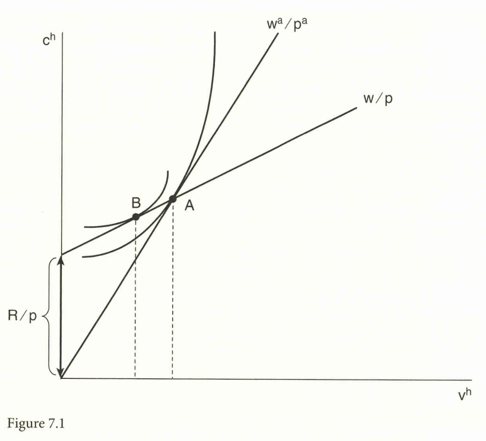
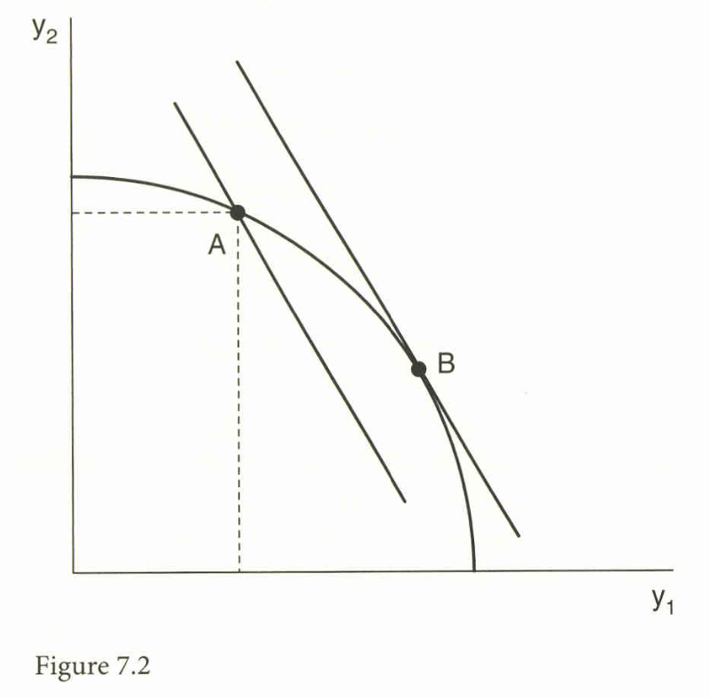

```{r setup, include=FALSE}
knitr::opts_chunk$set(echo = FALSE)
# install.packages("revealjs")
```


# 1. 一括移転

## 一括移転の理論的可能性

* 貿易は国に利益をもたらすが、ストルパー・サミュエルソン定理が示すように**勝者と敗者**を生み出す。
* **一括移転（lump sum transfers）**
とは、政府が利益を得た者から課税し、損失を被った者へ所得を移転する**歪みのない（nondistorting）**手段であると仮定される。
* 一括移転を通じて、すべての人々が利益を得る**パレート利得（Pareto gains）**を達成することが理論的に可能である。
* 自由貿易均衡における消費者 $h$ の予算制約は、価格 $(p, w)$ と移転額 $R^h$ の下で以下のように表される：

$$
p'c^h \le w'v^h + R^h \tag{7.2}
$$

## 補償のための移転システム

* 各個人が自給自足時の選択 $(c^h_0, v^h_0)$ を依然として購入可能とするための移転額 $R^h$ は、以下のように設定される：

$$
R^h = (p - p^0)' c^h_0 - (w - w^0)' v^h_0 \tag{7.3}
$$

* この移転システムは、総政府歳入 $\left(- \sum R^h\right)$ が非負であることを保証し、自給自足時の利潤がゼロであり、一定規模収穫の下で自由貿易時の利潤もゼロであるため、政府にコストはかからない。
* 総政府歳入は、自由貿易価格 $p$ で評価した生産の変化、すなわち**効率性利得**に等しい：

$$
- \sum_{h=1}^H R^h = p'y - p'y^0 \tag{7.4'}
$$

## Figure 7.1: 消費者の選択と消費利得

{width=70%}

## Figure 7.1: 概要
* Figure 7.1は、消費財 $c^h$ と要素供給 $v^h$ の選択を示しており、自給自足均衡は点 A である。
* 自由貿易により実質賃金が低下したと仮定し、政府が移転 $R/p$ を行うと、新しい予算制約線は点 A を通過する。
* 個人は点 A を購入可能でありながら、より高い効用をもたらす点 B を選択する。これは一括移転を用いた場合の**消費利得**を示す。

## Figure 7.2: 生産可能性フロンティアと効率性利得

{width=70%}

## Figure 7.2: 概要

* Figure 7.2は、自給自足均衡点 A と自由貿易下の生産点 B を示す。
* 貿易開放により生産は A から B に移動し、自由貿易価格 $p$ で評価した生産価値 $p'y$ は $p'y^0$ を上回る。
* 政府が徴収する歳入 $\left(- \sum R^h\right)$ は $p'y - p'y^0$ に等しく、これは**生産または効率性利得**である。
* 一括移転は、個人の詳細な情報が必要であり、人々が虚偽の報告をする**インセンティブ整合性問題**があるため、非現実的な政策である。

# 2. 商品税と補助金

## Dixit-Normanのシステム

* Dixit and Norman (1980) は、個人の情報が不要な**商品税/補助金システム**（commodity and taxes and subsidies）を提案した。
* このシステムでは、生産者には自由貿易価格 $(p, w)$ を適用し、消費者には自給自足価格 $(p^0, w^0)$ を維持させるために、財に $(p^0 - p)$、要素に $(w^0 - w)$ の税/補助金を課す。
* 消費者は自給自足時と同じ価格に直面するため、同じ消費選択を行い、同じ効用水準を達成する。

## Dixit-Normanシステムの厚生利得
* 政府歳入 $G$ は、一括移転の総歳入と同一の式で表され、効率性利得が存在すれば正となる：

$$
G = \sum_{h=1}^H (p^0 - p)' c^h_0 - \sum_{h=1}^H (w^0 - w)' v^h_0 \tag{7.5}
$$

* 歳入 $G$ を人頭補助金として分配することで、すべての消費者が利益を得る**パレート利得**が達成される。
* ただし、個人が特定の場所や産業への移動費用を持つ場合、賃金 $w$ を自給自足水準に固定すると、生産の移動（AからB）が妨げられ、効率性利得がゼロになる可能性がある。

# 3. 関税の部分的改革

## パレート利得を保証する条件

* 貿易制限のある状況 $0$ から $1$ への関税改革が補償原理を満たし、パレート利得を保証するための十分条件は、以下の式が非負であることである（Grinols and Wong, 1991; Ju and Krishna, 2000a）：

$$
(p^{*0} - p^{*1})' m^0 + t^1 (m^1 - m^0) \ge 0
$$

* 第1項 $(p^{*0} - p^{*1})' m^0$ は、**交易条件**の変化が厚生に与える影響を示す。輸入価格が上昇するか輸出価格が低下する場合（交易条件の悪化）には、この項は負となる。
* 第2項 $t^1 (m^1 - m^0)$ は、最終関税 $t^1$ で評価した輸入の変化であり、**効率性利得**を示す。
* **小国**（世界価格が一定）の場合、効率性効果が非負（$t^1 (m^1 - m^0) \ge 0$）であれば、誰も不利益を被らない。

# 4. 地域貿易協定

## 貿易創出と貿易転換

* 地域協定（RTAs）は、GATT第 XXIV条の下で許容される、特定の国グループ間の特恵的な協定である。
* **関税同盟（Customs Union）**は、共通外部関税を持ち、**自由貿易地域（Free Trade Area, FTA）**は各国が独自の外部関税を維持する。
* Viner (1950) が特定したRTAsの負の側面として、**貿易転換（Trade Diversion）**がある。これは、加盟国外の低価格供給者から、加盟国内の高価格供給者への購買の切り替えであり、関税収入の損失と非効率化を引き起こす。

## Kemp-Wanの定理と原産地規則

* **Kemp and Wan (1976) の定理**によれば、関税同盟が、**世界価格 $p^*$ と加盟国外からの総輸入量 $x^*$ を固定**するように共通外部関税を設定すれば、加盟国は相互移転を通じて誰も不利益を被らないことが保証される。
* **Krishna and Panagariya (2002)** は、Kemp-Wanの定理をFTAに拡張し、各参加国が**加盟国外の国々との貿易量を改革前の水準に維持**するように外部関税を調整すれば、国内移転を通じてパレート利得が達成可能であることを示した。
* FTAでは、パレート利得を保証するために、外部国が低関税国を経由して商品を転送する**積み替え（transshipment）**を防ぐ必要があり、実際には**原産地規則（Rules of Origin, ROO）**が使用される。

# 5. 地域協定に関する実証研究

## 実証結果の概要

* **英国のEEC加盟 (Grinols, 1984)**：英国は1973年から1980年の間、共通外部関税の採用により**交易条件の悪化**を経験し、平均してGDPの約2%の厚生損失を被ったと推定されている。
* **MERCOSUR (Chang and Winters, 2002)**：MERCOSURへの加盟は、ブラジルにとって外部国（米国、日本など）からの価格低下をもたらし、**重要な交易条件の改善**につながった。
* **NAFTA (Caliendo and Parro, 2015)**：一般均衡モデルのシミュレーションによると、NAFTAは全体で貿易創出が貿易転換を上回ったが、カナダは**交易条件の悪化**と貿易転換の損失により、全体として**損失を被った**と推定された。

# 6. 不完全競争と規模の経済

## 不完全競争下の厚生利得

* 不完全競争下では、価格が限界費用を上回るため、貿易開放がその産業の生産を増加させる場合、厚生が改善されると予想される。
* 費用逓増（Increasing Returns to Scale）が存在する場合、輸入競争による産業の縮小は平均費用の増加につながり、保護主義の論拠となり得る（Graham, 1923）。

## Grinolsの定理

* Grinols (1991) は、不完全競争または費用逓増に服する産業において、パレート利得を達成するための十分条件を提示した。
* その条件は、それらの産業の生産量の**加重平均が拡大する**ことである：

$$
\sum_{i=1}^{N} \omega_i(y_i^1 - y_i^0) > 0 \tag{7.18}
$$

* ここで、ウェイト $\omega_i$ は $0 \le \omega_i \le 1$ を満たし、完全競争産業では $\omega_i = 0$ となり、定数規模収穫かつ不完全競争下では価格に対するマークアップに等しい。

# 参考文献{-}

## 主な参考文献1

\footnotesize

* Akerlof, G., Rose, A., Yellen, J., & Hessenius, H. (1991). East Germany in from the Cold: The Economic Aftermath Of Currency Union. *Brookings Papers on Economic Activity*, *1*, 1–87.
* Caliendo, L., & Parro, F. (2015). Estimates of the Trade and Welfare Effects of NAFTA. *Review of Economic Studies*, *82*(1), 1–44.
* Chang, W., & Winters, L. A. (2002). How Regional Blocs Affect Excluded Countries: The Price Effects of MERCOSUR. *American Economic Review*, *92*(4), 889–904.
* Dixit, A., & Norman, V. (1980). *Theory of International Trade*. Cambridge University Press.

## 主な参考文献2
\footnotesize

* Grinols, E. L. (1984). The Thorn in the Lion's Paw: Has Britain Paid Too Much for Common Market Membership? *Journal of International Economics*, *16*, 271–93.
* Grinols, E. L., & Wong, K. (1991). An Exact Measure of Welfare Change. *Canadian Journal of Economics*, *24*(2), 429–49.
* Kemp, M. C., & Wan, H., Jr. (1976). An Elementary Proposition concerning the Formation of Customs Unions. In M. C. Kemp (Ed.), *Three Topics in the Theory of International Trade: Distribution, Welfare and Uncertainty*. North-Holland.
* Krishna, P., & Panagariya, A. (2002). On Necessarily Welfare-Enhancing Free Trade Areas. *Journal of International Economics*, *57*(2), 353–67.
* Viner, J. (1950). *The Customs Union Issue*. Carnegie Endowment for International Peace.

# 確認問題 (10問){-}

## 問1

国際貿易において、政府が利益を得た者から課税し、損失を被った者へ所得を移転することで、すべての人々が利益を得る「パレート利得」を達成できると理論上保証される移転の形式はどれか。

A. 歪みのある商品税/補助金である。

B. 歪みがないと仮定された一括移転である。

C. 効率的な賃金補助金である。

D. 貿易調整支援（TAA）による所得補填である。

## 問2

一括移転が現実の政策として採用するのが難しい主要な理由として、Feenstra (2015) が指摘しているのは何か。

A. 総利得が総損失を上回らない場合があるためである。

B. 移転の実施に、各個人の自給自足時の消費と要素供給に関する詳細な情報が必要であり、インセンティブ整合性問題が生じるためである。

C. 自由貿易価格を正確に決定できないためである。

D. 一括移転が必然的に政府財政の赤字を引き起こすためである。

## 問3

Dixit and Norman (1980) が提案した商品税/補助金システムが、一括移転と比較して優れている点は何か。

A. 生産者と消費者の両方に自給自足時の価格を維持させる点である。

B. 貿易競争の結果として、生産点 A から B への移動（効率性利得）を妨げる要素を排除する点である。

C. 個人の自給自足時の消費量や要素供給量に関する詳細な情報が不要である点である。

D. 貿易開放後、すべての個人に一律の（人頭）税を課す点である。

## 問4

Dixit-Normanの商品税/補助金システムにおいて、貿易開放による厚生の増加をもたらす唯一のメカニズムは何か。

A. 交易条件の改善である。

B. 輸入バラエティの増加による消費利得である。

C. 生産者が自由貿易価格に直面し、生産可能性フロンティア上で効率的な点に移動することによる効率性利得である。

D. 消費者が自給自足時の消費選択を変更することによる利得である。

## 問5

Grinols and Wong (1991) の定理によれば、貿易制限のある状況 $0$ から別の状況 $1$ への関税の部分的改革がパレート利得を保証するための十分条件（補償原理を満たす条件）は、以下のどの式が非負であることか。

A. $(p^1 - p^0)' y^0$ である。

B. $t^0 m^0 - t^1 m^1$ である。

C. $(p^{*0} - p^{*1})' m^0 + t^1 (m^1 - m^0)$ である。

D. $p^1 y^1 - p^0 y^0$ である。

## 問6

Viner (1950) が関税同盟の負の側面として特定した現象であり、加盟国内の国が、加盟国外の低価格供給者から、加盟国内の高価格供給者に購入先を切り替えることで発生する非効率化を指す用語は何か。

A. 貿易転換（Trade Diversion）である。

B. 貿易創出（Trade Creation）である。

C. 交易条件の悪化（Terms of Trade Deterioration）である。

D. 多国間抵抗（Multilateral Resistance）である。

## 問7

Kemp and Wan (1976) の定理が示す、関税同盟が加盟国に確実にパレート利得をもたらすための主要な条件は何か。

A. 共通外部関税を完全にゼロにすることである。

B. 加盟国外の国々との貿易を完全に停止することである。

C. 共通外部関税の設定により、世界価格と加盟国外からの総購入量を改革前の水準に維持することである。

D. すべての加盟国が単一の製品のみを生産することである。

## 問8

自由貿易地域（FTA）において、Krishna and Panagariya (2002) の定理が保証するパレート利得を達成するために、実務上必要となる制度的障壁は何か。

A. 共通通貨の使用である。

B. 原産地規則（Rules of Origin, ROO）であり、積み替えを防ぐことである。

C. 外部関税の完全な統一である。

D. 産業への固定費用補助金の提供である。

## 問9

Grinols (1984) による英国のEEC加盟に関する実証研究、およびCaliendo and Parro (2015) によるNAFTAに関するシミュレーションが、加盟国（英国、カナダ）にとって損失が生じる可能性を示唆した共通の要因は何か。

A. 国内における独占の増加である。

B. 国内バラエティの減少である。

C. 交易条件の悪化である。

D. 要素価格均等化の失敗である。

## 問10

不完全競争と費用逓増が存在する場合、Grinols (1991) の定理によれば、貿易によるパレート利得を達成するための十分条件は、不完全競争に服する産業の生産量がどうなることか。

A. すべての産業の生産量が変化しないことである。

B. すべての産業の平均費用が低下することである。

C. 不完全競争に服する産業の加重平均生産量が拡大することである。

D. 最も非効率な企業が退出することである。

## 解答

| 問題番号 | 解答 |
| :------: | :--: |
| 問1 | B |
| 問2 | B |
| 問3 | C |
| 問4 | C |
| 問5 | C |
| 問6 | A |
| 問7 | C |
| 問8 | B |
| 問9 | C |
| 問10 | C |

# 解説{-}

## 問1. パレート利得と一括移転

**解答:** B. 歪みがないと仮定された**一括移転**である。

**解説:** 一括移転は、個人の経済行動を歪ませることなく所得を移転できると仮定されており、貿易による総利得が総損失を上回る限り、全員を補償しパレート利得を達成することが理論上可能である。

## 問2. 一括移転の非現実性

**解答:** B. 移転の実施に、各個人の自給自足時の消費と要素供給に関する詳細な情報が必要であり、**インセンティブ整合性問題**が生じるためである。

**解説:** 一括移転 (7.3) の計算には、個人の自給自足時の消費・供給量の情報 $c^h_0, v^h_0$ が必要であり、この情報を収集しようとすると、人々はより有利な移転を受けるために虚偽の報告をするインセンティブが生じる。

## 問3. Dixit-Normanのシステムの特徴

**解答:** C. 個人の自給自足時の消費量や要素供給量に関する**詳細な情報が不要**である点である。

**解説:** Dixit-Normanのシステムは、必要な情報が財と要素の価格ベクトルのみであり、一括移転のように個々人の消費・供給量情報を必要としないため、一括移転より実現可能性が高いとされる。

## 問4. Dixit-Normanシステムにおける厚生の源泉

**解答:** C. 生産者が自由貿易価格に直面し、生産可能性フロンティア上で効率的な点に移動することによる**効率性利得**である。

**解説:** このシステムでは消費者は自給自足時と同じ価格に直面するため消費行動は変化せず、厚生の利得は、生産者が自由貿易価格に直面し、生産がより効率的な点に移動することによって生じる**効率性利得** (7.5) のみである。

## 問5. 関税の部分的改革における補償条件

**解答:** C. $(p^{*0} - p^{*1})' m^0 + t^1 (m^1 - m^0)$ である。

**解説:** Grinols and Wong (1991) らの定理によれば、関税改革がパレート利得を保証する十分条件は、この政府歳入の剰余を示す式が非負であることである。第1項は交易条件効果、第2項は効率性効果を測定している。

## 問6. Vinerの特定した負の側面

**解答:** A. **貿易転換（Trade Diversion）**である。

**解説:** 貿易転換は、輸入国が加盟国外の安価な供給者から、関税が撤廃された加盟国内の高価な供給者へ切り替えることで、関税収入の損失と非効率化が生じる現象である。

## 問7. Kemp-Wanの定理の主要な条件

**解答:** C. 共通外部関税の設定により、**世界価格と加盟国外からの総購入量**を改革前の水準に維持することである。

**解説:** Kemp and Wan (1976) は、関税同盟が世界価格 $p^{*0}$ と加盟国外からの総輸入量 $x^*(p^{*0})$ を固定する (7.12) ことで、加盟国外の国々に不利益を与えず、加盟国加盟国も全体として損失を回避できることを示した。

## 問8. FTAでパレート利得に必要な制度

**解答:** B. **原産地規則（Rules of Origin, ROO）**であり、積み替えを防ぐことである。

**解説:** FTAでは各国が異なる外部関税を持つため、低関税国を経由した積み替えが発生し、パレート利得を保証するための条件（加盟国外との貿易量の維持 (7.13)）が侵害される。したがって、積み替えを防ぐ原産地規則が不可欠である。

## 問9. 貿易協定の損失要因

**解答:** C. **交易条件の悪化**である。

**解説:** Grinols (1984) は英国がEEC加盟により**交易条件の悪化**を経験したと推定し、Caliendo and Parro (2015) はNAFTAによるカナダの損失の主要因が**交易条件の悪化**であると指摘した。

## 問10. Grinolsの定理によるパレート利得の条件（不完全競争）

**解答:** C. 不完全競争に服する産業の**加重平均生産量が拡大すること**である。

**解説:** Grinols (1991) は、不完全競争または費用逓増に服する産業において、その生産量の変化を加重平均したもの $\sum \omega_i(y_i^1 - y_i^0)$ が正 (7.18) であることが、パレート利得の十分条件であることを示した。


