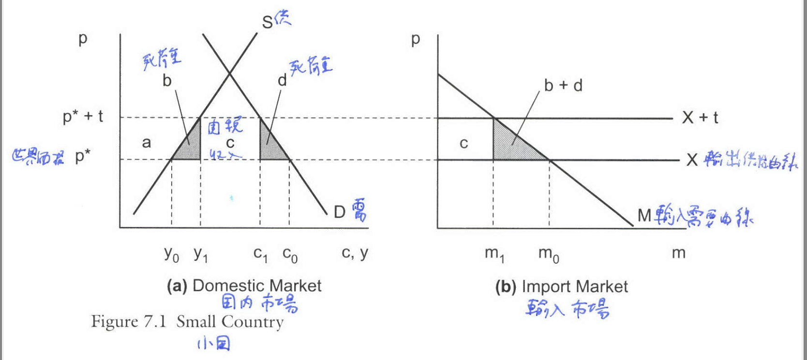
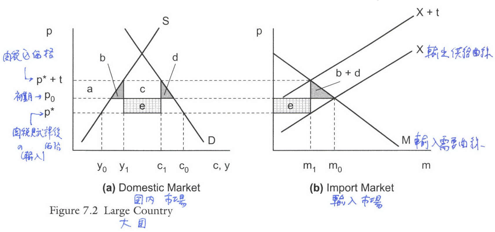
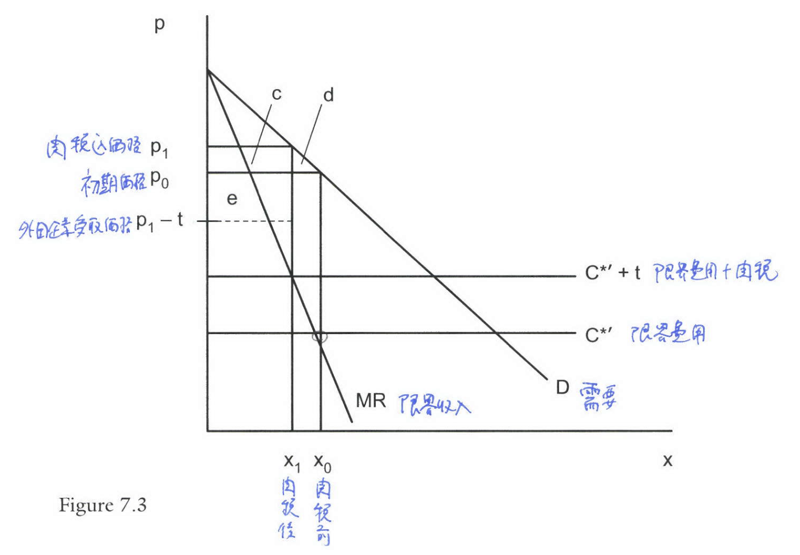
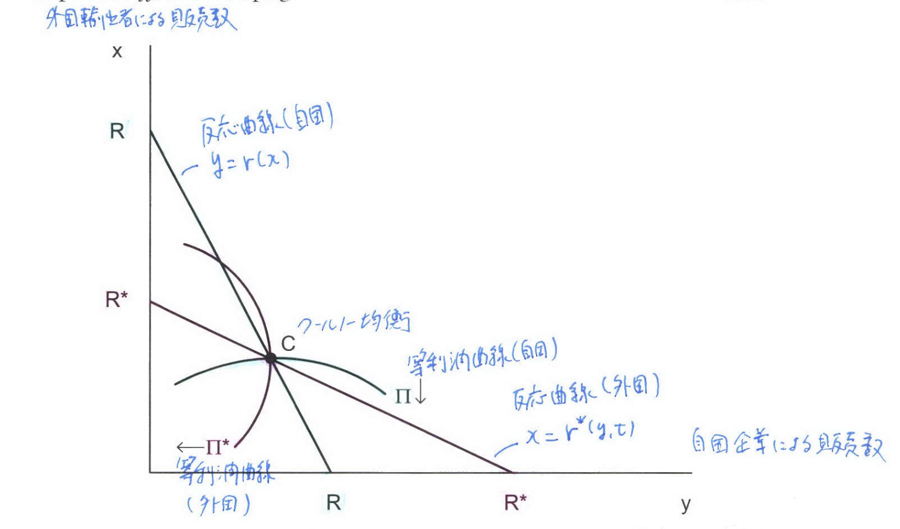
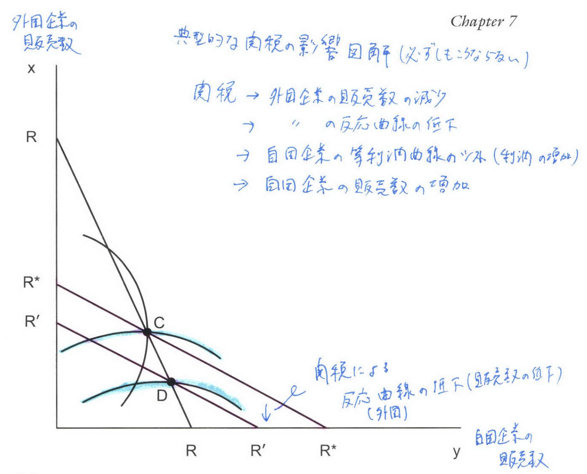
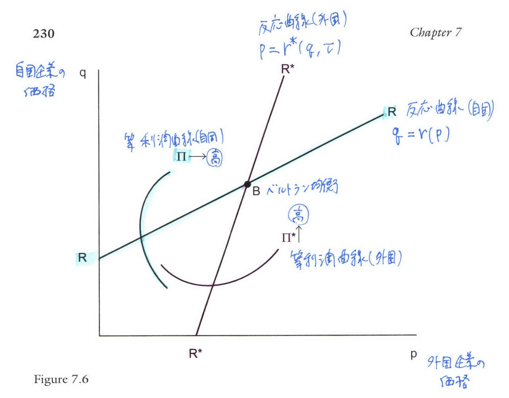
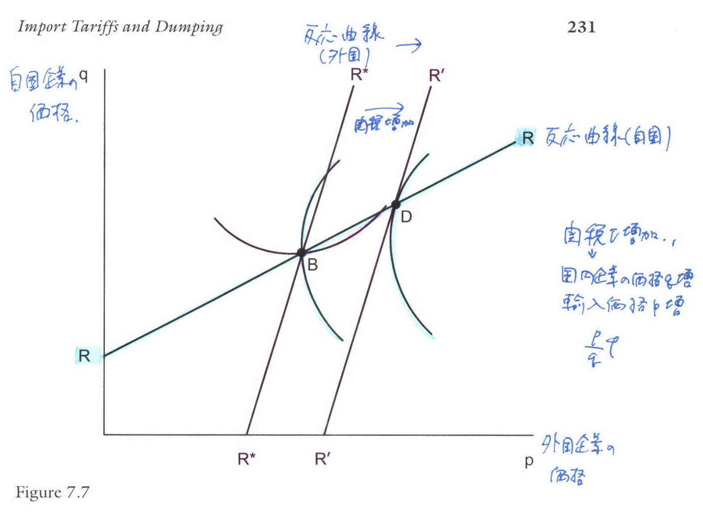

```{r setup, include=FALSE}
knitr::opts_chunk$set(echo = FALSE)
# install.packages("revealjs")
```


# 1. GATT/WTO体制下の関税


## 貿易政策の背景とWTO体制

*   多くの国が開発初期段階で、国内産業を育成するために輸入代替と呼ばれる**輸入関税やその他の貿易政策**を使用してきた。
*   これらの政策は、非効率な国内産業を国際競争から保護するものとして、しばしば批判される。
*   WTO加盟国は、厳しく規制された貿易体制を放棄し、実質的により自由な貿易へ移行することを約束している。


## 関税の使用に関するGATT/WTOの規定

GATT/WTO体制下でも、以下のような状況で関税の使用が許可されている：

(a)   **逃げ道条項関税（Escape Clause Tariffs）**: GATT第XIX条に基づき、輸入競合産業が損害を被った場合に、一時的に低い関税水準を維持する約束から逸脱することを許容する。

(b) **不当廉売関税（Antidumping Duties）**: 「低すぎる」輸入価格を相殺するために適用される。


## 米国の緊急輸入制限措置（safeguard）規定

*   米国の逃げ道条項規定（GATT第XIX条）は、**1974年通商法第201条**に組み込まれている。
*   201条の下で保護を受けるためには、輸入の増加が国内産業への「深刻な損害、またはその脅威」の**「実質的な原因（substantial cause）」**でなければならない。
*   「実質的な原因」とは「他のどの原因よりも少なくない原因」と定義されており、この基準は非常に厳しい。
*   その結果、1980年から2011年の間に提起された31件の201条事案のうち、大統領が輸入保護を承認したのはわずか9件である。

## 不当廉売関税規定

*   不当廉売関税規定はWTOの第VI条に相当し、米国では**通商法第731条**で扱われる。
*   不当廉売関税は、外国企業が自国市場価格や平均生産コストよりも低い価格で輸入市場に販売している場合に適用される。
*   不当廉売関税事案は、緊急輸入制限措置事案を遥かに上回る頻度で提起されている。1980年から2011年の間に、米国では**1,200件以上**の不当廉売関税事案が提起されている。

## 実質的な損害

*   不当廉売関税の適用には、商務省による「公正価値未満」での販売認定と、国際貿易委員会（ITC）による国内産業への**「実質的な損害（material injury）」**認定が必要である。
    *   不当廉売関税における「実質的な損害」基準は、緊急輸入制限措置の「深刻な損害の実質的な原因」基準よりも満たしやすい。
*   不当廉売関税事案の中には、ITCの裁定前に取り下げられるケースがあり、これは米国企業が外国企業と価格や市場シェアに関して合意するためである（**和解**）。


## 緊急輸入制限措置と不当廉売関税の適用基準の比較

緊急輸入制限措置（第201条）と不当廉売関税（第731条）の適用基準は大きく異なる。

\scriptsize

| 基準項目 | 緊急輸入制限措置（第201条） | 不当廉売関税（第731条） |
| :--- | :--- | :--- |
| **損害レベル** | **深刻な損害** (serious injury) | **実質的な損害** (material injury) |
| **原因の基準** | **実質的な原因** (substantial cause) | 実質的な損害を与えたこと |
| **厳格さ** | 損害の「他のどの原因よりも少なくない原因」である必要があり、**厳格**である。 | 「実質的な損害」基準は、緊急輸入制限措置の基準よりも**満たしやすい**。 |


# 2. 社会厚生

## 社会厚生関数の一般表現

全体的な社会厚生の尺度を導出するため、各個人 $h$ が準線形効用関数 $c_0^h + U^h(c^h)$ を持つと仮定される。

社会厚生は個人の効用の総和として定義される：
$$
W(p, I) = \sum_{h=1}^H \left[ I^h - p' d^h(p) + U^h[d^h(p)] \right] \tag{8.1}
$$

ここで、$I = \sum I^h$ は総所得、$p$ は輸入財の価格ベクトルである。右辺の最後の2項の和は消費者余剰に等しい。

## 関税の社会厚生への影響

輸入財を単一財（スカラー $p$）とし、国内価格 $p = p^* + t$ （$p^*$ は世界価格、$t$ は従量関税）とする。

関税収入 $tm$ と国内利潤 $\Pi = py - C(y)$ が消費者に再分配されると仮定すると、社会厚生 $W$ は関税 $t$ の関数として次のように書かれる：

$$
W(t) = W[p, L + tm + \Pi] \tag{8.2}
$$

## 厚生変化の一般式

関税 $t$ の変化に対する厚生の変化を全微分すると、以下の一般式が得られる：

$$
\frac{dW}{dt} = t \frac{dm}{dt} - m \frac{dp^*}{dt} + (p - C'(y)) \frac{dy}{dt} \tag{8.3}
$$

\footnotesize

右辺の各項は以下の厚生効果を表す：

1.  $t \frac{dm}{dt}$: **効率性コスト**（関税による死荷重損失）。
2.  $- m \frac{dp^*}{dt}$: **交易条件効果**（関税による世界価格 $p^*$ の変化）。
3.  $(p - C'(y)) \frac{dy}{dt}$: **価格-限界費用マージン効果**（不完全競争下の価格と限界費用の差 $(p-C'(y))$ を通じた国内生産量 $y$ の変化による効率性利得）。


# 3. 完全競争、小国


## 小国の最適関税

*   完全競争下では $p = C'(y)$ であり、第3項（価格-限界費用マージン効果）はゼロとなる。
*   **小国**では世界価格 $p^*$ は固定（$\frac{dp^*}{dt} = 0$）であるため、第2項（交易条件効果）もゼロとなる。
*   このとき、厚生変化の式は以下となる：
$$
\frac{dW}{dt} = t \frac{dm}{dt} \tag{8.4}
$$
*   ゼロ関税点 $t=0$ で評価すると、$\frac{dW}{dt}|_{t=0} = 0$ となり、社会厚生は臨界点を持つ。
*   二次導関数は $\frac{d^2 W}{dt^2}|_{t=0} = \frac{dm}{dt}|_{t=0} < 0$ であり、これは輸入需要曲線 $\frac{dm}{dp}$ の傾きが負であることに由来する。
*   したがって、**小国にとっての最適関税はゼロである**。

## 厚生損失の測定

*   自由貿易点 $t=0$ の周りでの厚生損失は、関税 $t$ の2次近似で表される：
$$
W(t) - W(0) \approx \frac{1}{2} t^2 \frac{dm}{dp}|_{t=0} = \frac{1}{2} t \Delta m < 0 \tag{8.7}
$$
*   この損失は、輸入価格の上昇と輸入量の変化の積の半分であり、**輸入需要曲線の下の三角形の面積**に等しい。

## Figure 8.1: Small Country

*   **概要**: Figure 8.1は、小国における関税の死荷重損失を国内市場（a）と輸入市場（b）で示すものである。
*   **関税の影響**: 自由貿易価格 $p^*$ に関税 $t$ が加わると、小国であるため、国内価格は $p^* + t$ に完全に上昇する。
*   **厚生損失**: 消費者余剰の損失 $-(a+b+c+d)$、生産者余剰の利得 $a$、関税収入 $c$ を合計すると、正味の厚生損失は $-(b+d)$ となる。この面積 $(b+d)$ が関税による死荷重損失（Deadweight Loss）であり、パネル(b)の輸入需要曲線の下の三角形として測定される。
*   死荷重損失は関税 $t$ の2乗に依存するため、小さな関税に対しては非常に小さいとされる。

## Figure 8.1: Small Country

{width=100%}

# 4. 完全競争、大国

## 大国の最適関税

*   **大国**では、関税の導入が世界価格 $p^*$ に影響を与え、$\frac{dp^*}{dt} \ne 0$ となる。
*   完全競争下（$p = C'(y)$）の厚生変化の式は以下となる：
$$
\frac{dW}{dt} = t \frac{dm}{dt} - m \frac{dp^*}{dt} \tag{8.8}
$$
*   関税がゼロの点 $t=0$ で評価すると：
$$
\frac{dW}{dt}|_{t=0} = - m \frac{dp^*}{dt}|_{t=0} > 0 \tag{8.9}
$$
*   関税により輸入需要が減少し、外国の輸出供給価格（世界価格 $p^*$）が低下するため、$\frac{dp^*}{dt} < 0$ となる。したがって、第2項（交易条件効果）は正となり、**小さな関税は必ず厚生を増加させる**。

## Figure 8.2: Large Country

*   **概要**: Figure 8.2は、大国における関税が交易条件を改善することを示すものである。
*   **関税の影響**: 関税 $t$ により外国の輸出供給曲線 X は $X+t$ にシフトする。大国では外国の供給弾力性が有限であるため、国内価格の上昇分（$p-p_0^*$）は関税額 $t$ よりも小さくなる。
*   **交易条件の改善**: この価格差は、外国価格 $p^*$ が初期値 $p_0^*$ よりも低下したことを意味し、これが輸入国にとっての**交易条件の利益 $e$** となる。
*   **正味の厚生**: 正味の厚生変化は、交易条件利益 $e$ から死荷重損失 $-(b+d)$ を差し引いた $e - (b+d)$ であり、交易条件利益 $e$ は $t$ に依存し、死荷重損失 $-(b+d)$ は $t^2$ に依存するため、関税が十分に小さい場合、正味の厚生は正となる。

## Figure 8.2: Large Country

{width=100%}


## 最適関税の公式

厚生変化がゼロとなる条件から、最適関税 $t^*$ が求められる：
$$
\frac{t^*}{p^*} = \frac{1}{\varepsilon^*} \tag{8.11}
$$

ここで、$\varepsilon^*$ は**外国の輸出供給の弾力性**である。

**最適関税率**（$t^*/p^*$）は、外国の輸出供給弾力性の逆数に等しい。

$\rightarrow$この公式から、供給弾力性が無限大である小国の場合には最適関税はゼロとなる。

# 5. 外国独占


## 外国独占下での関税の影響

*   単一の外国輸出業者がホーム市場で販売するケース（Brander and Spencer, 1984a, b）を考える。
*   外国企業の利潤 $\Pi^x$ は、販売量 $x$ と関税 $t$ の関数として与えられる：
$$
\Pi^x(x) = x [P(x) - t] - C^x(x) \tag{8.13}
$$
*   利潤最大化条件は、限界収入が限界費用（$C^x(x)+t$）に等しいことを示す。
*   関税が価格にどの程度転嫁されるか（パススルー $\frac{dp}{dt}$）は、交易条件の改善（$\frac{dp^*}{dt} < 0$）が生じるかどうかの鍵となる。

## パススルーと交易条件利益の条件

*   従量関税 $t$ のパススルーが不完全（$\frac{dp}{dt} < 1$）であることと、外国企業が関税の一部を吸収すること（$\frac{dp^*}{dt} < 0$）は同等である。
*   定数限界費用を仮定した場合、不完全なパススルーが発生する（すなわち、$\frac{dp^*}{dt} < 0$ となり、最適な関税が正となる）ための十分条件は、以下の通りである：
$$
2P'(x) + xP''(x) < 0 \tag{8.17'}
$$
*   これは、**限界収入曲線 $P(x) + xP'(x)$ が需要曲線 $P(x)$ よりも急勾配**であることを意味する。線形または凹型の需要曲線の場合、この条件は成立する。

## Figure 8.3: 外国独占下での関税の影響

{width=100%}

## Figure 8.3の説明
Figure 8.3は、単一の外国輸出業者（独占企業）が自国市場で販売しているケースにおいて、従量関税 $t$が課された場合の均衡と厚生の変化を示している。

1. **初期均衡**: 関税がない場合の国内価格および外国輸出価格は $p_0$。
2. **関税の影響と価格上昇**: 関税 $t$ が課されると、外国独占企業の限界費用が増加し、国内輸入価格は $p_1$ に上昇。

## Figure 8.3: 交易条件の改善（パススルー） 

限界収入曲線が需要曲線よりも急勾配であるという条件（$2P'(x) + xP''(x) < 0$）が満たされる場合、価格上昇分 $p_1 - p_0$ は関税額 $t$ よりも小さくなる。

*   これは、外国輸出業者が関税の一部を吸収すること（不完全なパススルー）を意味し、輸出業者が受け取る価格 $p^* = p_1 - t$ が $p_0$ より低下する。
*   この $dp^*/dt < 0$ の状況は、輸入国にとって**交易条件の利益**となる。

## Figure 8.3: 厚生変化の分析

### 厚生の変化

厚生の変化は、消費者余剰の損失 $-(c+d)$ と関税収入の利得 $+(c+e)$ の合計、すなわち $(e - d)$ で表される。

### 最適関税

関税が十分に小さい場合、交易条件利益 $e$ が死荷重損失 $d$ を上回るため、**正の関税が最適となる**。


## Brander and Spencer の定理

Brander and Spencer (1984a, b) の定理は、不完全競争下での関税の戦略的利用を概説する：

外国独占企業が一定限界費用を持つ場合、

(a) 小さな**従量関税（specific tariff）**は、限界収入が需要よりも急勾配であれば、交易条件を改善し、自国（home country）の厚生を向上させる。

(b) 小さな**従価関税（ad valorem tariff）**は、輸入財の消費が減少するにつれて需要の弾力性が増加する場合、交易条件を改善し、自国（home country）の厚生を向上させる。


# 6. クールノー複占

## クールノー複占下の厚生分析

*   自国（home country）企業 $y$ と外国企業 $x$ が数量競争（クールノー競争）を行う場合を考える。
*   厚生変化の一般式（8.3）を再掲する ($m=x$):
$$
\frac{dW}{dt} = t \frac{dx}{dt} - x \frac{dp^*}{dt} + (p - C'(y)) \frac{dy}{dt} \tag{8.3'}
$$


## パススルーと交易条件利益の条件

定数限界費用を仮定した場合、関税によるパススルーが不完全（$\frac{dp}{dt} < 1$）である条件は以下である：
$$
2P'(z) + zP''(z) < 0 \tag{8.25}
$$

ここで $z=x+y$ は市場全体の総生産量である。

この条件は、**市場全体の限界収入曲線が下向きに傾斜している**ことを意味し、多くの需要曲線で満たされるため、交易条件の改善（$\frac{dp^*}{dt} < 0$）が生じやすい。

## 最適関税の動機

$t=0$ の場合、厚生変化は主に第2項（交易条件効果）と第3項（効率性効果）によって決まる。

(1) $\frac{dp^*}{dt} < 0$ であれば、第2項は正となり、**交易条件利益**が生じる。

(2) 通常のクールノー均衡では、関税の導入により外国企業の反応曲線がシフトし、国内生産 $y$ が増加する傾向がある ($\frac{dy}{dt} > 0$)。

(3) 価格 $p$ は限界費用 $C'(y)$ を上回るため（$p - C'(y) > 0$）、国内生産の増加は第3項を正にし、**効率性利得**をもたらす。

## クールノー複占の下での最適関税

*   これらの理由から、クールノー複占の下では、**最適関税は曖昧さなく正となる可能性が非常に高い**。
*   第3項は「利潤移転」動機と呼ばれることがあるが、これは国内企業への利潤シフト（増加）とは直接的な関係はない。


## (1) クールノー複占の設定

自国企業（国内企業 $y$）と外国企業（輸出企業 $x$）が数量競争（クールノー競争）を行う。

総消費量 $z = x + y$ に対する逆需要関数を $p = P(z)$ とする。


関税 $t$ は外国企業が直面する費用として含まれ、 $C^x(x)$ は外国企業の費用、 $C(y)$ は自国企業の費用を示す。


## (2) クールノー複占下の利潤関数

それぞれの利潤 $\pi^x$（外国企業）および $\pi^y$（自国企業）は以下の式で定義される。


| 企業 | 利潤関数 | 数式 |
| :--- | :--- | :--- |
| **外国企業** ($\pi^x$) | $\pi^x(x, y) = x[P(z) - t] - C^x(x)$ | [62, (8.21a)] |
| **自国企業** ($\pi^y$) | $\pi^y(x, y) = y P(z) - C(y)$ | [62, (8.21b)] |

ここで、$z = x + y$ である。

## (3) 反応曲線を導出する一階条件

反応曲線（Reaction Curves）は、相手の生産量（$x$ または $y$）を所与とした場合に、自社の利潤を最大化する生産量を表す。

これは、それぞれの利潤関数を自社の生産量で偏微分し、ゼロと置くことによって得られる**一階条件**に等しい 。


\scriptsize

| 企業 | 一階条件（$\frac{\partial \pi}{\partial \text{output}} = 0$） | 
| :--- | :--------- | 
| **外国企業** ($R^*R^*$) | $\pi^x_x: P(z) + x P'(z) - [C^x(x) + t] = 0$ | 
| **自国企業** ($RR$) | $\pi^y_y: P(z) + y P'(z) - C'(y) = 0$ | 

一階条件を$x$と$y$について整理すると、Figure 8.4に示される反応曲線 $x=r^*(y, t)$ および $y=r(x)$ となる。

## (4) 等利潤曲線（Iso-profit Curves）

等利潤曲線は、ある特定の利潤水準 $\bar{\pi}$ を維持するために、外国企業と自国企業の生産量 $(x, y)$ が満たすべき軌跡を定義する数式。

**外国企業 ($\pi^x$) の等利潤曲線**

$$
 x[P(x+y) - t] - C^x(x) = \bar{\pi}^x
$$

$\rightarrow$
自国企業の販売量 $y$ が減少すると、より高い利潤水準。

**自国企業 ($\pi^y$) の等利潤曲線**

$$
  y P(x+y) - C(y) = \bar{\pi}^y
$$

$\rightarrow$
外国企業の販売量 $x$ が減少すると、より高い利潤水準。


## Figure 8.4: クールノー複占下の均衡

{width=100%}

## Figure 8.4: クールノー複占下の均衡

Figure 8.4は、自国企業（$y$）と外国企業（$x$）が数量を戦略変数として競争するクールノー複占市場における均衡を示している。

外国企業の販売量 $x$ と自国企業の販売量 $y$ の平面における**クールノー均衡点 C**を示している。

*   曲線 $R^*R^*$ は外国企業（$x$）の反応曲線、曲線 $RR$ は自国企業（$y$）の反応曲線である。
*   均衡点 C は、これら二つの反応曲線の交点である。
*   これらの反応曲線は両方とも**下向きに傾斜**（一方の生産量が増加すると、もう一方の最適な生産量が減少）。


## Figure 8.4: クールノー複占下の等利潤曲線

*   自国企業 $\pi$ の等利潤曲線（Iso-profit curves）は、外国企業の販売量 $x$ が**減少する下向きの方向**でより高い利潤。
*   外国企業 $\pi^*$ の等利潤曲線は、自国企業の販売量 $y$ が**減少する左向きの方向**でより高い利潤。

## Figure 8.5: クールノー複占下での関税の影響

{width=80%}


## Figure 8.5: クールノー複占下での関税の影響

Figure 8.5は、クールノー複占（数量競争）市場に**従量関税 $t$** が導入された際の影響を示す。

*   **市場構造**: 自国企業（$y$）と外国企業（$x$）が存在し、当初の均衡点は**点 C** である。
*   **関税導入によるシフト**: 関税 $t$ の導入により、外国企業の限界費用が上昇し、外国企業の反応曲線 $R^*R^*$ は**$R^{**}R^{**\prime}$ へと下方にシフト**する。
*   **新しい均衡点**: 均衡は点 C から新しい均衡点である**点 D** に移動する。

## Figure 8.5: クールノー複占下での関税の影響の分析

*   **生産量への影響**: 均衡点の移動により、外国企業の輸出販売量 $x$ は**減少し**、自国企業（国内企業）の販売量 $y$ は**増加する**（$\frac{dy}{dt} > 0$）。
*   **利潤と厚生への影響**:
    *   国内生産 $y$ の増加は、価格と限界費用の歪み（$p - C'(y) > 0$）を相殺する**効率性利得**をもたらす。
    *   また、この関税の導入により、自国企業の利潤は常に増加する（点 C から点 D へ）。
    *   典型的なケース（反応曲線が下向きに傾斜し、自国企業の曲線が上から切る）では、これらの理由から、**最適関税は曖昧さなく正となる**可能性が非常に高い。


# 7. ベルトラン複占

## ベルトラン複占下の交易条件利益

*   国内財 $q$ と輸入財 $p$ が不完全代替品であるベルトラン競争（価格競争）を考える。
*   従価関税 $t$ が課される。
*   定数限界費用を仮定すると、関税による交易条件利益（$\frac{dp^*}{dt} < 0$）が生じる条件は、**需要の弾力性が価格に関して増加する**ことである。
*   この条件が満たされる場合、関税の導入により輸入財の価格 $p$ が国内財の価格 $q$ よりも相対的に大きく上昇するため、ネット・オブ・タフ価格 $p^* = p/(1+t)$ は低下する。

## 厚生変化

*   ベルトラン複占下の社会厚生の変化は以下の通りである：
$$
\frac{dW}{d\tau} = \frac{x}{1+\tau} \frac{dp}{d\tau} - x \frac{dp^*}{d\tau} + [q - C'(y)] \frac{dy}{d\tau} \tag{8.31}
$$
*   第2項の交易条件効果 $\left( -x \frac{dp^*}{d\tau} \right)$ は正であり、これが最適関税が正となる主要な理由である。
*   第3項の効率性効果 $[q - C'(y)] \frac{dy}{d\tau}$ は、国内生産 $y$ の変化 $\frac{dy}{d\tau}$ に依存する。一般的に、国内生産が増加する場合、効率性利得が生じる。
*   需要の弾力性が価格に関して増加するとの仮定の下では、交易条件の利益が存在し、**最適関税は正である**。


## Figure 8.6: ベルトラン複占

{width=80%}

## Figure 8.6: ベルトラン複占の均衡

Figure 8.6は、不完全代替品である国内財（価格 $q$）と輸入財（価格 $p$）の間で行われるベルトラン複占（価格競争）市場の均衡を示している。

*   **市場構造**: 輸入品の価格 $p$ と国内財の価格 $q$ を軸とする図である。
*   **均衡点**: 均衡は、外国企業の反応曲線 $p=r^*(q, \tau)$ と自国企業の反応曲線 $q=r(p)$ の交点である**点 B** で決定される。
*   **反応曲線の性質**: 交易条件の利益が生じる条件（需要の弾力性が価格に関して増加する）が満たされる場合、両方の反応曲線は**上向きに傾斜している**。

## Figure 8.6: ベルトラン複占の等利潤曲線
*   **等利潤曲線**:
    *   自国企業の利潤曲線 $\pi$ は、輸入価格 $p$ が**高くなる方向（右向き）**で、より高い利潤を示す。
    *   外国企業の利潤曲線 $\pi^*$ は、国内価格 $q$ が**高くなる方向（上向き）**で、より高い利潤を示す。
*   **関税の影響（Figure 8.7で示唆される内容）**: この均衡点 B から従価関税 $\tau$ が増加すると、外国企業の反応曲線は右方にシフトし、新しい均衡点 D に向かう。

## Figure 8.7: ベルトラン複占下での関税の影響

{width=80%}


## Figure 8.7: ベルトラン複占下での関税の影響

Figure 8.7は、不完全代替品である財を巡るベルトラン複占（価格競争）市場において、従価関税 $\tau$ が導入されたときの影響を示す。

*   **初期均衡**: 関税導入前の均衡点は、反応曲線の交点である**点 B** である。
*   **関税導入と反応曲線シフト**: 従価関税 $\tau$ が増加すると、外国企業の反応曲線 $R^*R^*$ は**右方へシフト**し、$R^{**}R^{**\prime}$ となる。
*   **新しい均衡**: 均衡は、新しい交点である**点 D** へと移動する。

## Figure 8.7: ベルトラン複占下での関税の影響の分析

*   **価格転嫁**: 新しい均衡点 D では、関税込みの輸入価格 $p$ が上昇し、国内財価格 $q$ も誘導的に上昇している。
*   **交易条件の改善**: 均衡点 D は、初期均衡点 B を通る原点からの光線（輸入財の国内財に対する相対価格 $p/q$）の下に位置することから、輸入財の国内財に対する相対価格 $p/q$ が上昇する。この相対価格の上昇により、関税抜き外国価格 $p^* = p/(1+\tau)$ は低下し、輸入国に**交易条件の利益**が生じる。
*   **厚生効果**: 関税の導入は、交易条件の利益をもたらすだけでなく、国内価格 $q$ の増加が大きすぎない場合、国内生産 $y$ を増加させ、**追加的な厚生利益**を生じさせる。

# 8. 日本製のトラックとオートバイに対する米国の関税

## 実証研究の概要

*   不完全競争下では、外国企業の価格 $p^*$ の戦略的調整が交易条件に影響を与えるため、この「戦略的」反応を実証的に検証することが重要である。
*   Feenstra (1989) は、1980年代初頭の米国の対日関税（小型トラックと重量級オートバイ）のパススルーを分析した。

## 価格設定方程式と仮説検証

*   外国輸出業者の価格設定行動を対数線形モデルで推定する：
$$
\ln p_t = \alpha_t + \sum_{i=0}^L \beta_i \ln(c_t s_{t-i}) + \beta \ln(1+t_t) + \sum_{j=1}^M \gamma_j \ln q_{j,t} + \delta \ln I_t + \epsilon_t \tag{8.33}
$$
*   **対称的パススルー仮説**: 関税のパススルー弾力性 $\beta$ と為替レートのパススルー弾力性 $\sum \beta_i$ が等しい ($\sum \beta_i = \beta$)。
*   **均質性仮説**: 価格設定方程式が引数に関して1次の均質である ($\sum \beta_i + \beta + \sum \gamma_j + \delta = 1$)。

## 実証結果と交易条件効果

*   **小型トラック**: 為替レートのパススルー（0.63）と関税のパススルー（0.57）はほぼ等しく、**不完全なパススルー**が示された（約0.58）。
    *   これは、関税増加分の約9%を日本企業が吸収し、米国に**交易条件の利益**が生じたことを意味する。
    *   原因として、関税後に米国メーカーが競合モデルを導入し、競争が激化したことが挙げられる。
*   **重量級オートバイ**: 為替レート（0.89）と関税（0.95）のパススルーは単位（1.0）と有意に異ならず、**完全なパススルー**が示された。
    *   米国は**交易条件の利益を経験しなかった**。
    *   原因として、関税が一時的であったこと、および既に世界的な価格戦争で価格が限界費用に近かったため、関税を吸収する余地がなかったことが示唆される。


# 9. 幼稚産業保護


## 幼稚産業保護の理論的根拠

**幼稚産業保護**は、関税が一時期的に国内生産を増加させ、それにより将来のコストが削減され、産業が存続できるようになる場合に正当化される。

この議論は、企業が現在の損失を将来の利益で借り入れることができないという**資本市場の不完全性**に依存している。

限界費用が逓減する状況では、Krugman (1984) が議論したように、今日の輸入保護が明日の輸出産業を育成する**輸出促進**として機能する可能性がある。

# 10. 不当廉売

## 不当廉売の発生と類型

*   **不当廉売（dumping）**とは、外国輸出業者がライバルを市場から排除することを目的とする「略奪的不当廉売」である可能性がある。
*   しかし、不当廉売の訴えはしばしば同じ産業の貿易相手国間で相互に発生する。
*   これは、不完全競争下の寡占企業が互いの市場に参入する際の自然な現象であり、**「相互廉売（reciprocal dumping）」**モデル (Brander, 1981; Brander and Krugman, 1983) によって説明される。


## 相互廉売モデル

*   クールノー競争、氷塊型輸送費用 $\tau > 1$ (1単位を輸送するために $\tau$ 単位を出荷する必要がある) を仮定する。
*   外国輸出業者が受け取るFOB価格は $p/\tau$ であり、これが自国価格 $p^*$ よりも低い場合（$p/\tau < p^*$）に不当廉売が発生していると見なされる。

## 相互廉売の必然性

*   **定理 (WEINSTEIN 1992, FEENSTRA, MARKUSEN, AND ROSE 1998)**
> 需要の弾力性と生産の限界費用が両国で等しく、両国の企業が両市場で販売している場合、**相互廉売（$p/\tau < p^*$ かつ $p^*/\tau < p$）が必然的に発生する**。

*   相互廉売は、企業が両市場で販売を行っている限り保証される。
*   このモデルにおける貿易は、製品多様性の利得はないが、競争導入による独占力の低下という社会的な利得をもたらす。一方、輸送費用の浪費という損失もある。
*   しかし、自由参入があり利潤がゼロの場合、貿易は価格を低下させ、規模の経済が働くため、**厚生は必ず改善する** (Brander and Krugman, 1983)。


## 不当廉売関税の内生性と厚生損失

*   不当廉売関税（Antidumping Duties）は外生的に課される関税とは異なり、輸出業者が決定する価格に依存するため、**内生的な政策**として扱われる必要がある。
*   不当廉売関税調査の段階で、輸出業者は期間2の関税を低く抑えるために、**期間1の価格を引き上げるインセンティブ**を持つ。
*   この価格上昇は関税収入がないまま発生するため、輸入国にとって**純粋な交易条件の損失**となる。

## パススルーの増幅

不当廉売関税が課された後の行政レビューでは、DOCは不当廉売裁定時に輸入価格から既存の関税と輸送費を差し引いて評価する。

継続的な不当廉売の訴えを避けるためには、外国企業は期間2の価格を期間2の関税額以上に引き上げる必要がある。

Blonigen and Haynes (2002) は、行政レビューの対象となる事案では、**不当廉売関税のパススルーが160%に達する可能性がある**と推定している。

## 厚生損失の大きさ

パススルーが1を超えると、$\frac{dp^*}{dt} > 0$ となり、**交易条件が損失する**。

自由参入（利潤ゼロ）を仮定した場合、厚生利益の基準（関税のパススルーが輸入シェアよりも小さいこと）は、パススルーが1を超える場合に明らかに侵害される。

Ruhl (2014) は、不当廉売関税政策による1992年の米国の消費損失（厚生損失）をGDPの約3.2%と推定しており、これは従来の推定値よりもはるかに大きい。

# 11. まとめ{-}

## 外生的な関税と厚生

*   逃げ道条項規定のような外生的な関税は、死荷重損失、交易条件効果、独占歪みの軽減（効率性効果）の3つの厚生効果を持つ。
*   小さな関税の場合、厚生影響の最良の指標は**交易条件効果**である。
*   不完全競争下では、外国輸出業者が関税の一部を吸収し（市場の大きさに依存しない）、輸入国に交易条件の利益をもたらすことは十分にあり得る。小型トラックの事例はこの例である。
*   しかし、交易条件利益は外国の犠牲の上に成り立つ「近隣窮乏化政策」であり、報復を招く可能性がある。

## 不当廉売関税規定のコスト

*   不当廉売関税規定は、内生的な政策であるため、**非常に費用がかかる**と判断される。
*   不当廉売関税は、輸出業者に価格を引き上げるインセンティブを生み出し、これは輸入国にとって**交易条件の損失**に対応する。
*   不当廉売関税は、企業間の共謀的行動を促進する可能性もある。

# 参考文献{-}

## 主な参考文献1

\footnotesize

*   Blonigen, B. A., & Haynes, S. E. (2002). Antidumping Investigations and the Pass-through of Antidumping Duties and Exchange Rates. *American Economic Review*, *92*(4), 1044–1061.
*   Brander, J. A., & Krugman, P. R. (1983). A Reciprocal Dumping Model of International Trade. *Journal of International Economics*, *15*, 313–323.
*   Brander, J. A., & Spencer, B. J. (1984a). Trade Warfare: Tariffs and Cartels. *Journal of International Economics*, *16*, 227–242.
*   Brander, J. A., & Spencer, B. J. (1984b). Tariff Protection and Imperfect Competition. In H. Kierzkowski (Ed.), *Monopolistic Competition and International Trade*. Oxford University Press.
*   Broda, C., Limao, N., & Weinstein, D. E. (2008). Optimal Tariffs and Market Power: The Evidence. *American Economic Review*, *98*(5), 2032–2065.

## 主な参考文献2

\footnotesize

*   Feenstra, R. C. (1989). Symmetric Pass-Through of Tariffs and Exchange Rates under Imperfect Competition: An Empirical Test. *Journal of International Economics*, *27*(1/2), 25–45.
*   Prusa, T. J. (1992). Why Are So Many Antidumping Petitions Withdrawn? *Journal of International Economics*, *33*, 1–20.
*   Ruhl, K. (2014). The Aggregate Impact of Antidumping Policies. New York University, manuscript.
*   Staiger, R. W., & Wolak, F. A. (1994). Measuring Industry-Specific Protection: Antidumping in the United States. *Brookings Papers on Economic Activity: Microeconomics*, *1*, 51–118.
*   Weinstein, D. E. (1992). Competition and Unilateral Dumping. *Journal of International Economics*, *32*, 379–388.

# 確認問題 (10問){-}

## 問1

完全競争下の小国経済において、従量関税 $t$ が社会厚生 $W$ に与える影響について、 $t=0$ で評価した場合の厚生の変化の一次導関数 $\frac{dW}{dt}|_{t=0}$ はどうなるか。

A. $\frac{dW}{dt}|_{t=0} = - m \frac{dp^*}{dt} > 0$ である。

B. $\frac{dW}{dt}|_{t=0} = t \frac{dm}{dt} < 0$ である。

C. $\frac{dW}{dt}|_{t=0} = 0$ である。

D. $\frac{dW}{dt}|_{t=0} = (p - C'(y)) \frac{dy}{dt} > 0$ である。

## 問2

大国経済において、関税 $t$ がゼロのときの社会厚生を最大化する条件から導かれる最適関税率 $\frac{t^*}{p^*}$ の公式は、以下のどれに等しいか。ただし、$\varepsilon^*$ は外国の輸出供給の弾力性である。

A. $\frac{t^*}{p^*} = \varepsilon^*$ である。

B. $\frac{t^*}{p^*} = \frac{1}{\varepsilon^*}$ である。

C. $\frac{t^*}{p^*} = \frac{1}{\eta}$ である（$\eta$ は輸入需要弾力性）。

D. $\frac{t^*}{p^*} = p - C'(y)$ である。

## 問3

不完全競争下で関税が課された際、輸入国が交易条件の利益を得るための条件として最も適切であるのはどれか。

A. 国内価格が関税額分よりも大きく上昇すること（パススルーが完全であること）である。

B. 国内価格の上昇が関税額未満であること（外国企業が関税の一部を吸収すること）である。

C. 国内価格の上昇と輸入需要の減少が相殺されることである。

D. 輸出供給弾力性 $\varepsilon^*$ がゼロであることである。

## 問4

外国独占企業が一定限界費用を持つ場合、小さな従量関税が輸入国に交易条件の改善（厚生向上）をもたらすための十分条件は何か。

A. 輸入財に対する需要の弾力性が価格に関して一定であることである。

B. 限界収入曲線が需要曲線よりも急勾配であることである。

C. 輸入企業の利潤がゼロであることである。

D. 国内企業の生産量が大幅に減少することである。

## 問5

クールノー複占（国内企業と外国企業が数量競争）の下で、関税が不完全なパススルーをもたらすために一般的に満たされるべき条件は何か。

A. 市場全体の限界収入曲線が下向きに傾斜していることである。

B. 国内企業の利潤が一定水準に保たれることである。

C. 輸送費用がゼロであることである。

D. 外国企業の輸出量がゼロになることである。

## 問6

Feenstra (1989) の米国による対日関税の実証研究において、**不完全なパススルー**が発生し、米国に交易条件の利益をもたらしたと推定された製品はどれか。

A. 重量級オートバイ（700cc超）である。

B. 日本からの乗用車である。

C. 小型トラックである。

D. 鉄鋼製品である。

## 問7

クールノー競争と氷塊型輸送費用 $\tau > 1$ を仮定した相互廉売モデルにおいて、両国の企業が両市場で販売している場合に**相互廉売**が必然的に発生するという定理の定義は、以下のどれか。

A. 輸出先価格 $p$ が自国価格 $p^*$ よりも低い（$p < p^*$）ことである。

B. 輸出先FOB価格 $p/\tau$ が自国価格 $p^*$ よりも低い（$p/\tau < p^*$）ことである。

C. 限界費用 $c$ が価格 $p$ よりも低い（$c < p$）ことである。

D. 輸送費用 $\tau$ が関税 $t$ よりも小さい（$\tau < t$）ことである。

## 問8

Brander and Krugman (1983) の相互廉売モデルにおいて、固定された企業数を仮定した場合、貿易が世界厚生に与える影響は一般に曖昧であるが、自由参入を仮定した場合、貿易は厚生にどのような影響を与えるか。

A. 企業数の増加により、必ず世界厚生が低下する。

B. 価格が低下し、規模の経済が働くため、必ず世界厚生が改善する。

C. 輸送費用の浪費が独占力の低下を常に上回るため、必ず世界厚生が低下する。

D. 輸送コストがゼロになるため、厚生が改善する。

## 問9

不当廉売関税が外生的な関税（逃げ道条項関税）と比較して、輸入国に厚生損失をもたらす可能性が高い主要な理由として、不当廉売関税のどのような性質が指摘されているか。

A. 不当廉売関税は、関税収入が外国政府に流出するためである。

B. 不当廉売関税は、輸出業者の価格選択に依存して内生的に決定されるため、輸出業者が関税を避けるために価格を引き上げるインセンティブを持つことである。

C. 不当廉売関税は、国内生産の効率性を低下させるためである。

D. 不当廉売関税は、常に完全なパススルーを引き起こすためである。

## 問10

Blonigen and Haynes (2002) の実証結果によれば、不当廉売関税が課された後の行政レビューの対象となる事案では、パススルーが100%を大きく超える（例えば160%）可能性がある。この結果が示唆する、輸入国への厚生への影響として最も適切なものはどれか。

A. 輸出業者がさらなる関税を避けるために価格を大幅に引き上げる結果、輸入国は交易条件の大きな損失を被る。

B. 輸入国が非常に大きな関税収入を得るため、全体的な厚生が向上する。

C. 国内企業が大きな効率性利得を得るため、交易条件の損失を相殺する。

D. 為替レートの変動効果が支配的となり、関税の影響は無視できる。

## 解答

| 問題番号 | 解答 |
| :------: | :--: |
| 問1 | C |
| 問2 | B |
| 問3 | B |
| 問4 | B |
| 問5 | A |
| 問6 | C |
| 問7 | B |
| 問8 | B |
| 問9 | B |
| 問10 | A |

# 解説{-}

## 問1. 小国の最適関税

**解答:** C. $\frac{dW}{dt}|_{t=0} = 0$ である。

**解説:** 小国（$\frac{dp^*}{dt} = 0$）かつ完全競争（$p=C'(y)$）の下での厚生変化の一般式 $\frac{dW}{dt} = t \frac{dm}{dt} - m \frac{dp^*}{dt} + (p - C'(y)) \frac{dy}{dt}$ において、関税 $t=0$ で評価すると、$\frac{dW}{dt}|_{t=0} = 0$ となる。これは最適関税がゼロであることを示している。

## 問2. 大国の最適関税

**解答:** B. $\frac{t^*}{p^*} = \frac{1}{\varepsilon^*}$ である。

**解説:** 大国における最適関税率（関税率 $\frac{t^*}{p^*}$）は、**外国の輸出供給の弾力性 $\varepsilon^*$ の逆数**に等しい [49, (8.11)]。これは、交易条件効果と死荷重損失が相殺される点で決定される。

## 問3. パススルーと交易条件利益

**解答:** B. 国内価格の上昇が関税額未満であること（外国企業が関税の一部を吸収すること）である。

**解説:** 国内価格 $p = p^* + t$ であり、$\frac{dp}{dt} = \frac{dp^*}{dt} + 1$ である。パススルーが不完全 ($\frac{dp}{dt} < 1$) であれば、$\frac{dp^*}{dt} < 0$ となり、外国企業が受け取る価格 $p^*$ が低下するため、輸入国にとって**交易条件の利益**となる。

## 問4. 外国独占下での厚生向上の条件

**解答:** B. 限界収入曲線が需要曲線よりも急勾配であることである。

**解説:** 外国独占（定数限界費用）の下で、従量関税により交易条件が改善する（$\frac{dp^*}{dt} < 0$）ための十分条件は、**限界収入曲線が需要曲線よりも急勾配**であること（$2P'(x) + xP''(x) < 0$）である [56, (8.17’)]。この場合、小さな関税は厚生を向上させる。

## 問5. クールノー複占下の不完全パススルーの条件

**解答:** A. 市場全体の限界収入曲線が下向きに傾斜していることである。

**解説:** クールノー複占の下で関税のパススルーが不完全（$\frac{dp}{dt} < 1$）となる条件は、市場全体の限界収入曲線が下向きに傾斜していること（$2P'(z) + zP''(z) < 0$）である [65, (8.25)]。これは、外国独占の場合よりも弱い条件である。この条件が満たされれば、交易条件利益が生じる。

## 問6. 交易条件利益をもたらした製品

**解答:** C. 小型トラックである。

**解説:** Feenstra (1989) の実証研究によると、日本からの**小型トラック**に対する関税は、パススルー弾力性が約0.58であり、不完全であったため、米国は交易条件の利益を得た。一方、重量級オートバイではパススルーは完全（約1.0）であり、交易条件利益はなかった。

## 問7. 相互廉売の定義

**解答:** B. 輸出先FOB価格 $p/\tau$ が自国価格 $p^*$ よりも低い（$p/\tau < p^*$）ことである。

**解説:** 相互廉売は、企業が輸出市場で受け取るFOB価格 $p/\tau$ が、輸送費のない自国市場価格 $p^*$ よりも低い場合に発生すると定義される。これは、不完全競争下で企業が市場分割を行い、限界費用（$c\tau$）を上回る価格で販売しているにもかかわらず発生する現象である。

## 問8. 相互廉売モデルにおける自由参入と厚生

**解答:** B. 価格が低下し、規模の経済が働くため、必ず世界厚生が改善する。

**解説:** 相互廉売モデル（同質財のクールノー競争）において、固定企業数では輸送費用の浪費により世界厚生の変化は曖昧である。しかし、**自由参入（利潤ゼロ）**を仮定すると、貿易開放は競争を通じて価格を低下させ、平均費用も低下（規模の経済）するため、**厚生は必ず改善する**ことが示されている。

## 問9. 不当廉売関税が厚生損失をもたらす理由

**解答:** B. 不当廉売関税は、輸出業者の価格選択に依存して内生的に決定されるため、輸出業者が関税を避けるために価格を引き上げるインセンティブを持つことである。

**解説:** 不当廉売関税は、輸出業者が価格を「公正価値未満」に設定しているかどうかに基づいて課される内生的な政策である。輸出業者は将来の関税を最小化するため、不当廉売関税調査の段階から価格を引き上げ、これは輸入国にとって関税収入のない**純粋な交易条件の損失**となる。

## 問10. 100%超のパススルーが示唆する厚生影響

**解答:** A. 輸出業者がさらなる関税を避けるために価格を大幅に引き上げる結果、輸入国は交易条件の大きな損失を被る。

**解説:** 不当廉売関税行政レビューでは、継続的な不当廉売の訴えを避けるために、輸出業者は既存の関税額以上に価格を引き上げる必要があり、パススルーが100%を大きく超える（$\frac{dp}{dt} > 1$）可能性がある。パススルーが1を超えると、$\frac{dp^*}{dt} > 0$ となり、輸入国は**交易条件の損失**を被る。この結果は、不当廉売関税規定が輸入国に非常に大きな厚生損失をもたらすことを示唆している。

