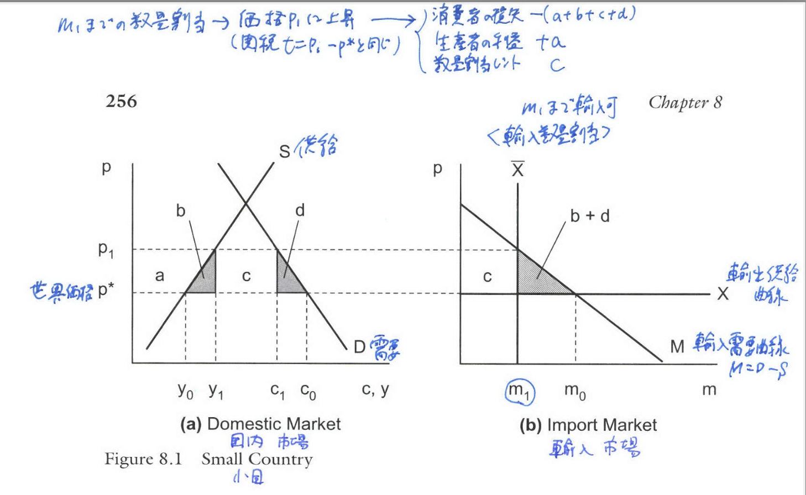
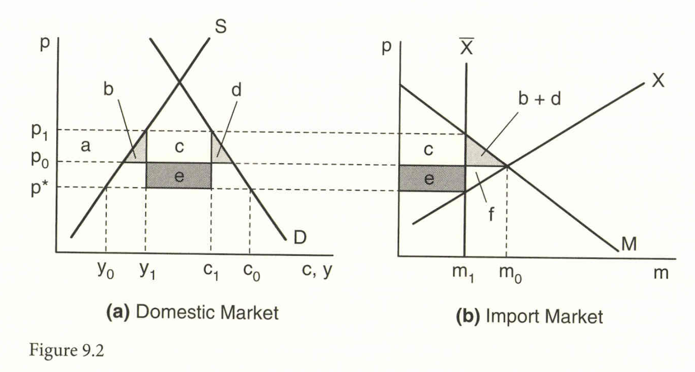
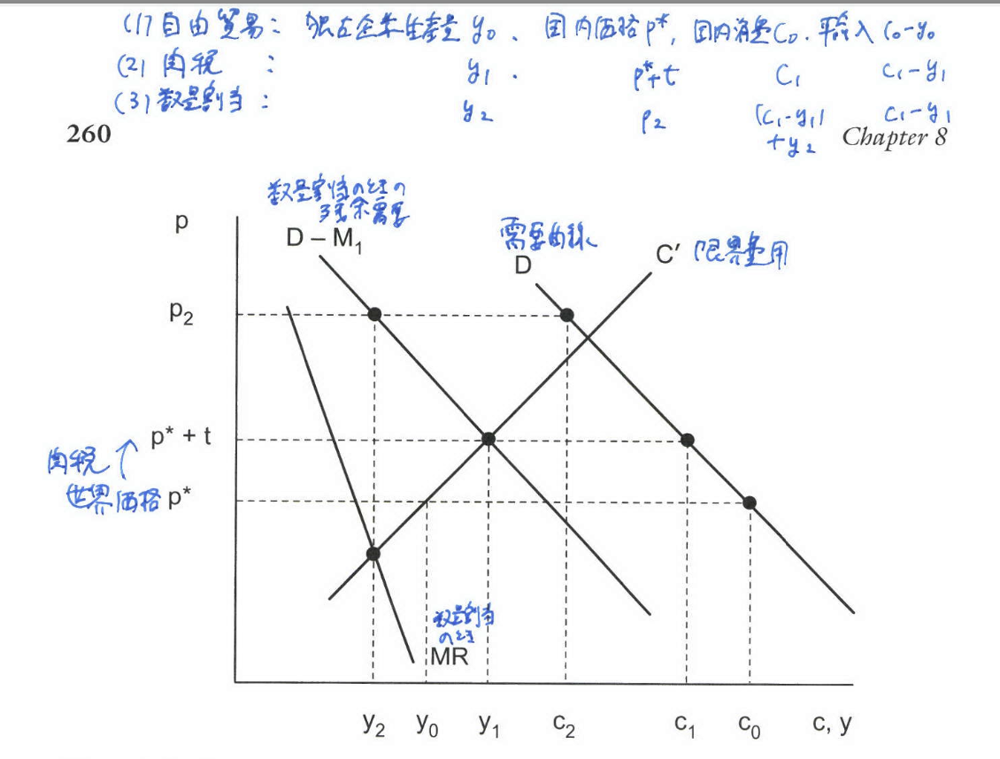
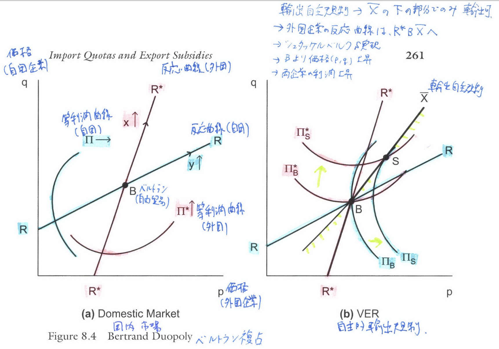
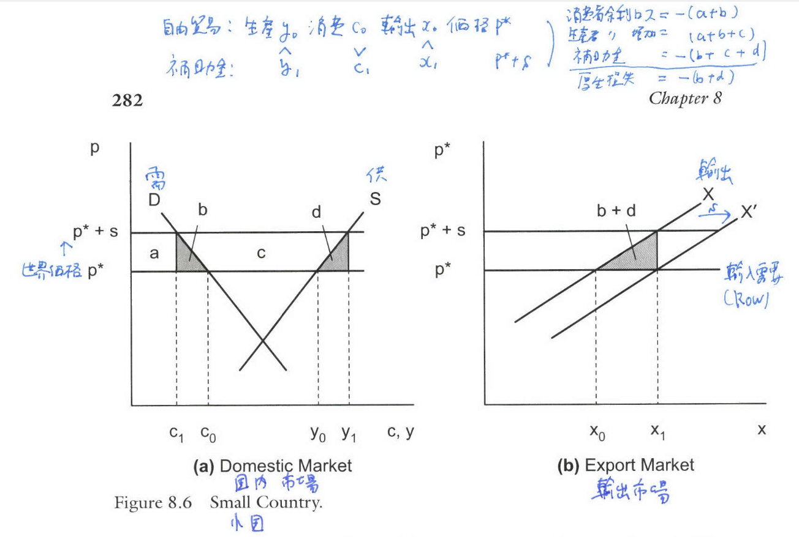
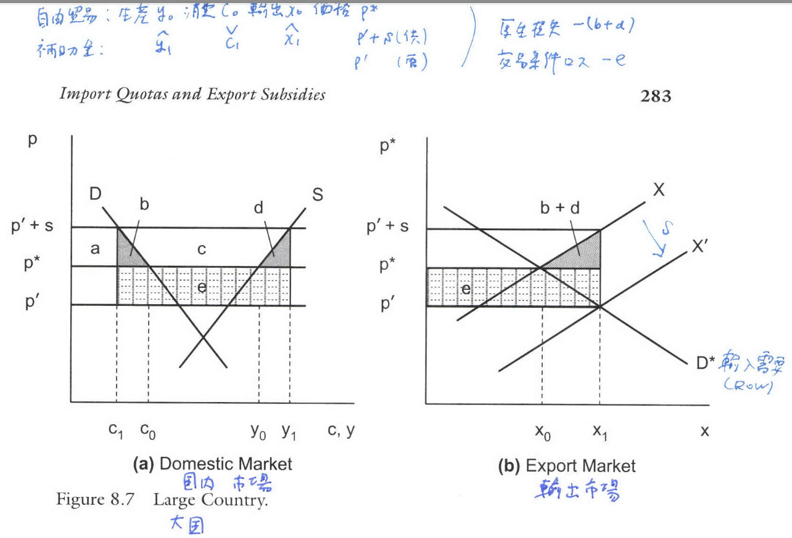
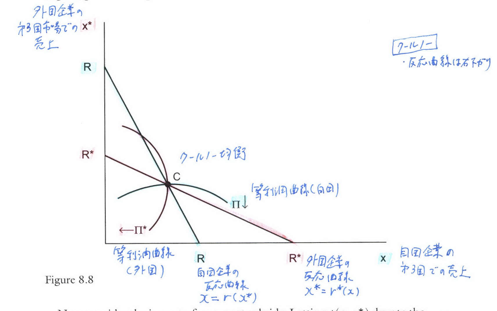
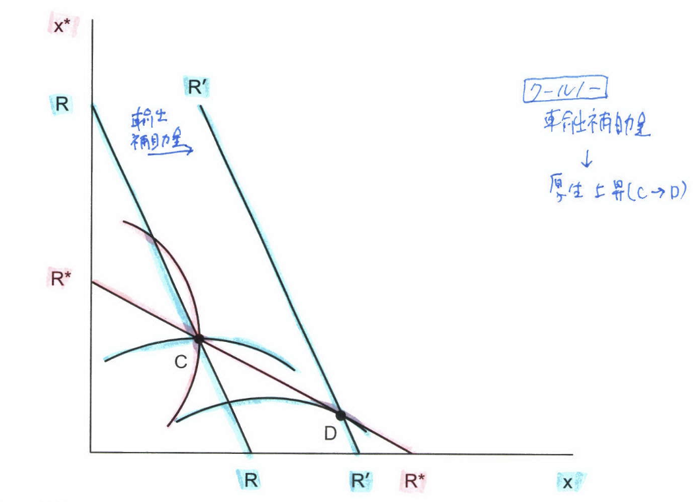
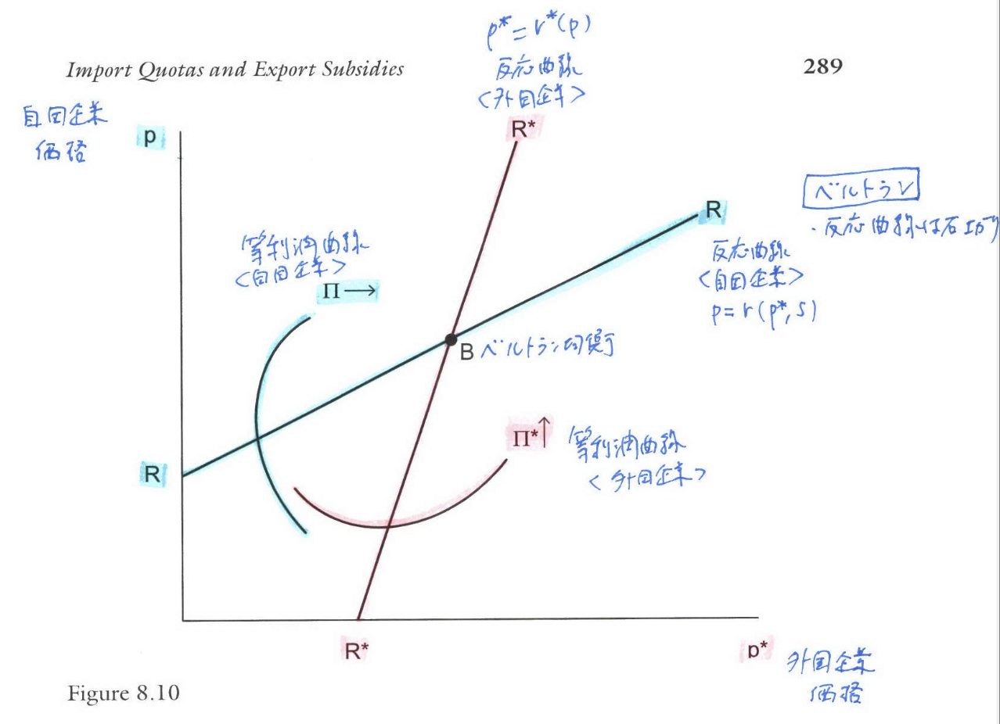
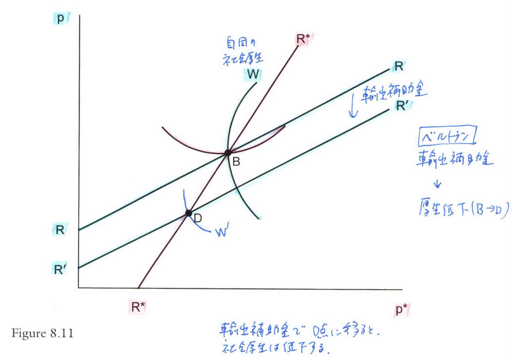

```{r setup, include=FALSE}
knitr::opts_chunk$set(echo = FALSE)
# install.packages("revealjs")
```


# 1. 序論


## 輸入割当と輸出補助金の役割

* 輸入割当（quota）と輸出補助金（export subsidy）は、貿易政策として広く用いられる手段である。
* これらの政策手段は、関税（tariff）と比較してどのような影響の違いがあるのか、またその違いが市場の競争形態によって依存するかどうかを調査する。
* **完全競争**の下では、輸入割当と関税には本質的な**等価性（Equivalence）**があるが、**不完全競争**の下ではこの等価性は破綻する。
* 割当と関税の違いは、輸出企業が製品の**品質**を選択できる場合にも生じる。

# 2. 関税と数量割当の等価性


## 完全競争下での関税と割当の等価性

* 完全競争の下では、輸入量を制限する割当は、特定の水準の関税を適用した場合と本質的に同じ効果を持つ（等価性）。
* 図9.1は、この等価性を小国経済のモデルで示している。

## Figure 9.1: Import Quota in a Small Country

* **概要**: パネル(a)は国内市場、パネル(b)は輸入市場の均衡を示すものである。自由貿易価格 $p^*$ の下で、輸入量 $m_0$ が決定される。
* **割当の影響**: 輸入割当 $X$ が課されると、パネル(b)の輸出供給曲線が垂直になり、国内価格は $p^*$ から $p_1$ へと上昇する。
* **等価性**: この価格 $p_1$ は、関税 $t = p_1 - p^*$ を課した場合と同じ国内の消費量 $c_1$ と生産量 $y_1$ をもたらすため、割当には等価な関税が存在する。

## Figure 9.1

{width=90%}

## 割当レント（Quota Rents）の発生と配分

* 割当導入による厚生変化を分析すると、消費者余剰の損失 $-(a+b+c+d)$、生産者余剰の利得 $a$ が生じる。
* 領域 $c$ は、国内価格 $p_1$ と世界価格 $p^*$ の差、すなわち $(p_1 - p^*) \times m_1$ に等しい**割当レント**となる。
* このレント $c$ の帰属によって、国内厚生への影響が大きく異なる。

## 割当レントの配分方法

1.  **国内企業への付与**: レント $c$ は国内企業に帰属し、厚生損失は関税と同じ $-(b+d)$ となる。
2.  **レントシーキング（Rent Seeking）**: 割当免許獲得のための非効率な活動に $c$ が浪費される場合、厚生損失は $-(b+d+c)$ となり、関税よりも大きくなる。
3.  **政府による競売**: 競売により政府がレント $c$ を徴収する場合、厚生損失は関税と同じ $-(b+d)$ となる。
4.  **輸出国の政府への付与 (輸出自主規制/VRA)**: **輸出自主規制**の下では、レント $c$ は外国生産者に帰属するため、輸入国（国内）の厚生損失は $-(b+d+c)$ となり、関税よりも大きくなる。

## Figure 9.2: 大国における輸入数量割当


* **概要**: 大国が割当を課した場合を示す図である。大国では外国の輸出供給が上向きに傾斜しているが、輸出自主規制の下では割当レント（$c$ または $c+e$）が外国生産者に帰属する。
* **厚生への影響**: 輸入国の死荷重損失は $b+d$ であり、輸出自主規制の場合、レント $c$ の分だけ関税よりも損失が大きくなる。

## Figure 9.2

{width=90%}


# 3. 不完全競争下での等価性の破綻

## 不完全競争による等価性の破綻

* 国内市場に不完全競争が存在する場合、割当は国内企業に「保護された」市場を生み出し、関税とは異なり、価格を大きく上昇させ、販売量を減少させる可能性がある。

## Figure 9.3: 国内独占

* **概要**: 固定された世界価格 $p^*$ の下で、国内独占企業に対する関税と割当の影響を比較する。
* **関税 $t$ の影響**: 国内価格は $p^*+t$ となり、生産量は $y_t$ となる。
* **割当 $X$ の影響**: 関税と同じ輸入量 $m_t$ をもたらす割当 $X$ が課されると、独占企業は価格 $p_q$ を設定し、生産量 $y_q$ を供給する。
* **非等価性**: 割当価格 $p_q$ は関税価格 $p^*+t$ よりも高くなり、国内生産量 $y_q$ は $y_t$ よりも低くなる。これは、割当が独占企業に参入障壁として機能し、**独占による歪みを悪化させる**ためである。

## Figure 9.3: 国内独占

{width=90%}


## ベルトラン複占下の輸出自主規制

* 国内企業と外国企業が価格競争（ベルトラン競争）を行う市場を考える。
* **輸出自主規制（VER, Voluntary Export Restraint）の影響**: 外国企業が輸出自主規制により輸出量 $x$ を制限されると、国内企業は外国企業が価格を上げるしかない状況を利用し、価格設定において**シュタッケルベルク・リーダー**のように振る舞うことができる。
* **結果**: 均衡は価格が大きく上昇する点へと移動する（図9.4(b)の B から S へ）。
* **共謀の促進**: この価格上昇により、国内企業と外国企業の両方の利潤が増加する。このため、輸出自主規制は企業間の**共謀を促進する慣行（facilitating practice）**として機能すると指摘される。

## Figure 9.4: ベルトラン複占における輸出自主規制

{width=90%}


# 4. 品質選択による等価性の破綻

## 品質選択の理論的枠組み

* 関税と割当が異なる影響を持つ第三の理由として、輸出企業が製品の品質 $z_i$ を内生的に選択できることが挙げられる。
* 企業は、品質調整済み価格 $q_i = \frac{p_i}{z_i}$ に基づき、利潤を最大化するよう価格 $p_i$ と品質 $z_i$ を同時に選択する。
* 自由貿易の下では、品質 $z_i$ の最適選択は、品質の平均費用と限界費用が等しい条件で決定される。

$$
\frac{g_i(z_i)}{z_i} = g'_i(z_i) \tag{9.5}
$$

## 輸出自主規制による品質改善

* 外国企業が割当制約に直面し、ラグランジュ乗数 $\lambda$ が正の値をとる場合、品質の最適選択条件は以下のように変化する。
$$
\frac{g_i(z_i)}{z_i} = g'_i(z_i) - \frac{\lambda}{z_i} \tag{9.5'}
$$

* **品質改善**: この式から、割当制約 $\lambda > 0$ の増加は、企業にとっての品質あたりの限界費用を相対的に低下させるため、**品質 $z_i$ の増加（品質改善）**を引き起こす。
* これは、輸送費用 $T$ の増加が品質を上げる**ワシントン・アップル効果**と同様の結果である。
* 一方、従価関税 $t$ は、品質 $z_i$ の最適選択に影響を与えない。


## 日本の自動車輸出自主規制の事例

* 1980年代の米国による対日自動車輸出自主規制の導入後、日本の自動車生産者は、理論的予測通り、**モデル特性の著しい改善**を実施した。
* 1980年から1985年にかけて、日本の自動車の品質指数（Unit-Quality）は合計で1,650ドル増加したが、同時期のトラック（関税の対象）ではこれほどの変化は見られなかった。
* この実証結果は、**輸出自主規制が品質改善を促す**という理論的予測を強く支持するものである。


# 5. 貿易財の品質の測定

## 品質調整済み価格の推定

* 製品特性が観察されない場合でも、価格情報から品質 $z_i$ を推定し、品質調整済み価格 $q_i = \frac{p_i}{z_i}$ を得る試みがなされている。
* Feenstra and Romalis (2014) は、独占的競争下での需要側と供給側（ゼロ利潤条件）のモデルを組み合わせ、2カ国 $i$ と $j$ の相対的な品質調整済み輸出価格の比を導出した。

$$
\frac{q_i^k}{q_j^k} = \left( \frac{p_i^k}{p_j^k} \right)^{1-\theta} \left( \frac{p_i^{*k}}{p_j^{*k}} \right)^{\theta - \frac{1}{\sigma}} \left( \frac{f_k^i}{f_k^j} \right)^{\frac{1}{\sigma(\sigma-1)}} \tag{9.17}
$$

* ここで $p_i^k$ は c.i.f.価格、$p_i^{*k}$ は f.o.b.価格である。

## Figure 9.5: 輸出価格、品質、品質調整済み輸出価格

* **概要**: 所得（一人当たり実質GDP）と、未調整輸出価格（トップ）、推定品質指数（セカンド）、品質調整済み価格（サード）の関係を示す。
* **結果**: 裕福な国はより高価な財を輸出するが、その高価格のほとんどは**品質の高さ**によって説明される。品質調整済み価格の変動は、生の価格変動に比べて非常に少ない。

## Figure 9.7: 交易条件（未調整・品質調整済み）

* **概要**: 品質調整前後の交易条件と所得の関係を示す。
* **品質調整済み交易条件**: 品質調整前の交易条件は所得と関係がないが、品質調整後の「真の交易条件」は、所得水準に対して**弱く負の関係**にある（セカンドパネル）。
* **結論**: この結果は、裕福な国は貧しい国よりも「真の」品質調整済み交易条件が低い傾向にあることを示唆している。


# 6. 輸出補助金

## 完全競争下の輸出補助金（小国）

* **小国の場合**: 輸出補助金（export subsidy）$s$ は国内価格を $p^*+s$ に上昇させ、国内の死荷重損失 $-(b+d)$ を発生させるため、厚生は**常に低下する**。


## Figure 9.8: 小国における輸出補助金

{width=90%}

## 完全競争下の輸出補助金（大国）

* **大国の場合（Figure 9.9）**: 輸出供給の増加により世界価格 $p^*$ が低下し、**交易条件が損失する**。厚生損失は、死荷重損失 $(b+d)$ に加え、交易条件損失 $(e)$ が発生し、**曖昧さなく厚生を低下させる**。

## Figure 9.9: 大国における輸出補助金

{width=90%}

## 多財モデルとターゲット型補助金

* 輸出補助金が、補助金対象財の交易条件損失を克服できるほど、他の輸出財の交易条件を改善できれば、厚生が向上する可能性がある。
* **Itoh and Kiyono (1987) の研究**: リカード・モデル（連続的な財）において、特定の財群に**ターゲットを絞った輸出補助金**を適用した場合、歳入コストを一次の利得よりも小さくできるため、**厚生を改善できる**ことが示されている。


# 7. 不完全競争下での補助金


## 戦略的貿易政策の可能性

* 不完全競争下（特に第三国市場への輸出）では、輸出補助金が国内企業に戦略的優位性を与え、利潤を増加させ、補助金コストを上回る利益をもたらす**戦略的貿易政策**の可能性が生じる。

## クールノー複占（数量競争）

* **補助金の影響**: 輸出補助金 $s$ は自国企業の反応曲線 RR を右にシフトさせ（図9.11）、自国企業の輸出 $x$ を増加させ、外国企業の輸出 $x^*$ を減少させる。
* **結論**: Brander and Spencer (1985) は、クールノー複占下では、**輸出補助金は国内厚生を向上させる**ことを示した。これは、国内企業が数量コミットメントを通じて外国企業から利潤を移転できるためである。

## Figure 9.10: クールノー複占

{width=90%}


## Figure 9.11: クールノー複占における輸出補助金

{width=90%}

## ベルトラン複占（価格競争）

* **補助金の影響**: 輸出補助金 $s$ は自国企業に価格 $p$ を下げるインセンティブを与える（図9.13）。
* **結論**: Eaton and Grossman (1986) は、ベルトラン複占下では、輸出補助金は価格競争を激化させ、厚生を低下させることを示した。この場合、厚生を向上させるためには、補助金ではなく**輸出税**が必要となる。


## Figure 9.12: ベルトラン複占

{width=90%}

## Figure 9.13: ベルトラン複占における輸出補助金

{width=90%}

## THEOREM 

* **定理 (BRANDER AND SPENCER 1985; EATON AND GROSSMAN 1986)**

(a) クールノー複占の下では、輸出補助金は国内厚生を向上させる。

(b) ベルトラン複占の下では、輸出税は国内厚生を向上させる。


## 戦略的貿易政策の限界

* 戦略的貿易政策は、市場の競争形態（クールノーかベルトランか）に**極めて敏感**であるため、政府が競争形態を正確に把握できない場合、厚生を改善する政策を実施することは不可能となる。
* また、補助金が内生的な政策（輸出業者の価格決定に依存する）として扱われる場合、クールノー競争下でも厚生を改善しないことが示されている。


# 8. 商業用航空機への補助金

## 商業用航空機市場の実証研究

* **事例**: 米国（ボーイング）と欧州（エアバス）による大型旅客機市場は、補助金戦争の好例として研究されている。
* **実証研究**: Irwin and Pavcnik (2004) は、1992年の補助金制限合意により、民間航空機の価格が 3.1〜8.8% 上昇したと推定した。
* **A-380のシミュレーション**: ベルトラン競争を仮定したシミュレーションでは、エアバスA-380のような新製品の市場参入は、大幅な割引がないと需要が極端に低くなること、そして市場シェアをめぐる競争（共食い効果）を反映したマークアップ設定が行われていることを示した。

Feenstra教授の第9章「輸入割当と輸出補助金」の結論（CONCLUSIONS）は、関税、輸入割当、輸出補助金の厚生効果と、市場の競争構造に依存する政策手段の非等価性について要約している。

# 9. 結論{-}

## 輸入割当と関税の比較

*   **関税の厚生効果**：外生的な関税は、(a)死荷重損失、(b)交易条件効果、(c)国内企業のアウトプット増加による独占歪みの軽減という3つの効果を持つ。輸入割当についても同様の分解が適用される。
*   **輸出自主規制と厚生損失**：輸入割当レントを輸出国に譲渡する輸出自主規制の場合、潜在的な交易条件の利益は損失となる。

## 不完全競争下での輸入割当

### 不完全競争下での割当の影響

輸入国にとっての唯一の潜在的な利得源は、割当が独占による歪みを相殺するほど国内生産を大きく増加させた場合である。

しかし、実際には、国内独占やベルトラン複占の下では、割当は価格上昇と国内生産量の減少につながり、**独占による歪みを悪化させる**可能性が高いことが判明している。

## 輸出補助金の厚生効果

*   **完全競争下の効果**：完全競争下の2財モデルにおいて、輸出補助金による厚生基準は、(a)死荷重損失と(b)交易条件効果である。大国にとって関税は交易条件を改善するが、輸出補助金は**交易条件を悪化させる**ため、厚生は曖昧さなく低下する。

*   **多財モデルでの可能性**：財が多いモデルでは、特定の財に**ターゲットを絞った輸出補助金**が、他の輸出財の交易条件を改善することで、収益コストを上回り、厚生を向上させる可能性が示されている（リカードモデルによるIto and Kiyonoの分析結果）。

## 不完全競争下での輸出補助金

*   **戦略的貿易政策（第三国市場への販売）**：不完全競争下で第三国市場への販売を考察する場合、厚生は輸出利益と補助金費用の差となる。
    *   **クールノー競争**：輸出補助金は厚生を向上させる。
    *   **ベルトラン競争**：輸出補助金は厚生を向上させない（輸出税が必要）。
*   **政策実施の困難性**：最適政策（補助金か輸出税か）は競争形態（クールノーかベルトランか）に**極めて敏感**であるため、政府が競争形態を把握することは非常に難しく、厚生を改善する形でこの政策を実施することは不可能となる。


## 実証分析との関連

*   輸入割当と輸出補助金の分析は、しばしば**差別化された製品**を生産する**多製品企業**が関与する産業を対象とする点で、実証的に関連付けられている。
*   こうした産業に適用可能な**ヘドニック回帰**やBerry (1994) による需要と価格の推定といった実証的技法が導入された。


## 主な参考文献I

\footnotesize

* Anderson, S. P., de Palma, A., & Thisse, J.-F. (1992). *Discrete Choice Theory of Product Differentiation*. MIT Press.
* Bhagwati, J. N. (1965). On the Equivalence of Tariffs and Quotas. In R. E. Baldwin et al. (Eds.), *Trade Growth and the Balance of Payments: Essays in Honor of Gottfried Haberler* (pp. 53–67). Rand-McNally.
* Brander, J. A., & Spencer, B. J. (1985). Export Subsidies and International Market Share Rivalry. *Journal of International Economics*, *16*, 83–100.
* Eaton, J., & Grossman, G. M. (1986). Optimal Trade and Industrial Policy under Oligopoly. *Quarterly Journal of Economics*, *101*(2), 383–406.

## 主な参考文献II

\footnotesize

* Feenstra, R. C. (1988a). Quality Change under Trade Restraints in Japanese Autos. *Quarterly Journal of Economics*, *103*(1), 131–146.
* Feenstra, R. C., & Romalis, J. (2014). International Prices and Endogenous Quality. *Quarterly Journal of Economics*, *129*(2), 477–528.
* Harris, R. (1985). Why Voluntary Export Restraints Are 'Voluntary.' *Canadian Journal of Economics*, *18*(4), 799–809.
* Irwin, D. A., & Pavcnik, N. (2004). Airbus versus Boeing Revisited: International Competition in the Aircraft Market. *Journal of International Economics*, *64*(2), 223–245.

## 主な参考文献III

\footnotesize

* Itoh, M., & Kiyono, K. (1987). Welfare-Enhancing Export Subsidies. *Journal of Political Economy*, *95*(1), 115–137.
* Krishna, K. (1989). Trade Restrictions as Facilitating Practices. *Journal of International Economics*, *26*, 251–270.
* Krueger, A. O. (1974). The Political Economy of the Rent-seeking Society. *American Economic Review*, *64*(3), 291–303.


# 確認問題 (10問){-}

## 問1

完全競争下の小国経済において、輸入割当が課され、その割当免許が輸入国の国内企業に付与された場合、国内の正味の厚生損失は関税が課された場合と比較してどうなるか。

A. 割当レントが国内企業に帰属するため、関税よりも厚生損失は小さくなる。

B. レントシーキング活動により割当レントが浪費されるため、関税よりも厚生損失は大きくなる。

C. 割当レントが関税収入 $c$ に相当するため、死荷重損失 $(b+d)$ のみとなり、関税と同じ厚生損失となる。

D. 割当レントは必ず外国に流出するため、関税よりも厚生損失は大きくなる。

## 問2

輸入割当（クォータ）が関税と異なり、輸入国に最大の厚生損失をもたらす状況は、以下のどれか。

A. 割当免許が競売にかけられ、政府がレントを徴収する場合。

B. 輸出自主規制（自主的輸出規制）として割当が実施され、割当レントが外国生産者に帰属する場合。

C. 国内に完全競争市場が成立している場合。

D. 割当が自由貿易水準よりも大きい水準で設定された場合。

## 問3

国内市場に独占企業が存在する場合、関税 $t$ と同じ輸入量 $m_t$ を達成するように割当 $X$ が課されたとき、国内価格 $p_q$ と国内生産量 $y_q$ に与える影響について、最も適切なものはどれか。

A. $p_q = p^* + t$ であり、 $y_q = y_t$ となり、等価性が成立する。

B. $p_q < p^* + t$ であり、 $y_q < y_t$ となり、独占による歪みが改善される。

C. $p_q > p^* + t$ であり、 $y_q < y_t$ となり、割当は独占による歪みを悪化させる。

D. $p_q > p^* + t$ であり、 $y_q > y_t$ となり、国内生産が大きく促進される。

## 問4

ベルトラン複占（価格競争）市場において、外国企業に対する輸出自主規制（自主的輸出規制）が「共謀を促進する慣行」として機能するとされる主な理由として、最も適切なものはどれか。

A. 輸出自主規制が国内企業にスタッケルバーグ・リーダーの優位性を与え、価格を大きく上昇させる結果、国内企業と外国企業の両方の利潤が増加するため。

B. 輸出自主規制が外国企業の限界費用を引き下げ、価格競争を激化させるため。

C. 輸出自主規制により国内企業が独占力を持たなくなるため。

D. 輸出自主規制が国内政府に大量の関税収入をもたらすため。

## 問5

外国輸出企業が製品の品質 $z$ を内生的に選択できる場合、従価関税ではなく割当（輸出自主規制）を課すことが、品質改善を促す理論的メカニズムとして機能する理由を述べた数式はどれか。ただし、$\lambda$ は割当制約のラグランジュ乗数である。

A. 割当は品質選択の最適条件 $\frac{g(z)}{z} = g'(z)$ に影響を与えないため。

B. 割当は品質選択の最適条件が $\frac{g(z)}{z} = g'(z) + t$ となるように、関税 $t$ を費用として加えるため。

C. 割当制約が緊縛的である場合、品質選択の最適条件は $\frac{g(z)}{z} = g'(z) - \frac{\lambda}{z}$ となり、$\lambda > 0$ が品質改善を促すため。

D. 割当制約は品質調整済み価格 $q=p/z$ を直接低下させるため。

## 問6

Feenstra (1988a) による1980年代の対日自動車輸出自主規制の実証研究において観察された、理論的予測を支持する現象は何か。

A. 輸出自主規制が課された後、日本の自動車価格は一切上昇しなかったこと。

B. 輸出自主規制が課された後、日本の自動車はモデル特性の改善（品質向上）を経験し、トラック（関税の対象）よりも大きな品質変化を示したこと。

C. 輸出自主規制により、割当レントの全額が米国の消費者に還元されたこと。

D. 輸出自主規制が課された時期、日本の自動車の需要は非常に非弾力的であったこと。

## 問7

Feenstra and Romalis (2014) が行った貿易財の品質測定に関する実証研究の結果、品質調整済み交易条件について得られた知見として、最も適切なものはどれか。

A. 裕福な国は高価格の製品を輸出しているが、その価格差はほとんど品質によるものではなく、真の価格調整済み価格の差であること。

B. 裕福な国と貧しい国の間の品質調整済み交易条件は、所得水準に関わらずほぼ一定であること。

C. 品質調整済み交易条件は、貧しい国よりも裕福な国の方が低くなる傾向があること。

D. 貿易財の品質は輸送費用の影響を受けず、すべての国で均一であること。

## 問8

完全競争下の**大国経済**において、輸出補助金 $s$ が社会厚生に与える影響として、最も適切なものはどれか。

A. 輸出補助金は交易条件を改善するため、厚生は常に向上する。

B. 輸出補助金は死荷重損失と交易条件損失の両方をもたらすため、曖昧さなく厚生を低下させる。

C. 輸出補助金は死荷重損失のみをもたらし、厚生変化は $-(b+d)$ となる。

D. 輸出補助金は関税と同じ効果を持ち、交易条件が改善すれば厚生は向上する可能性がある。

## 問9

不完全競争市場がクールノー複占（数量競争）の場合、輸出補助金が国内厚生を向上させるために利用される戦略的根拠（Brander and Spencer, 1985）について、最も適切なものはどれか。

A. 補助金が外国企業の限界費用を増加させるため。

B. 補助金が国内企業にスタッケルバーグ・リーダーとしての優位性を与え、国内企業の輸出量を増加させ、外国企業の輸出量を減少させるため。

C. 補助金が製品の品質を低下させ、価格競争を激化させるため。

D. クールノー競争下では、輸出補助金の歳入コストがゼロとなるため。

## 問10

戦略的貿易政策の理論的結論（Brander and Spencer, 1985; Eaton and Grossman, 1986）が、現実の政策として利用し難いとされる主な理由として、最も適切なものはどれか。

A. 補助金が常に報復を招き、世界厚生を低下させるため。

B. 政策の効果が市場競争の形態（クールノーかベルトランか）に極めて敏感であり、政府がその競争形態を正確に把握できないため。

C. 輸出補助金は常に利潤移転効果を持たないため。

D. 輸出補助金は内生的な政策であり、輸出業者が関税を避けるために価格を引き上げるインセンティブを持つため。


## 解答

| 問題番号 | 解答 |
| :------: | :--: |
| 問1 | C |
| 問2 | B |
| 問3 | C |
| 問4 | A |
| 問5 | C |
| 問6 | B |
| 問7 | C |
| 問8 | B |
| 問9 | B |
| 問10 | B |


# 解説{-}

## 問1. 完全競争下の割当レントの帰属

**解答:** C. 割当レントが関税収入 $c$ に相当するため、死荷重損失 $(b+d)$ のみとなり、関税と同じ厚生損失となる。

**解説:** 割当免許が国内企業に付与される場合、割当レント $c$ は国内に留保される。国内企業が得る利潤 $c$ は消費者余剰の損失の一部を相殺するため、正味の厚生損失は死荷重損失 $-(b+d)$ のみとなり、関税を課した場合と同じ損失となる。

## 問2. 最大の厚生損失をもたらす割当の形態

**解答:** B. 輸出自主規制として割当が実施され、割当レントが外国生産者に帰属する場合。

**解説:** 輸出自主規制は、割当レント $c$ が外国生産者に流出するため、輸入国は死荷重損失 $b+d$ に加えて、レント $c$ の全てを失う。この結果、厚生損失は $-(b+d+c)$ となり、関税を課した場合と比較して最大となる。

## 問3. 国内独占下での割当と関税の非等価性

**解答:** C. $p_q > p^* + t$ であり、 $y_q < y_t$ となり、割当は独占による歪みを悪化させる。

**解説:** 国内独占下で割当が課されると、独占企業は「保護された」市場でより大きな独占力を発揮する。その結果、同じ輸入量を達成する関税と比較して、割当価格 $p_q$ は高くなり、国内生産量 $y_q$ は低くなる（図9.3）。割当は独占による歪みを悪化させる働きを持つ。

## 問4. ベルトラン複占下での輸出自主規制の影響

**解答:** A. 輸出自主規制が国内企業にスタッケルバーグ・リーダーの優位性を与え、価格を大きく上昇させる結果、国内企業と外国企業の両方の利潤が増加するため。

**解説:** ベルトラン複占（価格競争）において輸出自主規制が課されると、国内企業は外国企業が輸出制限のために価格を上げる反応を見越して、自社も価格を大幅に引き上げることができる。これにより両社の利潤が増加し、輸出自主規制は企業間の**共謀を促進する慣行**として作用する。

## 問5. 割当による品質改善の理論的メカニズム

**解答:** C. 割当制約が緊縛的である場合、品質選択の最適条件は $\frac{g(z)}{z} = g'(z) - \frac{\lambda}{z}$ となり、$\lambda > 0$ が品質改善を促すため。

**解説:** 割当が緊縛的であるとき、ラグランジュ乗数 $\lambda > 0$ が品質の最適選択条件 (9.5') に組み込まれる。$\lambda$ は特定輸送費用 $T$ と同様に機能し、企業は品質 $z$ を高めることで利潤を維持しようとする（品質改善）。

## 問6. 対日自動車輸出自主規制における実証結果

**解答:** B. 輸出自主規制が課された後、日本の自動車はモデル特性の改善（品質向上）を経験し、トラック（関税の対象）よりも大きな品質変化を示したこと。

**解説:** Feenstra (1988a) は、対日自動車輸出自主規制（割当）の期間中、日本の自動車はモデル特性を大幅に改善させ、品質指数が大きく増加したことを実証した。これは、割当が品質改善を促すという理論（問5）を支持する。

## 問7. 品質調整済み交易条件に関する知見

**解答:** C. 品質調整済み交易条件は、貧しい国よりも裕福な国の方が低くなる傾向があること。

**解説:** Feenstra and Romalis (2014) の分析によると、裕福な国は高価格の製品を輸出入するが、これらの価格差は主に品質差によるものである。品質調整後の「真の交易条件」は、所得が低い国の方が高い傾向にあることが示された（図9.7）。

## 問8. 完全競争下の大国経済における輸出補助金の影響

**解答:** B. 輸出補助金は死荷重損失と交易条件損失の両方をもたらすため、曖昧さなく厚生を低下させる。

**解説:** 大国が輸出補助金を課すと、輸出供給が増加し、世界価格が低下する。これにより、国内の死荷重損失 $(b+d)$ に加え、交易条件が損失する $(e)$ ため、厚生は輸入関税の場合と異なり、曖昧さなく低下する。

## 問9. クールノー複占下で輸出補助金が厚生を向上させる根拠

**解答:** B. 補助金が国内企業にスタッケルバーグ・リーダーとしての優位性を与え、国内企業の輸出量を増加させ、外国企業の輸出量を減少させるため。

**解説:** クールノー複占（数量競争）では、輸出補助金は国内企業に戦略的優位性を与え、外国企業の販売量を犠牲にして自国の輸出量を増やす（利潤移転）。これにより、補助金費用を上回る利潤増加が達成され、厚生が向上する。

## 問10. 戦略的貿易政策の現実的な限界

**解答:** B. 政策の効果が**市場競争の形態（クールノーかベルトランか）に極めて敏感**であり、政府がその競争形態を正確に把握できないため。

**解説:** 戦略的貿易政策の定理は、最適政策（補助金または輸出税）が市場競争の形態に決定的に依存することを示している。政府が競争形態を正確に区別できないため、厚生を改善する政策としてこれらの戦略的介入を実施することは非常に困難である。


