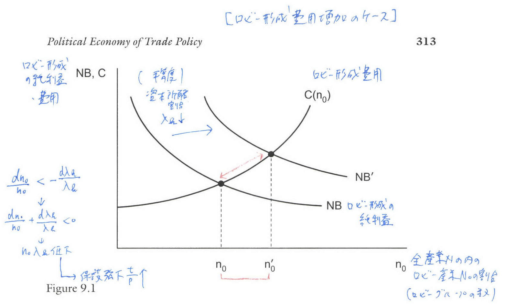
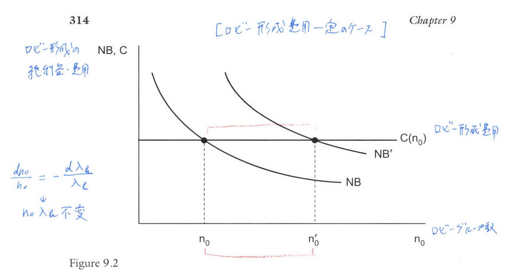
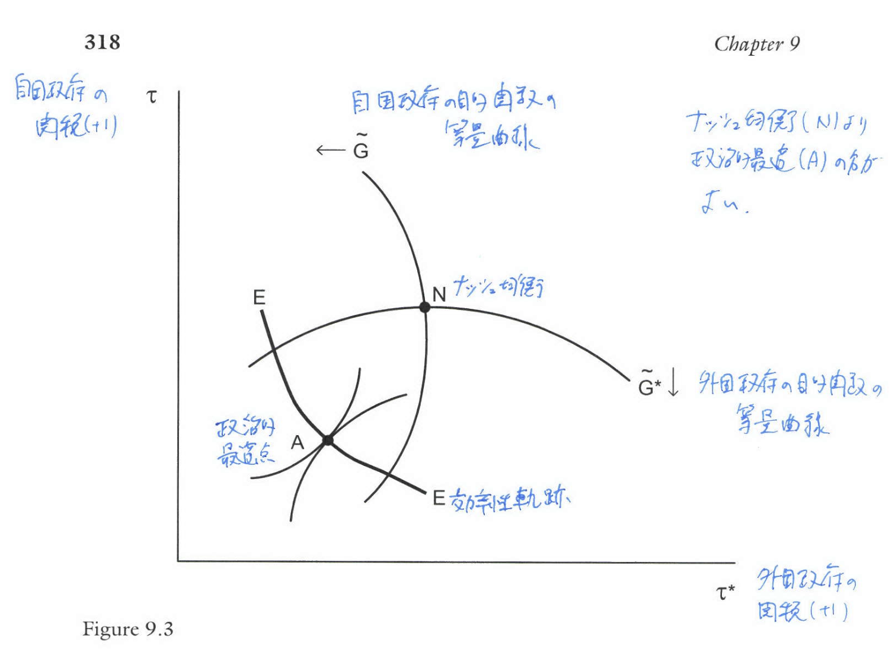
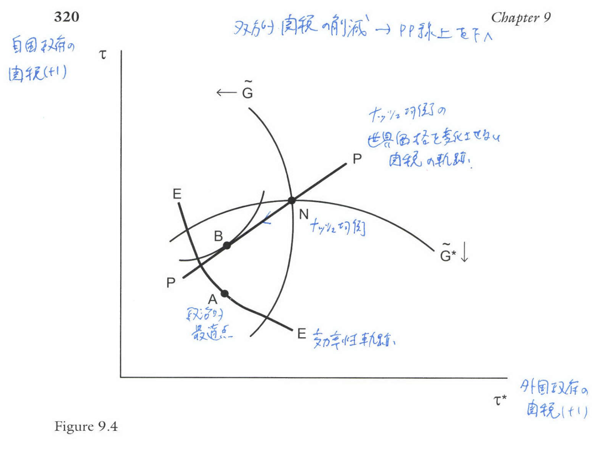

```{r setup, include=FALSE}
knitr::opts_chunk$set(echo = FALSE)
# install.packages("revealjs")
```


# 1. 序論

## 貿易政策が使用される理由

*   前章までで、不完全競争市場下において、政府が貿易政策から利益を得る機会（戦略的貿易政策）は**非常に限定的である**と結論付けられている。
*   では、なぜ貿易政策が頻繁に使用されるのかという疑問が生じる。
*   一つの答えとして、関税は産業や労働組合といった**特別利益団体（special interest groups）からの要求に対応して付与される**など、政策が政治的に動機付けられていることが挙げられる。

## 政治経済学モデルの概要

*   本章では、保護主義の政治経済学に関する研究として、以下のモデルの概要を述べる。
    *   **メイヤーの中位投票者モデル (Median Voter Model)** (Mayer, 1984)。
    *   **「保護売り出し」モデル (Protection for Sale Model)** (Grossman and Helpman, 1994)。
*   また、これらの枠組みを用いて、GATT/WTOのルール（**相互主義**や**最恵国待遇**）の経済的根拠や、**地域貿易協定**の影響について考察する。

# 2. 中位投票者モデル

## 前提と効用関数

*   中位投票者モデルは、政策が多数決によって決定されると仮定する。
*   投票される政策に対する選好が「単峰性（single peaked）」を持つならば、採用される政策は**中位投票者（Median Voter）**の効用を最大化する。
*   貿易政策への応用として、ここでは2x2の**ヘクシャー＝オリーン（HO）モデル**を仮定する。
*   家計 $h$ の準線形効用関数は $c_0^h + U(c_M^h)$ で与えられ、$c_0^h$ は輸出財（ニュメレール財）、$c_M^h$ は輸入財の消費である。

## 個人の効用と最適消費

*   個人の効用 $V(p, I^h)$ は以下で与えられる。

$$
V(p, I^h) = I^h - p^T d(p) + U[d(p)] \tag{10.1}
$$

*   ここで $I^h$ は個人の所得、$p$ は国内価格ベクトル、$d(p)$ は輸入財の最適消費量である。

## 最適関税の導出

*   個人 $h$ の所得 $I^h$ は、賃金 $w$ と資本収益 $rK^h$、および関税収入 $T$ の分配 $T/L$ から構成される。
*   個人の所得を、経済全体の総労働量 $L$ と総資本 $K$ の比率 $(\frac{K}{L})$ に対する個人 $h$ の資本/労働比率 $\rho^h = \frac{K^h}{K/L}$ を用いて書き直すことができる。

## 最適関税

*   関税 $t$ に関する効用を微分し、中位投票者 $m$ の効用を最大化する条件 $\frac{dV^m}{dt} = 0$ を設定すると、最適関税 $t^m$ は以下の式で与えられる。

$$
t^m = \frac{(\rho^m - 1)}{m'(p)} \frac{\partial r}{\partial p} K \tag{10.4}
$$

*   $p^m$ は中位投票者の相対的な資本/労働比率であり、通常 1 より小さい ($\rho^m < 1$) である。
*   $m'(p) < 0$ は輸入需要の減少を示す。
*   $\frac{\partial r}{\partial p}$ は輸入財価格 $p$ の上昇による資本収益 $r$ の変化であり、HOモデルの下では**ストルパー＝サミュエルソンの定理**により、輸入財が労働集約的であれば $\frac{\partial r}{\partial p} < 0$、資本集約的であれば $\frac{\partial r}{\partial p} > 0$ である。

## 最適関税の予測と不平等

*   上記の結果 (10.4) から、中位投票者モデルは以下の予測を導く。
    *   **資本豊富国**が労働集約的な輸入財に関税をかける場合: $\rho^m < 1$、$\frac{\partial r}{\partial p} < 0$ より $t^m > 0$ （**正の輸入関税**）となる。
    *   **労働豊富国**が資本集約的な輸入財に関税をかける場合: $\rho^m < 1$、$\frac{\partial r}{\partial p} > 0$ より $t^m < 0$ （**輸入補助金**）となる。

*   実際には輸入補助金はほとんど観察されないという限界がある。

## 不平等と貿易障壁の実証

*   Dutt and Mitra (2002) は、中位投票者の相対的資本/労働比率が低い ($\rho^m$ が小さい) ことで測られる**所得不平等の増加**が、関税に与える影響を分析した。
*   不平等度 ($1 - \rho^m$) の変化に対する最適関税の変化は、以下の関係を満たす。

$$
\frac{d t^m}{d (1 - \rho^m)} = - \frac{G_{\rho^m \tau}}{G_{\tau \tau}} = \frac{(\frac{\partial r}{\partial p}) K}{L^2 \frac{d^2 V^m}{d t^2}} \tag{10.5, 10.3'}
$$

## 不平等と貿易障壁の予測

*   $\frac{d^2 V^m}{d t^2} < 0$ が二階の条件から導かれるため。
    *   資本豊富国（労働集約的な輸入財）では $\frac{\partial r}{\partial p} < 0$ なので、**不平等が増加するほど関税は高くなる**と予測される。
    *   労働豊富国（資本集約的な輸入財）では $\frac{\partial r}{\partial p} > 0$ なので、**不平等が増加するほど関税は低下する**（または補助金が増加する）と予測される。
*   Dutt and Mitra の実証分析では、この非単調的な関係が確認され、特に民主主義国においてHOモデルに基づく中位投票者枠組みを強く支持する結果となった。

# 3. 「保護売り出し」モデル

## モデルの構造

*   「保護売り出し」モデル (Grossman and Helpman, 1994) は、政府がロビー団体からの**献金**と**消費者厚生**を同時に考慮して貿易政策を決定する代表民主主義のモデルである。
*   経済には$N$個の産業があり、それぞれの産業には**特定の要素（Specific Factor、資本 $K_i$）**が存在する。
*   総人口 $L$ のうち、特定の産業 $i$ の資本を所有する $H_i$ 人の個人がその産業のロビーを形成する。
*   政府は、献金 $R_j(p)$ と総厚生 $W(p)$ に重み $\alpha > 0$ を与えて、以下の目的関数 $G(p)$ を最大化する。

$$
G(p) = \sum_{j \in \mathcal{L}} R_j(p) + \alpha W(p) \tag{10.11}
$$

*   $\mathcal{L}$ はロビーを組織した産業の集合である。

## 均衡関税決定の枠組み

*   ロビーは、自分たちの正味の厚生（所得）を反映した「**真実の献金スケジュール (truthful contribution schedule)**」$R_j(p)$ を選択する。
*   政府の目的関数 (10.11') は、ロビー組織化産業には $(1 + \alpha)$ の重みを、その他の産業や労働者には $\alpha$ の重みを与えることを示す。

$$
G(p)=\sum_{j \in J_{o}}\left[(1+\alpha) W_{j}(p)-B_{j}\right]+\sum_{j \notin J_{o}} \alpha W_{j}(p) \tag{10.11'}
$$


## 均衡関税
*   政府が目的関数を最大化する価格 $p_i = p_i^* \tau_i$ を選択する条件（一階の条件）から、均衡関税 $t_i = p_i - p_i^*$ は以下の単純な式で与えられる。

$$
\frac{t_i}{p_i^* + t_i} = - \frac{1}{\epsilon_i} \left( \frac{\delta_i - \lambda_{\mathcal{L}}}{1 - \lambda_{\mathcal{L}} + \frac{\alpha}{L}} \right) \frac{y_i}{m_i} \tag{10.15}
$$

*   ここで、$\epsilon_i$ は輸入需要の弾力性、$\frac{y_i}{m_i}$ は生産量と輸入量の比率、$\lambda_{\mathcal{L}}$ はロビー組織化産業の特定要素を所有する人口の割合、$\delta_i$ は産業 $i$ が組織化されている場合に1、そうでない場合に0をとる指標変数である。

## 予測

*   この式 (10.15) から、ロビー組織化産業 ($\delta_i=1$) は正の関税（輸入関税または輸出補助金）を受け取る傾向にあるが、**非組織化産業** ($\delta_i=0$) は負の関税（**輸入補助金または輸出税**）を受け取る傾向にあると予測される。
*   関税や補助金の大きさは、**生産/輸入比率** $(\frac{y_i}{m_i})$ と、**輸入需要弾力性の逆数**に依存する。組織化産業では、生産/輸入比率が高いほど、より高い関税/輸出補助金を受ける。

## 実証結果の概要

*   Goldberg and Maggi (1999) や Gawande and Bandyopadhyay (2000) による米国の非関税障壁に関する実証研究では、予測された係数の符号が確認された。
*   これらの研究では、政府の目的関数における消費者厚生の重み $\alpha$ は、政治献金への重み（標準化されている）よりも**非常に高い**ことが判明している。例えば、Goldberg and Maggiは$\alpha$ が献金重みの50〜100倍、Gawande and Bandyopadhyayは1,750〜3,175倍という驚くほど高い値を見出している。


# 4. 内生的なロビー形成

## ロビー形成のモデル化

*   Grossman and Helpmanの初期モデルではロビーの存在は**外生的**であったが、Mitra (1999) はロビーの形成を**内生的**にモデル化した。
*   ロビーの組織化された産業の割合 $n_{\mathcal{L}}$ と、特定要素を所有する人口の割合 $\lambda_K$ の積 $\lambda_{\mathcal{L}} = n_{\mathcal{L}} \lambda_K$ が貿易政策を決定する重要なパラメータとなる。

## Figure 10.1: ロビー組織化費用が増加する場合

*   Figure 10.1 は、ロビーを形成することによる**純利益 (NB)** と、**ロビー組織化費用 $C(n_{\mathcal{L}})$** の関係を示している。
*   費用関数 $C(n_{\mathcal{L}})$ が**増加**していると仮定される。
*   所得分配の悪化（$\lambda_K$ の低下）は、組織化された産業にさらなる利益をもたらすため、純利益曲線 NB を NB' へと**右にシフト**させる。
*   この場合、ロビーの増加率 $\frac{dn_{\mathcal{L}}}{n_{\mathcal{L}}}$ は、所得不平等の悪化によるシフト量よりも小さくなるため、均衡点 $n_{\mathcal{L}} \lambda_K$ は**低下する**。
*   結果として、貿易政策 $(t_i/p_i^*)$ は増加し、**保護水準が上昇する**。

## Figure 10.1

{width="100%"}

## Figure 10.2: ロビー組織化費用が一定の場合

*   Figure 10.2 は、ロビー組織化費用 $C(n_{\mathcal{L}})$ が**一定**であると仮定された場合を示している。
*   所得分配の悪化（$\lambda_K$ の低下）により純利益曲線が NB' へと右にシフトする。
*   費用が一定であるため、ロビーの増加率 $\frac{dn_{\mathcal{L}}}{n_{\mathcal{L}}}$ はシフト量と**等しくなる**。
*   結果として、均衡点 $n_{\mathcal{L}} \lambda_K$ は**変化しない**ため、貿易政策は変わらない。
*   この結果から、所得分配の変化が保護水準に与える全体的な影響は、**ロビー組織化費用 $C(n_{\mathcal{L}})$ の構造に極めて敏感である**ことが示唆される。

## Figure 10.2

{width="100%"}

# 5. 2国モデル

## 用語の定義と均衡

*   中位投票者モデルや「保護売り出し」モデルは通常、国際価格 $p^*$ を固定と仮定するが、国が大きい場合、関税は**交易条件**に影響を与える。
*   自国と外国の両国が関税を課す2国モデルを考えると、両国は交易条件を操作するインセンティブを持つ。
*   自国の輸入と外国の輸出が一致する市場清算条件 $m(p^*\tau) = x^*(p^*/\tau^*)$ により、世界均衡価格 $p^*(\tau, \tau^*)$ は両国の関税率に依存して決定される。
*   自国の関税 $\tau$ の上昇は、自国の輸入財の世界価格 $p^*$ を低下させる $(\frac{\partial p^*}{\partial \tau} < 0)$。

## 政治的最適とナッシュ均衡

*   政府の目的関数 $G(p^*, \tau)$ は、世界価格 $p^*$ と関税 $\tau$ の関数として一般的に書かれる。

*   **政治的最適関税 (Politically Optimal Tariff)** は、政府が世界価格 $p^*$ を固定として目的関数を最大化することで得られる関税である。
$$
G_{\tau}(p^*, \tau) = 0 \tag{10.24a}
$$


## ナッシュ均衡関税

*   **ナッシュ均衡関税 (Nash Equilibrium Tariff)** は、政府が自身の関税が交易条件に与える影響を認識した上で、相手国の関税 $\tau^*$ を所与として目的関数を最大化することで得られる関税である。
$$
\frac{\partial G}{\partial \tau} = \frac{\partial G}{\partial p^*} \frac{\partial p^*}{\partial \tau} + G_{\tau} = 0 \tag{10.25a}
$$

## Figure 10.3: ナッシュ均衡の非効率性

*   Figure 10.3 は、両国の関税 $\tau$ と $\tau^*$ の平面における、ナッシュ均衡 (N) と政治的最適点 (A) の位置関係を示している。
*   ナッシュ均衡 (N) は両国の**反応曲線**の交点として定義される。
*   図中の**効率性軌跡 (Efficiency Locus) EE** は、両国の無差別曲線が接する点を示す。

## 定理

### 定理 (Bagwell and Staiger 1999; Grossman and Helpman 1995a)

(a) ナッシュ均衡は**非効率**である。

(b) 政治的最適点は**効率的**である。

\vspace{7mm}

*   政治的最適点 A は、効率性軌跡 EE 上に位置する。
*   ナッシュ均衡 N は効率性軌跡 EE の外側に位置し、点 N の左下側には両国にとって厚生が改善する領域が存在する。これは、**ナッシュ均衡が政治的最適点 A よりも両国にとって悪い**ことを意味する。

## Figure 10.3

{width="100%"}

# 6. GATTの相互主義と地域協定

## GATTの相互主義原則

*   ナッシュ均衡の非効率性は、GATT/WTOのような国際機関が存在する重要な役割、すなわち**交易条件を操作するインセンティブを相殺または排除する**役割を正当化する。
*   GATTの**相互主義（Reciprocity）**の原則は、一方の国が貿易障壁を削減することに対し、相手国が相互的な削減を行うことを意味する。
*   Bagwell and Staiger (1999, 2002) は、2国モデルにおける相互的な関税削減は、**世界価格 $p^*$ を不変**に保つ場合に成立することを示した。

## Figure 10.4: 相互主義による厚生改善

*   Figure 10.4 は、世界価格 $p^*$ をナッシュ均衡レベルで一定に保つ関税の軌跡を**PP線**として示している。
*   PP線はナッシュ均衡点 N を通り、正の傾きを持つ。
*   ナッシュ均衡 N から PP線に沿って関税を相互的に削減すると、両国にとっての政府の目的関数 $G$ が初期には上昇する。
*   この結果は、**相互主義の原則がGATTの強力な正当性を提供する**ことを示している。
*   両国の規模が対称的であれば、PP線は効率性軌跡 EE と政治的最適点 A で交差すると主張される。


## Figure 10.4

{width="100%"}


## 自国市場効果によるGATTの合理性

*   Ossa (2011) は、交易条件効果に依存しない、GATT/WTOの原則の別の合理性を**自国市場効果**を用いて示した。
*   独占的競争の下、各国政府は市場を保護し、国内の製品多様性から得られる利益を確保するインセンティブを持つ。
*   このモデルにおいて、国 $j$ の厚生はCES価格指数 $P_j$ の逆数に等しい。
$$
W^j = \frac{1}{P_j} \tag{10.28}
$$
*   **相互的な関税変更**は、貿易収支の変化をゼロにし、**両国における企業数 $N_i$ を不変に保つ**。
*   **定理** (Ossa 2011): 相互的な貿易自由化は、**両国の厚生を単調に増加させる**。

# 7. 地域貿易協定

## 地域貿易協定のジレンマ

*   地域貿易協定 (RTA, Regional Trade Agreement) は、GATTの最恵国待遇 (MFN) の原則（Article I）に違反するが、Article XXIV で一部許可されている。
*   RTAが究極的な目標である多角的自由貿易への「**踏み石 (stepping stone)**」となるのか、あるいは「**つまずきの石 (stumbling block)**」となるのかが重要な論点である。

## HOモデル（中位投票者モデル）での結果

*   Levy (1997) は、中位投票者モデルを用いてこの問題を分析した。
*   HOモデルの下では、個人の効用 $U^1$ は、統合された世界の資本/労働比率 $k^*$ の準凸関数（quasi-convex function）となる。
*   国1の**拒否集合**（autarkyよりも厚生が低下するため自由貿易を拒否する $k^*$ の区間）は凸である (k$^{b1}$, k$^{a1}$)。
*   2国間の二国間自由貿易が両国のメディアン投票者に利益をもたらすためには、両国の拒否集合が**互いに素（disjoint）**でなければならない。

## 定理（Levy 1997）(a)

(a) 2x2 HO生産構造の下で、両国の中位投票者が二国間自由貿易から利益を得る場合、**少なくとも一国は多角的自由貿易から利益を得る**。

* したがって、HOモデルでは、二国間協定は多角的自由貿易の**障害とはなりえない**。


## 定理（Levy 1997）(b)

(b) 独占的競争と**製品多様性**を考慮した拡張モデルでは、中位投票者が閉鎖経済から多角的自由貿易で利得を得る一方で、**二国間自由貿易から多角的自由貿易へ移行する際に両国の中位投票者が損失を被る**ことが**可能である**。

*   これは、RTAが製品多様性による利益をもたらす一方で、労働集約的な第三国が加わることで相対価格が変化し、中位投票者が価格の変化から損失を被る場合などに生じる。
*   この状況では、二国間協定が多角的自由貿易の**つまずきの石**となるというBhagwatiの懸念を裏付けている。

# 8. 中国への外国投資の政治経済学

## 非民主主義国への応用 (中国)

*   Branstetter and Feenstra (2002) は、Grossman-Helpmanの枠組みを**中華人民共和国**のような非民主主義国へ適用した。
*   中国では、関税率が固定されていたため、**外国投資（FDI）**に対する政策（特に多国籍企業の参入）が、政府の目的関数に与えられた重みを「明らかにする (reveal)」ために使用された。
*   多国籍企業 (M) の参入は、**国有企業**の製品市場での競争を通じて脅威を与えるため、この二者の利益は相反する。

## 政府の目的関数と実証結果

*   各省の政府の目的関数 $G$ は、消費者/労働者効用 $U$ に重み $\alpha$、自国の国有企業利潤 $N_h \pi_h$ に重み $\beta$、多国籍企業からの税金/レント、および関税収入に重み 1 を与えて定義される。

$$
G(M, \tau, t) = \alpha U + \beta N_h \pi_h + M\tau \pi_m + (N_f - M) t d_f \tag{10.32}
$$

*   多国籍企業に課される**利益税（レント） $\tau$** の選択に関する一階の条件を推定することで、これらの重みを特定できる。

## 実証結果(Branstetter and Feenstra, 2002)

*   $\beta$ （国有企業への重み）は、$\alpha$ （消費者厚生への重み）よりも**有意に高い**ことが判明した。
*   推計では、国有企業への重みは消費者厚生の**4倍から7倍**高いと示された。
*   この結果は、消費者厚生に非常に高い重みが置かれる米国（Goldberg and Maggi, 1999）の結果と**強い対比**をなすものである。


# 9. 結論

## 政治経済学モデルの意義

*   本章では、中位投票者モデル（Mayer, 1984）と「保護売り出し」モデル（Grossman and Helpman, 1994）という二つの主要なモデルに焦点を当てた。
*   中位投票者モデルは単純化された枠組みにもかかわらず、Dutt and Mitra (2002) によって驚くべき実証的裏付けを得ている。
*   「保護売り出し」モデルは、多数の産業ロビーからの影響を政府がどのように考慮するかを説明し、米国をはじめとする多くの国で強い実証的裏付けを得ている。

## 国際的な協力と効率性

*   大国モデルでは、関税は交易条件を改善できるため、国際価格が外生的であると仮定するモデルとは異なる結果となる。
*   ナッシュ均衡関税は交易条件の操作インセンティブを含むため**非効率**であるのに対し、政治的最適関税は**効率的**である。
*   GATTの**相互主義**の原則は、関税削減が**交易条件を不変に保つ**ことで、交易条件を操作するインセンティブを排除し、ナッシュ均衡に関連する相互損失を回避する方法を提供している。

## 地域協定と多角的自由貿易

*   地域貿易協定 (RTA) が多角的自由貿易を促進するか、阻害するかの問題について、Levy (1997) の中位投票者モデルは、HOモデルの下ではRTAは**障害となりえない**ことを示した [138, 109(a)]。
*   しかし、製品多様性を考慮した拡張モデルでは、RTAが多角的自由貿易への「**つまずきの石**」となる可能性が示されている [109(b), 113]。

# 主な参考文献{-}

## 参考文献I

\footnotesize

*   Bagwell, K., & Staiger, R. W. (1999). An Economic Theory of GATT. *American Economic Review*, *89*(1), 215–248.
*   Bagwell, K., & Staiger, R. W. (2002). *The Economics of the World Trading System*. MIT Press.
*   Branstetter, L., & Feenstra, R. (2002). Trade and Foreign Direct Investment in China: A Political Economy Approach. *Journal of International Economics*, *58*(2), 335–358.
*   Dutt, P., & Mitra, D. (2002). Endogenous Trade Policy through Majority Voting. *Journal of International Economics*, *58*(1), 107–134.
*   Eaton, J., & Grossman, G. M. (1986). Optimal Trade and Industrial Policy under Oligopoly. *Quarterly Journal of Economics*, *101*(2), 383–406.

## 参考文献II

\footnotesize
*   Goldberg, P., & Maggi, G. (1999). Protection for Sale: An Empirical Investigation. *American Economic Review*, *89*(5), 1135–1155.
*   Grossman, G. M., & Helpman, E. (1994). Protection for Sale. *American Economic Review*, *84*, 833–850.
*   Grossman, G. M., & Helpman, E. (1995a). Trade Wars and Trade Talks. *Journal of Political Economy*, *103*(4), 675–708.
*   Levy, P. I. (1997). A Political-Economic Analysis of Free-Trade Agreements. *American Economic Review*, *87*(4), 506–519.
*   Mayer, W. (1984). Endogenous Tariff Formation. *American Economic Review*, *74*(5), 970–985.
*   Mitra, D. (1999). Endogenous Lobby Formation and Endogenous Protection: A Long-Run Model of Trade Policy Determination. *American Economic Review*, *89*(5), 1116–1134.
*   Ossa, R. (2011). A 'New Trade' Theory of GATT/WTO Negotiations. *Journal of Political Economy*, *119*(1), 122–152.

# 確認問題 (10問){-}

## 問1

メイヤーの中位投票者モデルにおいて、資本/労働比率が経済全体の平均よりも低い ($\rho^m < 1$) 中位投票者が政策を決定する資本豊富国を考える。この国が労働集約的な財を輸入している場合、最適関税 $t^m$ はどのような符号をとるか。

A. $\frac{\partial r}{\partial p} > 0$ であるため、最適関税は負（輸入補助金）となるである。

B. $\rho^m < 1$ であり、ストルパー＝サミュエルソンの定理より $\frac{\partial r}{\partial p} < 0$ となるため、最適関税は正（輸入関税）となるである。

C. 自由貿易が政治的最適となるため、最適関税はゼロとなるである。

D. $\rho^m$ が 1 より小さいかどうかに関わらず、最適関税は世界価格 $p^*$ に等しくなるである。

## 問2

中位投票者モデルに基づくDutt and Mitra (2002) の研究において、所得不平等（$1 - \rho^m$）の増加が関税水準に与える影響について、最も適切な予測はどれか。

A. 所得不平等が増加すると、資本豊富国および労働豊富国の両方で関税は一律に上昇するである。

B. 資本豊富国では不平等が増加すると関税は高くなるが、労働豊富国では不平等が増加すると関税は低下する（または補助金が増加する）である。

C. 資本豊富国では不平等が増加すると関税は低下するが、労働豊富国では不平等が増加すると関税は高くなるである。

D. 中位投票者モデルは、所得不平等の影響を分析するには適さないである。

## 問3

Grossman and Helpman (1994) の「保護売り出し」モデルにおいて、ロビーを組織していない産業 ($\delta_i = 0$) に課される均衡関税 $t_i$ の一般的な予測はどれか。ただし、ロビー組織化産業の特定要素所有者の人口割合 $\lambda_{\mathcal{L}}$ は $0 < \lambda_{\mathcal{L}} < 1$ とし、$\frac{y_i}{m_i} > 0$ とする。

A. $t_i$ は正であり、輸入関税が課されるである。

B. $t_i$ は負であり、輸入補助金または輸出税が課されるである。

C. $t_i$ はゼロとなり、自由貿易が適用されるである。

D. $t_i$ は無限大となり、輸入が禁止されるである。

## 問4

Grossman and Helpman (1994) のモデルの実証研究（Goldberg and Maggi, 1999など）から得られた主要な知見として、最も適切なものはどれか。

A. 産業の政治献金は、政府の目的関数において消費者厚生よりもはるかに大きな重みを持つである。

B. 政府の目的関数において、消費者厚生に与えられる重み ($\alpha$) は、ロビーからの献金に与えられる重みよりも非常に高いである。

C. 均衡関税水準は、生産量と輸入量の比率に全く依存しないである。

D. 非組織化産業に輸入補助金が頻繁に観察されるというモデルの予測が強く実証されたである。

## 問5

\footnotesize

Mitra (1999) による内生的なロビー形成モデルにおいて、所得不平等の悪化（特定要素を所有する人口の割合 $\lambda_K$ の低下）が貿易保護水準に与える影響は、ロビー組織化費用 $C(n_{\mathcal{L}})$ の形状に敏感である。もし $C(n_{\mathcal{L}})$ が一定であった場合、貿易保護水準（関税）はどうなるか。

A. 所得不平等の悪化はロビーの純利益曲線（NB）を右にシフトさせ、均衡における $\lambda_{\mathcal{L}}$ は不変となるため、貿易政策は**変化しない**である。

B. 所得不平等の悪化は $\lambda_{\mathcal{L}}$ を低下させるため、貿易保護水準は**一律に上昇する**である。

C. $C(n_{\mathcal{L}})$ が一定の場合、ロビーは形成されないため、貿易保護水準はゼロとなるである。

D. 所得不平等の悪化はロビーの増加を促し、競争激化により貿易保護水準は**低下する**である。

## 問6

Bagwell and Staiger (1999) の2国モデルにおいて、両国が交易条件効果を認識し、相互に最適関税を課し合うことで到達する**ナッシュ均衡（N）**の効率性に関する結論はどれか。

A. ナッシュ均衡は、両国が政治的最適点（A）で得られる厚生よりも劣るが、効率性軌跡（EE）上にあるため効率的であるである。

B. ナッシュ均衡は効率的であり、両国にとっての最適な結果をもたらすである。

C. ナッシュ均衡は非効率的であり、その左下側には両国にとって厚生が改善する領域が存在するである。

D. 政治的最適点（A）はナッシュ均衡点（N）よりも関税が高くなるため、厚生は必ず低下するである。

## 問7

GATTの原則である**相互主義（Reciprocity）**をBagwell and Staigerの枠組みで解釈した場合、相互的な関税削減はどのような条件を満たす必要があるか。

A. 関税削減により、両国の国内価格が関税削減前の水準に保たれること。

B. 関税削減により、両国がナッシュ均衡点に戻ること。

C. 関税削減により、両国の政府が支払う補助金の総額がゼロになること。

D. 関税削減により、世界価格 $p^*$ が不変に保たれること。

## 問8

Ossa (2011) が提示した、GATTの原則を正当化するもう一つの理論的根拠（自国市場効果）において、相互的な貿易自由化が厚生を改善させる主なメカニズムは何か。

A. 交易条件が改善し、死荷重損失がゼロとなるためである。

B. 独占的競争の下で、相互的な関税削減が企業数（製品多様性）を不変に保ちつつ、両国の厚生を単調に増加させるためである。

C. 関税削減により、すべての企業が利潤を移転できるためである。

D. 地域貿易協定の形成が、多角的自由貿易への「踏み石」となるためである。

## 問9

Levy (1997) による中位投票者モデルの結果について、HOモデルと製品多様性を考慮した拡張モデルの比較として、最も適切なものはどれか。

A. HOモデルでは二国間協定は多角的自由貿易を阻害しないが、製品多様性モデルでは「つまずきの石」となる可能性がある。

B. HOモデルでは二国間協定は多角的自由貿易を阻害するが、製品多様性モデルでは常に促進する。

C. どちらのモデルにおいても、二国間協定が成立すれば、多角的自由貿易は常に達成される。

D. どちらのモデルにおいても、多角的自由貿易が閉鎖経済よりも利益をもたらすならば、二国間協定は常に多角的自由貿易の「踏み石」となる。

## 問10

Branstetter and Feenstra (2002) による中国のFDI政策に関する実証研究で、政府の目的関数における国有企業（State-Owned Enterprises, SOEs）の利潤に与えられる重み ($\beta$) と消費者厚生に与えられる重み ($\alpha$) の関係について得られた主要な知見は何か。

A. 中国では米国と同様に、消費者厚生の重み ($\alpha$) が国有企業利潤の重み ($\beta$) よりも大幅に高かったである。

B. 国有企業利潤の重み ($\beta$) は、消費者厚生の重み ($\alpha$) よりも有意に高く、その比率は4倍から7倍であったである。

C. $\alpha$ も $\beta$ もゼロであり、中国政府はこれらの要素を目的関数に含めていなかったである。

D. 国有企業への重みは、1990年代を通じて増加し続けたである。

## 解答

| 問題番号 | 解答 |
| :------: | :--: |
| 問1 | B |
| 問2 | B |
| 問3 | B |
| 問4 | B |
| 問5 | A |
| 問6 | C |
| 問7 | D |
| 問8 | B |
| 問9 | A |
| 問10 | B |

# 解説{-}

## 問1. 中位投票者モデルにおける最適関税

**解答:** B. $\rho^m < 1$ であり、ストルパー＝サミュエルソンの定理より $\frac{\partial r}{\partial p} < 0$ となるため、最適関税は正（輸入関税）となる。

**解説:** 中位投票者の相対的資本/労働比率 $\rho^m$ は 1 より小さい ($\rho^m < 1$) である。輸入財が労働集約的である場合、輸入財価格 $p$ の上昇は資本収益 $r$ を低下させる（ストルパー＝サミュエルソンの定理 $\frac{\partial r}{\partial p} < 0$）。最適関税の式 $t^m = \frac{(\rho^m - 1)}{m'(p)} \frac{\partial r}{\partial p} K$ において、分子の $(\rho^m - 1)$ は負、$\frac{\partial r}{\partial p}$ は負、分母の $m'(p)$ は負であるため、全体として $t^m$ は正となり、輸入関税が最適となる。

## 問2. 所得不平等と関税水準

**解答:** B. 資本豊富国では不平等が増加すると関税は高くなるが、労働豊富国では不平等が増加すると関税は低下する（または補助金が増加する）。

**解説:** 不平等度の増加（$\rho^m$ の低下）は、最適関税 $t^m$ を決定する式 (10.5) に影響を与える。資本豊富国（労働集約的な輸入財、$\frac{\partial r}{\partial p} < 0$）では、不平等が増加するほど関税は高くなり、労働豊富国（資本集約的な輸入財、$\frac{\partial r}{\partial p} > 0$）では、不平等が増加するほど関税は低下する（または輸入補助金が増加する）と予測されるである。Dutt and Mitra (2002) はこの予測を実証的に確認している。

## 問3. 「保護売り出し」モデルにおける非組織化産業の関税

**解答:** B. $t_i$ は負であり、輸入補助金または輸出税が課される。

**解説:** 均衡関税の式 (10.15) $\frac{t_i}{p_i^* + t_i} \propto (\delta_i - \lambda_{\mathcal{L}})$ において、非組織化産業では $\delta_i = 0$ であるため、$(\delta_i - \lambda_{\mathcal{L}}) = -\lambda_{\mathcal{L}}$ は負となる。したがって、関税 $t_i$ は負となり、政府は非組織化産業に対して輸入補助金または輸出税を適用することで、国内価格 $p_i$ を下げて消費者利益に貢献すると予測される。

## 問4. 「保護売り出し」モデルの実証結果

**解答:** B. 政府の目的関数において、消費者厚生に与えられる重み ($\alpha$) は、ロビーからの献金に与えられる重みよりも非常に高い。

**解説:** Goldberg and Maggi (1999) や Gawande and Bandyopadhyay (2000) の実証研究では、推定された $\alpha$ は、政治献金に与えられる重みよりも50倍から3,000倍程度高いことが示され、政府が消費者厚生を重視しているという驚くべき知見が得られている。

## 問5. 内生的なロビー形成（費用一定の場合）

**解答:** A. 所得不平等の悪化はロビーの純利益曲線（NB）を右にシフトさせ、均衡における $\lambda_{\mathcal{L}}$ は不変となるため、貿易政策は**変化しない**。

**解説:** ロビー組織化費用 $C(n_{\mathcal{L}})$ が一定の場合（Figure 10.2）、所得不平等の悪化（$\lambda_K$ の低下）によって純利益曲線 NB が NB' にシフトする。このシフトに伴って、ロビーの数 $n_{\mathcal{L}}$ も同率で増加するため、貿易政策を決定するパラメータ $\lambda_{\mathcal{L}} = n_{\mathcal{L}} \lambda_K$ は**均衡において不変**となる。したがって、貿易保護水準は変わらない。

## 問6. ナッシュ均衡の効率性

**解答:** C. ナッシュ均衡は非効率的であり、その左下側には両国にとって厚生が改善する領域が存在する。

**解説:** Bagwell and Staiger (1999) の定理は、交易条件の操作インセンティブを含むナッシュ均衡は**非効率**であり、その結果として得られる関税は両国にとって悪影響を及ぼし、効率性軌跡 (EE) から外れていることを示しているである。ナッシュ均衡点 N の左下側には、両国がNよりも高い厚生を達成できる領域が存在する。

## 問7. GATT相互主義の条件

**解答:** D. 関税削減により、**世界価格 $p^*$ が不変に保たれる**こと。

**解説:** Bagwell and Staiger (1999) によれば、GATTの相互主義の核心的な経済的意味は、相互的な関税削減によって、貿易取引の価値が変化しない、すなわち**世界価格 $p^*$ が変化しない**ことに帰着する。これは、両国が交易条件の操作という悪しきインセンティブを相殺する役割を果たすものである。

## 問8. 自国市場効果による厚生改善メカニズム

**解答:** B. 独占的競争の下で、相互的な関税削減が企業数（製品多様性）を不変に保ちつつ、両国の厚生を単調に増加させるためである。

**解説:** Ossa (2011) のモデルでは、相互的な関税削減（Reciprocal tariff change）は、両国の差別化財セクターにおける企業数 $N$ を不変に保つことが示されている。これにより、関税の歪みだけが減少するため、相互的な貿易自由化は**両国の厚生を単調に増加させる**という定理が導かれる。

## 問9. 地域貿易協定モデルの比較

**解答:** A. HOモデルでは二国間協定は多角的自由貿易を阻害しないが、製品多様性モデルでは「つまずきの石」となる可能性がある。

**解説:** Levy (1997) のHOモデルの結果は、二国間協定が多角的協定を拒否する原因とはなりえない（つまずきの石ではない）ことを示した [109(a)]。しかし、製品多様性（独占的競争）を考慮すると、二国間協定の形成が、多角的自由貿易への移行によって中位投票者の厚生を低下させ、結果的に多角的自由貿易の**障害となる（つまずきの石）**可能性が示されている [109(b), 113]。

## 問10. 中国のFDI政策における重み

**解答:** B. 国有企業利潤の重み ($\beta$) は、消費者厚生の重み ($\alpha$) よりも有意に高く、その比率は4倍から7倍であった。

**解説:** Branstetter and Feenstra (2002) の分析では、中国政府の目的関数において国有企業利潤に与えられる重み ($\beta$) が消費者厚生の重み ($\alpha$) よりも有意に高く、その比率が4倍から7倍に達することが推定された。これは、中国のような非民主主義国が、米国のような民主主義国（消費者厚生の重みが非常に高い）とは対照的に、特定の利益団体（国有企業）の利潤を重視していることを示唆している。

