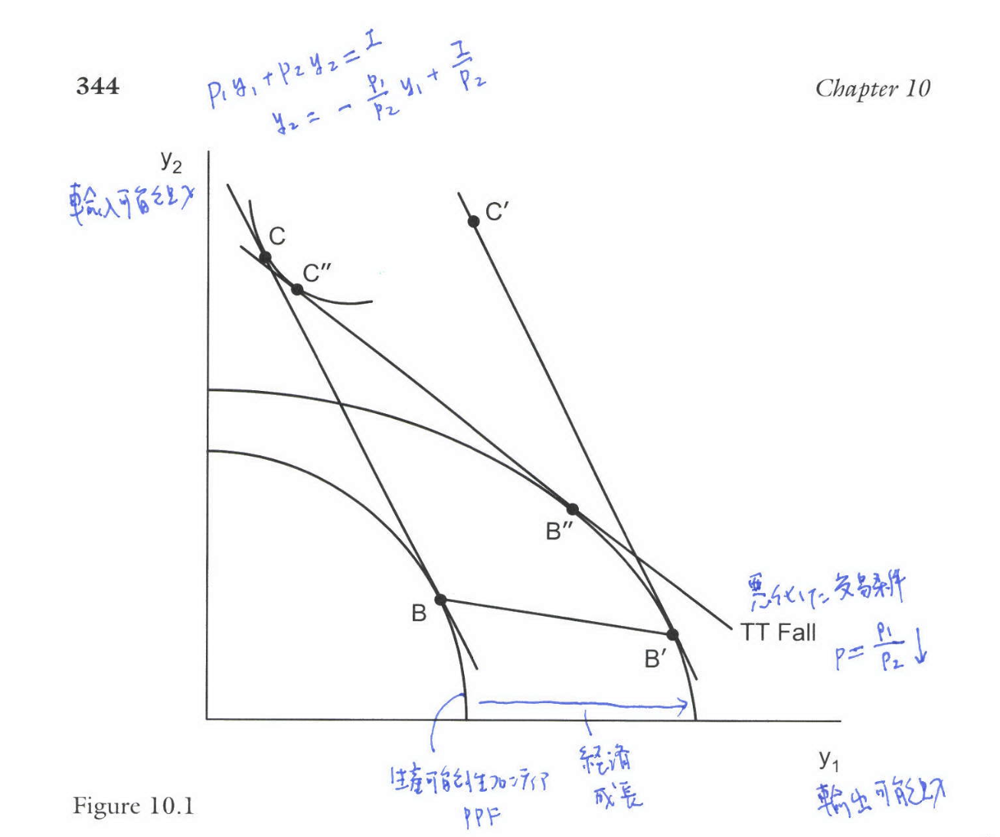

```{r setup, include=FALSE}
knitr::opts_chunk$set(echo = FALSE)
# install.packages("revealjs")
```

# 1. 序論

## 貿易と成長の関係

* 古典的なリカード・モデルでは、貿易は静学的な利益をもたらすが、成長そのもののメカニズムとは区別されていた。

* 近年の**内生的成長（Endogenous Growth）**理論では、貿易が技術進歩率や成長率そのものに与える影響を分析する。

* 本章では、生産性の測定、窮乏化成長、そして知識のスピルオーバー（波及効果）の有無による貿易の動学的効果について議論する。

# 2. 生産性の測定 (MEASUREMENT OF PRODUCTIVITY)

## 全要素生産性 (TFP) の測定

* 企業の産出量の成長は、投入要素（労働、資本）の増加と、それらでは説明できない**生産性（Productivity）**の成長に分解される。

* 完全競争と規模に関して収穫一定を仮定すると、技術進歩率 $\hat{A}_t$（ソロー残差）は以下のように測定できる。

$$
\text{TFP}_t = \hat{y}_t - [\theta_{Lt}\hat{L}_t + (1 - \theta_{Lt})\hat{K}_t] \tag{11.1'}
$$

* ここで $\theta_{Lt}$ は労働分配率である。

## 不完全競争下での生産性測定

* 不完全競争や規模の経済が存在する場合、従来のTFP測定にはバイアスが生じる。

* Hall (1988) は、価格と限界費用の比率（マークアップ）$\mu$ と規模の経済性 $\phi$ を考慮した推定式を提案した。

$$
\hat{y}_t = \hat{A}_t^* + \mu \theta_{Lt} (\hat{L}_t - \hat{K}_t) + \phi \hat{K}_t \tag{11.5}
$$

* この式を用いることで、貿易自由化が企業のマークアップに与える影響（競争促進効果）を推定することが可能となる。

## 貿易自由化とマークアップの実証

* Harrison (1994) はコートジボワールのデータを分析し、輸入浸透度の上昇が企業の価格-費用マージン（マークアップ）を低下させることを示した。

* Levinsohn (1993) はトルコの貿易自由化を分析し、保護が撤廃された産業においてマークアップが低下する傾向があることを確認した。

* これらは、輸入競争が国内市場の不完全競争を是正し、効率性を高めるという仮説を支持している。

# 3. 窮乏化成長 (IMMISERIZING GROWTH)

## 窮乏化成長のメカニズム

* Bhagwati (1958) は、経済成長がかえってその国の厚生を低下させる**窮乏化成長（Immiserizing Growth）**の可能性を理論的に示した。

* これは、成長による交易条件（Terms of Trade）の悪化が、成長による一次的な利益を上回る場合に発生する。

## Figure 11.1: Immiserizing Growth

* **概要**: 輸出財（財1）に偏った成長が生じた場合の厚生変化を示す。

* **PPFのシフト**: 成長により生産可能性フロンティア（PPF）が外側にシフトする（BからB'へ）。

* **交易条件の悪化**: 輸出財の供給増加により、世界市場での相対価格が大幅に低下する。

* **厚生の低下**: 新しい価格線の下での消費点 C' は、成長前の消費点 C よりも低い無差別曲線上に位置しており、国の厚生は低下している。

## Figure 11.1

{width=80%}

## 窮乏化成長の発生条件

* 窮乏化成長が発生するための必要十分条件は以下の通りである。

$$
\frac{y_1 \partial y_1 / \partial \alpha}{m_1 \partial G / \partial \alpha} > \frac{\varepsilon - 1 + m_1 \chi}{p \delta} \tag{11.12}
$$

* ここで重要なのは、外国の輸入需要の価格弾力性 $\varepsilon$ である。

* **定理 (Bhagwati 1958)**: 窮乏化成長の必要条件は、(a) 外国の輸入需要が非弾力的（inelastic）であること、または、(b) 成長が（価格一定の下で）輸入財の生産を減少させること、である。

# 4. 内生的成長 (ENDOGENOUS GROWTH)

## Grossman-Helpmanモデル

* 中間投入財のバラエティ（種類数 $N$）の拡大が最終財生産の効率性を高めるモデルを考える。

* 最終財の生産関数は以下の通りである（$\sigma > 1$）。

$$
y = \left[ \sum_{i=1}^N x_i^{(\sigma-1)/\sigma} \right]^{\sigma/(\sigma-1)} = N^{1/(\sigma-1)} X \tag{11.17}
$$

* ここで $N$ が増加することは、実質的な技術進歩 $A = N^{1/(\sigma-1)}$ と同等の効果を持つ。

## 閉鎖経済における均衡成長率

* 新製品開発の固定費用が、既存の知識ストック（$N$）に反比例して低下すると仮定する（知識の外部性）。

* 閉鎖経済（Autarky）における定常状態の成長率は以下で決定される。

$$
g = \frac{dL/a - (\sigma - 1)\rho}{\sigma} \tag{11.28}
$$

* $L$ は労働賦存量、$a$ はR&Dの費用パラメータ、$\rho$ は割引率である。労働力 $L$ が大きいほど成長率が高くなる**規模効果（Scale Effect）**が存在する。

# 5. 知識のスピルオーバーと貿易

## 知識の完全な国際スピルオーバー

* 貿易が行われ、かつ知識が国境を越えて完全に伝播する場合（Knowledge Spillovers）、世界全体が統合された一つの経済のように振る舞う。

* この場合、世界の成長率は上昇する。

$$
g^W = \frac{d(L+L^*)/a - (\sigma - 1)\rho}{\sigma} \tag{11.32}
$$

* 貿易は市場規模を拡大させ、R&Dの収益性を高めることで、すべての国の成長を促進する。

## 知識のスピルオーバーがない場合

* Feenstra (1996) は、財の貿易は行われるが、R&Dの知識が国境を越えないケースを分析した。

* **定理 (Feenstra 1996)**: 知識のスピルオーバーがない場合、
  (a) 大国の成長率は閉鎖経済の成長率に収束する。
  (b) 小国の成長率は、その閉鎖経済の成長率よりも**低下する**。

* 小国では輸入との競争によりR&Dセクターが縮小し、製品開発のペースが鈍化する可能性がある。

# 6. 規模効果のない成長 (GROWTH WITHOUT SCALE EFFECTS)

## 異質的企業と動学的選択

* Grossman-Helpmanモデルの「規模効果」（人口増加が成長率を永続的に高める）は、実証的には支持されていない（Jones, 1995）。

* Sampson (2016) は、Melitz型の異質的企業モデルを動学化し、規模効果に依存しない成長モデルを提示した。

## 貿易による選択効果と成長

* 新規参入企業は、既存の「成功している企業」の技術分布から学習を行う。

* 貿易開始により、生産性の低い企業が淘汰され（選択効果）、生き残る企業の平均生産性が上昇する。これにより、将来の参入企業の技術水準も高まる。


## 定理 (Sampson 2016)

* **定理 (Sampson 2016)**: 貿易は、ゼロ利潤カットオフ生産性（ZCP）の成長率を高める。

ゼロ利潤カットオフ生産性（ZCP）の成長率は以下で与えられる。
$$
\frac{\dot{\varphi}_{d t}}{\varphi_{d t}}=\frac{\dot{\varphi}_{x t}}{\varphi_{x t}}=\frac{1}{\theta}\left[\frac{f_{d}(\sigma-1)\left(1+\tau^{-\theta}\left(f_{d} / f_{x}\right)^{\frac{\theta-\sigma+1}{\sigma-1}}\right)}{(\theta-\sigma+1) f_{e}}-\rho\right]
$$

* 貿易は、静学的な利益だけでなく、動学的な生産性上昇率の向上をもたらす。

# 7. 実証的証拠 (EMPIRICAL EVIDENCE)

## 収束とスピルオーバーの実証

* **収束（Convergence）**: Sachs and Warner (1995) は、開放的な経済政策をとる国々の間では所得の収束が見られると主張した。

* **R&Dスピルオーバー**: Coe and Helpman (1995) は、貿易相手国のR&D支出が自国のTFPを上昇させることを示した。

* **地理的局所性**: Keller (2002) は、技術の波及効果は距離とともに急速に減衰することを示し、知識スピルオーバーが完全にグローバルではないことを示唆した。

# 結論{-}

## 本章のまとめ

1. **生産性の測定**: 不完全競争下では、従来のソロー残差はバイアスを含むため、マークアップを考慮した測定が必要である。
2. **貿易と成長**: 知識のスピルオーバーが存在する場合、貿易は世界全体の成長を促進する。
3. **スピルオーバーの欠如**: 知識が伝播しない場合、小国の成長は阻害される可能性がある。
4. **企業の異質性**: 貿易による淘汰（選択効果）は、規模効果に依存せずに長期的な成長率を高めるメカニズムとなる。

## 参考文献


\footnotesize

* Bhagwati, J. N. (1958). Immiserizing Growth: A Geometrical Note. *Review of Economic Studies*, *25*, 201–205.

* Coe, D. T., & Helpman, E. (1995). International R&D Spillovers. *European Economic Review*, *39*(5), 859–887.

* Feenstra, R. C. (1996). Trade and Uneven Growth. *Journal of Development Economics*, *49*, 229–256.

* Grossman, G. M., & Helpman, E. (1991). *Innovation and Growth in the Global Economy*. MIT Press.

* Hall, R. (1988). The Relation between Price and Marginal Cost in U.S. Industry. *Journal of Political Economy*, *96*, 921–947.

* Jones, C. I. (1995). R&D-Based Models of Economic Growth. *Journal of Political Economy*, *103*(4), 759–784.

* Sampson, T. (2016). Dynamic Selection: An Idea Flows Theory of Entry, Trade and Growth. *Quarterly Journal of Economics*, *131*(1), 315-380.

# 確認問題 (10問){-}

## 問1

完全競争市場を仮定したソロー残差（Solow residual）によるTFP測定において、技術進歩率として定義されるものはどれか。

A. 産出量の成長率から、労働と資本の成長率を単純平均したものを引いた値である。

B. 産出量の成長率から、労働と資本の成長率をそれぞれの収入シェア（分配率）で加重平均したものを引いた値である。

C. 労働生産性の成長率そのものである。

D. 資本分配率と労働分配率の和である。

## 問2

Hall (1988) による不完全競争下の生産性測定の手法において、推定される係数から明らかにできるものは何か。

A. 産業の労働分配率のみである。

B. 技術進歩率の絶対水準のみである。

C. 価格と限界費用の比率（マークアップ）および規模の経済性である。

D. 輸出入の代替弾力性である。

## 問3

Bhagwati (1958) が提唱した「窮乏化成長（Immiserizing Growth）」が発生するための必要条件として、最も適切なものはどれか。

A. 自国の輸出財に対する外国の輸入需要が非弾力的（inelastic）であることである。

B. 自国の経済成長が輸入代替産業に偏っていることである。

C. 交易条件が改善することである。

D. 成長が小国経済で発生することである。

## 問4

Grossman-Helpmanの内生的成長モデルにおいて、最終財部門の生産性が向上する主な要因は何か。

A. 熟練労働者の賃金低下である。

B. 中間投入財のバラエティ（種類数）の拡大である。

C. 資本ストックの物理的な蓄積である。

D. 政府による直接的な補助金支出である。

## 問5

Grossman-Helpmanモデルにおいて、知識（Knowledge）が国境を越えて完全にスピルオーバーする場合、貿易自由化が成長率に与える影響はどのようなものか。

A. 大国の成長率は上がるが、小国の成長率は下がるである。

B. 規模効果（Scale Effect）により、世界全体の成長率が上昇するである。

C. 競争の激化により、すべての国の成長率が低下するである。

D. 成長率は変化せず、静学的な利益のみが発生するである。

## 問6

Feenstra (1996) のモデルにおいて、知識の国際的なスピルオーバーが**全く存在しない**場合、貿易が小国の成長率に与える影響として正しいものはどれか。

A. 小国はR&D活動に特化するため、成長率が加速するである。

B. 小国の成長率は閉鎖経済時よりも低下するである。

C. 小国は大国と同じ成長率に収束するである。

D. 貿易は小国の成長率に影響を与えないである。

## 問7

Jones (1995) が指摘した「規模効果（Scale Effect）」への批判とはどのようなものか。

A. 人口や研究者数が増加しても、長期的な経済成長率が永続的に上昇しているという実証的証拠が見られないことである。

B. 大国ほど貿易依存度が低いため、規模効果は貿易理論には適用できないことである。

C. 規模の経済は収穫逓減の法則により相殺されることである。

D. 内生的成長モデルは、技術進歩を外生変数として扱っていることである。

## 問8

Sampson (2016) の異質的企業モデルにおいて、貿易が長期的な成長率を高めるメカニズムとして最も適切なものはどれか。

A. 貿易による市場拡大が、企業のR&D固定費を低下させるためである。

B. 貿易による淘汰（選択効果）で低生産性企業が退出し、新規参入企業がより高い技術水準から学習を行うためである。

C. 貿易が政府のR&D補助金を増加させるためである。

D. 貿易相手国からの直接投資が増加するためである。

## 問9

Sachs and Warner (1995) による実証研究が示唆する、貿易政策と経済収束（Convergence）の関係はどのようなものか。

A. 閉鎖的な通商政策をとる国々においてのみ、所得の収束が見られるである。

B. 開放的な通商政策をとる国々のグループ内では、貧しい国が豊かな国より速く成長し、所得が収束する傾向があるである。

C. 貿易政策と経済成長の間には統計的に有意な関係は見られないである。

D. 自由貿易は豊かな国と貧しい国の格差を常に拡大させるである。

## 問10

Keller (2002) による国際的なR&Dスピルオーバーに関する実証分析の主要な結果はどれか。

A. 技術の波及効果は地理的距離に関係なく、瞬時に世界中に広まるである。

B. 技術の波及効果は地理的に局所化されており、距離とともに減衰するである。

C. R&Dスピルオーバーは、輸入よりも輸出を通じてのみ発生するである。

D. 発展途上国から先進国への逆方向のスピルオーバーが支配的であるである。

## 解答

| 問題番号 | 解答 |
| :------: | :--: |
| 問1 | B |
| 問2 | C |
| 問3 | A |
| 問4 | B |
| 問5 | B |
| 問6 | B |
| 問7 | A |
| 問8 | B |
| 問9 | B |
| 問10 | B |

# 解説{-}

## 問1. 全要素生産性 (TFP) の定義

**解答:** B. 産出量の成長率から、労働と資本の成長率をそれぞれの収入シェア（分配率）で加重平均したものを引いた値である。

**解説:** ソロー残差によるTFP測定は、産出量の成長のうち、投入要素の量的拡大で説明できない残差部分を技術進歩とみなす。完全競争下では、投入要素の弾力性は収入シェア $\theta$ で近似される（式11.1'参照）。

## 問2. Hall (1988) の手法

**解答:** C. 価格と限界費用の比率（マークアップ）および規模の経済性である。

**解説:** Hallの手法は、完全競争の仮定を緩め、産出量の成長式にマークアップ $\mu$ と規模の経済パラメータ $\phi$ を導入した（式11.5）。これにより、ソロー残差に含まれていた不完全競争によるバイアスを識別・推定できる。

## 問3. 窮乏化成長の発生条件

**解答:** A. 自国の輸出財に対する外国の輸入需要が非弾力的（inelastic）であることである。

**解説:** 窮乏化成長は、成長による供給増が大幅な交易条件の悪化（輸出価格の低下）を招く場合に生じる。外国の需要が価格に対して非弾力的であれば、数量が増えても価格が暴落し、総収入や厚生が減少する可能性が高まる（定理参照）。

## 問4. Grossman-Helpmanモデルの成長源泉

**解答:** B. 中間投入財のバラエティ（種類数）の拡大である。

**解説:** Grossman-Helpmanモデルでは、中間財の種類 $N$ が増えることで、最終財生産の効率性が高まる（生産関数 $y = N^{1/(\sigma-1)} X$）。このバラエティの拡大プロセスが内生的な技術進歩としてモデル化されている。

## 問5. 知識スピルオーバーと規模効果

**解答:** B. 規模効果（Scale Effect）により、世界全体の成長率が上昇するである。

**解説:** 知識が完全に共有される場合、世界経済は統合された一つの大きな経済として機能する。内生的成長モデルの「規模効果」により、市場規模（$L+L^*$）の拡大はR&Dのインセンティブを高め、成長率を押し上げる（式11.32）。

## 問6. 知識スピルオーバーがない場合の影響

**解答:** B. 小国の成長率は閉鎖経済時よりも低下するである。

**解説:** Feenstra (1996) は、知識が国境を越えない場合、貿易は小国の製品開発を阻害することを示した。小国ではR&D部門が輸入競争に圧迫され縮小するため、成長率が閉鎖経済時よりも低下する（定理参照）。

## 問7. 規模効果への批判

**解答:** A. 人口や研究者数が増加しても、長期的な経済成長率が永続的に上昇しているという実証的証拠が見られないことである。

**解説:** 初期の内生的成長モデルは、人口規模 $L$ が成長率 $g$ に比例する規模効果を示唆したが、Jones (1995) は先進国のデータを用いてこれを否定した。研究者数が増えても成長率は一定であることから、「規模効果のない成長モデル（Semi-endogenous growth）」が提唱された。

## 問8. Sampson (2016) の動学的選択

**解答:** B. 貿易による淘汰（選択効果）で低生産性企業が退出し、新規参入企業がより高い技術水準から学習を行うためである。

**解説:** Sampsonのモデルでは、新規参入者は既存企業の技術分布から学ぶ。貿易自由化は低生産性企業を退出させ（選択効果）、市場に残る企業の平均生産性を高める。これが知識の源泉となり、ZCP（ゼロ利潤カットオフ生産性）の成長率を持続的に高める。

## 問9. 貿易開放度と収束

**解答:** B. 開放的な通商政策をとる国々のグループ内では、貧しい国が豊かな国より速く成長し、所得が収束する傾向があるである。

**解説:** Sachs and Warner (1995) は、開放的な経済グループ内では条件付き収束（catch-up）が観察されるが、閉鎖的な経済グループでは必ずしもそうではないことを実証した。

## 問10. R&Dスピルオーバーの地理的範囲

**解答:** B. 技術の波及効果は地理的に局所化されており、距離とともに減衰するである。

**解説:** Keller (2002) は、各国のTFPに対する外国R&Dの影響を推定し、距離が離れるほどその効果が減少すること（Local Spillovers）を発見した。これは知識が瞬時に世界中に広まるという仮定（Global Spillovers）への反証となっている。
```