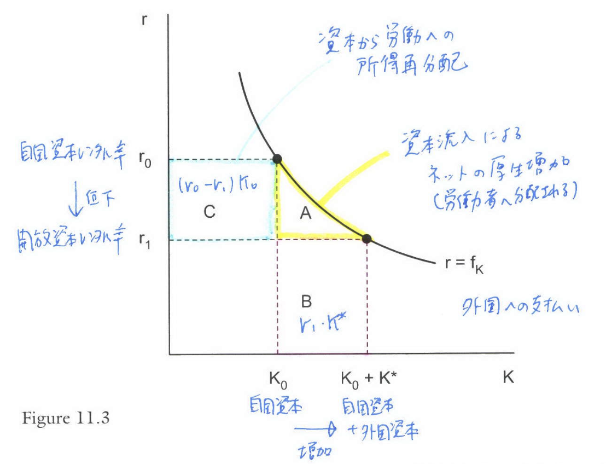
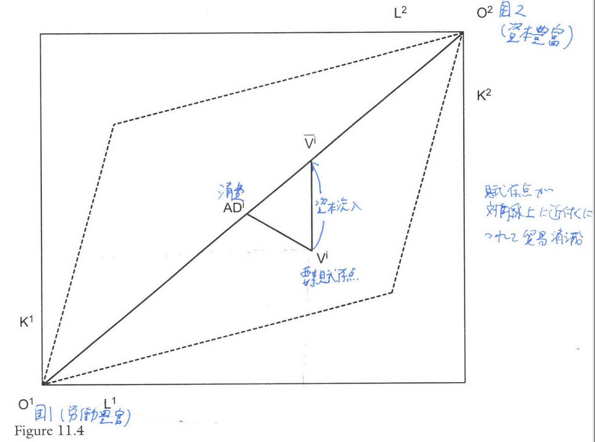
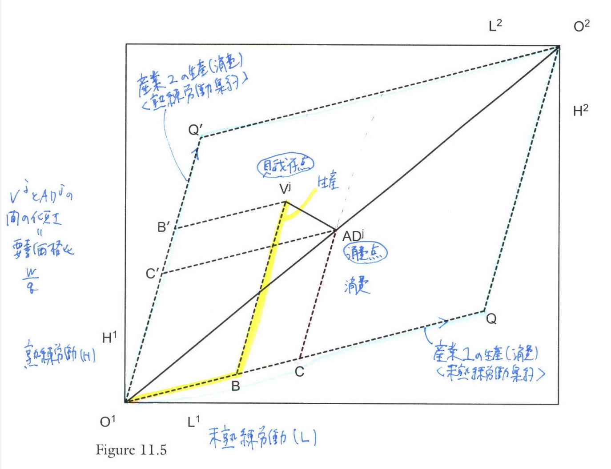
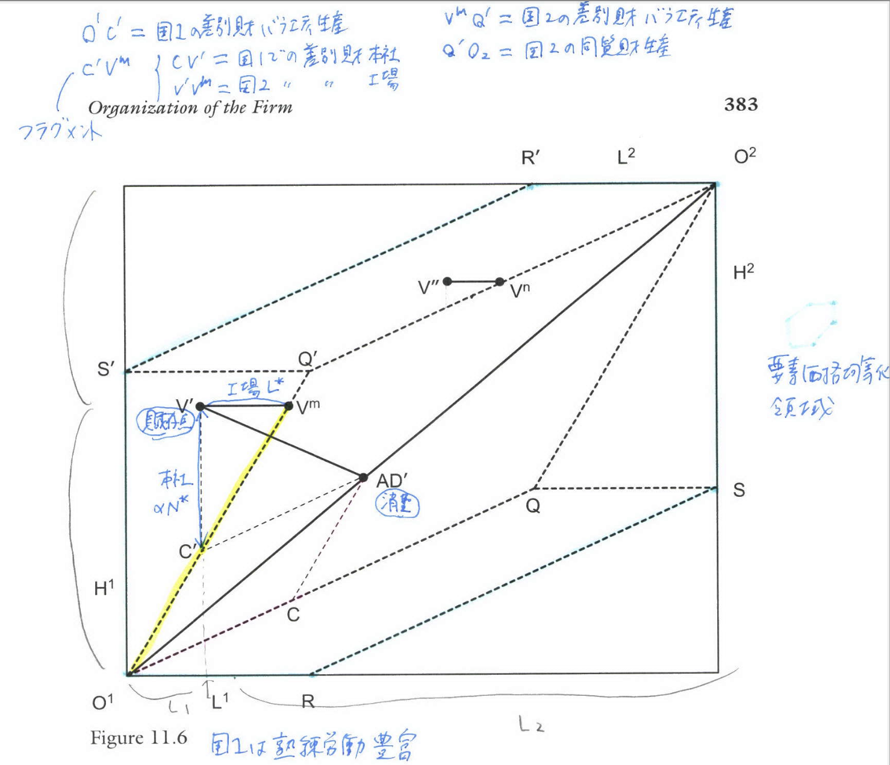
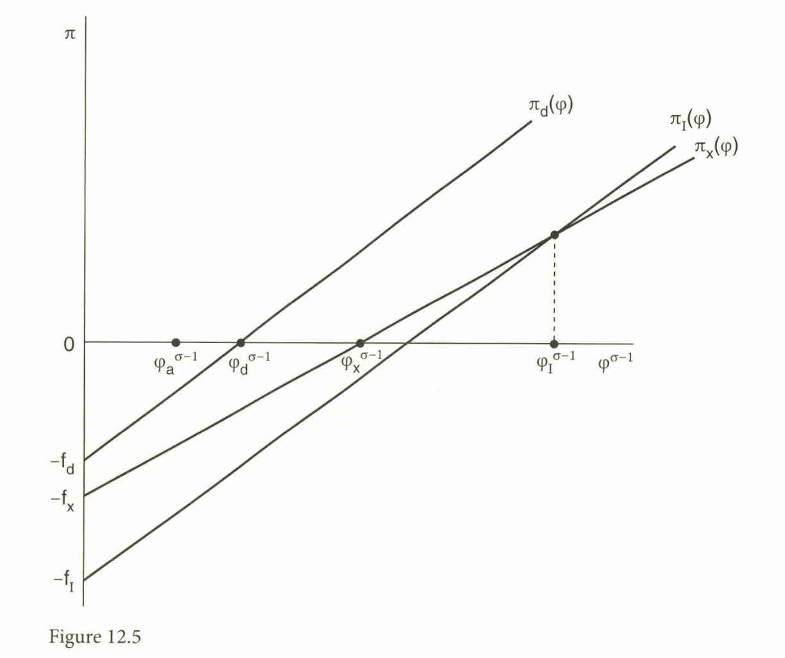

```{r setup, include=FALSE}
knitr::opts_chunk$set(echo = FALSE)
# install.packages("revealjs")
```


# 1. 序論

## 多国籍企業と海外直接投資

* 国際貿易の多くは多国籍企業（Multinational Enterprise: MNE）によって行われており、企業が複数の国で事業を行うための投資は海外直接投資（FDI）と呼ばれる。

* 多国籍企業の活動を理解するための古典的な枠組みとして、所有（Ownership）、立地（Location）、内部化（Internalization）の3つの側面からなる**OLIフレームワーク**（Dunning, 1977）がある。

* 本章では、資本移動、垂直的・水平的多国籍企業、異質的企業のFDI決定、そして不完備契約下での企業の組織化（内部化）について議論する。

# 2. 1部門経済における資本移動

## 資本流入の厚生効果

* 最も単純なFDIの形態として、1部門経済における資本の物理的な移動を考える（MacDougall, 1960）。

* 生産関数を $y = f(L,K)$ とし、外国からの資本流入を $K^*$ とする。

* **資本流入の効果**：資本流入は国内の資本レンタル率 $r$ を低下させ、労働の限界生産力（賃金 $w$）を上昇させる。

## Figure 12.1: 資本流入の厚生分析

* **概要**: 図12.1は、資本流入による限界生産力の変化と厚生への影響を示している。横軸は資本ストック、縦軸は資本のレンタル率である。

* **厚生の増加**: 資本流入 $K^*$ により、国内総生産は $A+B$ 増加する。外国資本への支払い $r_1 K^* = B$ を差し引くと、受入国の純粋な厚生利得は領域 $A$ となる。

* **分配への影響**: 資本レンタル率の低下により、国内資本家は損失を被る一方、労働者は生産性向上により賃金が上昇し、その利得は $A+C$ となる（領域 $C$ は国内資本家から労働者への所得再分配である）。

## Figure 12.1

{width=90%}


# 3. 2部門ヘクシャー・オリーン・モデルにおける資本移動

## 貿易と資本移動の代替性

* Mundell (1957) は、2部門ヘクシャー・オリーン（HO）モデルにおいて、関税が資本移動を誘発する効果を分析した。

* **関税ジャンプFDI**: 資本集約的な財に関税を課すと、国内の資本レンタル率が上昇するため、外国から資本が流入する。

* **貿易の消滅**: 資本流入は、両国の要素価格（レンタル率）が均等化するまで続く。Mundellの分析では、最終的に両国の資本・労働比率が等しくなり、財の貿易が完全に消滅する点（図12.2の点 $T^1$）で均衡する。

* **結論**: このモデルでは「要素移動（資本移動）は財貿易の完全な代替」となる。


## Figure 12.2

{width=90%}

# 4. 垂直的および水平的多国籍企業

## 垂直的多国籍企業（Vertical Multinationals）

* Helpman (1984) は、本社機能（高技能労働集約的）と生産工場（低技能労働集約的）を異なる国に配置する**垂直的多国籍企業**をモデル化した。

* **動機**: 国家間の要素価格差（賃金格差）を利用するためである。

* **FPE集合の拡大**: 垂直的FDIにより、本社サービスと生産活動を分離（フラグメンテーション）できるため、要素価格均等化（FPE）が成立する領域が拡大する（図12.4）。

## Figure 12.3

{width=90%}

## Figure 12.4

{width=80%}

## 水平的多国籍企業（Horizontal Multinationals）

* Markusen (1984, 2002) は、複数の国で同様の生産施設を持ち、現地市場向けに生産・販売を行う**水平的多国籍企業**をモデル化した。

* **トレードオフ**: 企業は、輸出に伴う「輸送費用」を節約する利益と、海外に工場を建設する「追加的固定費用」のコストを比較してFDIを選択する。

* **発生条件**: 水平的FDIは、(a)輸送費用が高い、(b)工場固有の固定費用が低い、(c)両国の市場規模（GDP）が大きく類似している場合に生じやすい。

## ナレッジ・キャピタル・モデル

* 本社で生み出された知識（ナレッジ）が、複数の工場で「公共財」として利用されるモデルである。

* 実証研究（Carr, Markusen, and Maskus, 2001）によれば、世界のFDIの多くは先進国間で行われており、水平的多国籍企業のモデル（市場規模の類似性がFDIを促進する）と整合的である。

# 5. 異質的企業と水平的多国籍企業

## 生産性と国際化モードの選択

* Helpman, Melitz, and Yeaple (2004) は、Melitz (2003) モデルを拡張し、企業の生産性の異質性がFDIの決定に与える影響を分析した。

* **仮定**: 固定費用の大きさは、国内販売 < 輸出 < FDI の順であるとする。

* **選別（Sorting）**:
    1. **低生産性企業**: 国内市場のみで販売。
    2. **中生産性企業**: 輸出を選択（高い変動費用・輸送費を負担）。
    3. **高生産性企業**: FDIを選択（高い固定費用を負担し、低い変動費用で販売）。

## Figure 12.5: 生産性と利潤

* **概要**: 横軸に生産性 $\varphi$、縦軸に利潤 $\pi$ をとったグラフである。

* **説明**: 輸出による利潤関数 $\pi_x$ はFDIによる利潤関数 $\pi_I$ よりも傾きが緩やかだが、切片（固定費負担）は小さい。

* **均衡**: ある閾値の生産性 $\varphi_I$ を境に、それ以上の生産性を持つ企業にとっては、輸出よりもFDIの方が高い利潤をもたらす。

* **数式**: FDIと輸出のカットオフ条件は以下のように表される。
$$
\left( \frac{1 - \tau^{1-\sigma}}{1 - 1/\sigma} \right) \frac{B_j}{\sigma} (\varphi_I)^{\sigma-1} = f_I - f_x \tag{12.10}
$$


## Figure 12.5

{width=80%}


# 6. 企業の組織：内部化と不完備契約

## 内部化の理論

* なぜ企業は海外の独立企業と契約するのではなく、自社で子会社を所有（内部化）するのか？

1. **技術的外部性**: 規模の経済など。
2. **市場支配力**: 供給者による独占力の行使を避けるため。
3. **取引費用（Transaction Costs）**: 不完備契約下での「ホールドアップ問題」を回避するため（Coase, 1937; Williamson, 1975）。

## Antràs and Helpman (2004) モデル

* **枠組み**: 本社（Headquarters）とサプライヤー（Manager）のどちらが生産工程の所有権を持つべきかを、**残余コントロール権**（Property Rights）のアプローチで分析する。

* **主要な定理**:
    * 本社サービス（資本や技術）の投入が重要（集約度 $\eta_h$ が高い）な場合、本社が所有権を持つ**垂直統合（FDI）**が選択される。
    * 部品製造などのサプライヤーの投入が重要（集約度 $\eta_h$ が低い）な場合、**アウトソーシング**が選択される。

$$
\beta^*_V > \beta^*_O \tag{12.12}
$$
(垂直統合の方が本社の交渉力 $\beta$ が高くなるため、インセンティブが改善する)

## 中国の加工貿易への応用

* Feenstra and Hanson (2005) および Fernandes and Tang (2012) は、中国の加工貿易データを用いて所有権と入力（input）のコントロール権を分析した。

* **純粋組立（Pure Assembly）**: 海外本社が原材料を供給・管理する。
* **輸入組立（Import and Assembly）**: 中国工場が原材料を調達・管理する。

* **実証結果**: 情報探索コストや投入物の重要性に応じて、所有形態（海外所有か中国所有か）とコントロール権の配分が決定されていることが示された。

# 7. 不完全情報とマッチング

## 国際貿易におけるマッチングング

* Rauch and Trindade (2003) は、適切なパートナーを見つけるための**探索（Search）とマッチング**のコストを導入したモデルを構築した。

* **ネットワークの役割**: 移民ネットワークや民族的つながり（例：華僑ネットワーク）は、情報の非対称性を緩和し、マッチングの成功確率を高めることで貿易を促進する。

* **労働市場への影響**: パートナー探しにおける不確実性が高いほど、労働市場の統合は妨げられ、賃金格差が維持される。不確実性がなくなれば、完全な資本移動と同様の賃金均等化が達成される。

# 8. 結論

## 本章のまとめ

* **資本移動**: 単純なモデルでは、資本移動は厚生を高め、労働者に利益をもたらすが、貿易を代替する可能性がある。

* **多国籍企業の形態**: 垂直的FDIは要素価格差によって、水平的FDIは市場規模と貿易費用によって動機づけられる。

* **企業の異質性**: 最も生産性の高い企業のみがFDIを行う。

* **企業の境界**: 不完備契約下では、本社サービスの重要性が高い産業ほど、FDI（垂直統合）が選択される傾向にある。

## 主な参考文献1

\footnotesize

* Antràs, P. (2003). Firms, Contracts, and Trade Structure. *Quarterly Journal of Economics*, *118*(4), 1375–1418.

* Antràs, P., & Helpman, E. (2004). Global Sourcing. *Journal of Political Economy*, *112*(3), 552–580.

* Feenstra, R. C., & Hanson, G. H. (2005). Ownership and Control in Outsourcing to China: Estimating the Property-Rights Theory of the Firm. *Quarterly Journal of Economics*, *120*(2), 729–762.

* Helpman, E. (1984). A Simple Theory of International Trade with Multinational Corporations. *Journal of Political Economy*, *92*(3), 451–471.

* Helpman, E., Melitz, M. J., & Yeaple, S. R. (2004). Export versus FDI with Heterogeneous Firms. *American Economic Review*, *94*(1), 300–316.


## 主な参考文献2

\footnotesize

* MacDougall, G. D. A. (1960). The Benefits and Costs of Private Investment from Abroad: A Theoretical Approach. *Economic Record*, *36*, 13–35.

* Markusen, J. R. (2002). *Multinational Firms and the Theory of International Trade*. MIT Press.

* Mundell, R. A. (1957). International Trade and Factor Mobility. *American Economic Review*, *47*(3), 321–335.

* Rauch, J. E., & Trindade, V. (2003). Information, International Substitutability, and Globalization. *American Economic Review*, *93*(3), 775–791.

# 確認問題 (10問){-}

## 問1

1部門経済モデル（MacDougall, 1960）において、外国からの資本流入が受入国に与える影響として最も適切なものはどれか。

A. 資本のレンタル率が上昇し、国内資本家が利益を得るである。

B. 労働の限界生産力が低下し、賃金が低下するである。

C. 国内総生産は増加するが、外国資本への支払いを差し引くと純厚生は減少するである。

D. 労働の限界生産力が上昇して賃金が上がり、受入国全体として正の純厚生利得（三角形の領域）を得るである。

## 問2

Mundell (1957) の2部門ヘクシャー・オリーン・モデルにおける資本移動の分析結果として、最も適切なものはどれか。

A. 関税は資本流出を引き起こし、国内産業を空洞化させるである。

B. 関税による「関税ジャンプFDI」が発生し、最終的に両国の要素価格が均等化して財貿易が消滅するである。

C. 資本移動と財貿易は補完的な関係にあり、FDIの増加は貿易量を増大させるである。

D. 資本移動は発生するが、要素価格均等化（FPE）は決して達成されないである。

## 問3

Helpman (1984) の垂直的多国籍企業モデルにおいて、企業が海外生産を行う主な動機は何か。

A. 輸送費用を節約し、現地市場へのアクセスを改善するためである。

B. 国家間の要素価格（賃金）の差異を利用し、生産工程をスキル集約度に応じて立地させるためである。

C. 貿易障壁（関税など）を回避するためである。

D. 研究開発（R&D）のスピルオーバー効果を得るためである。

## 問4

Markusen (2002) の水平的多国籍企業モデルにおいて、水平的FDIが発生しやすい条件として最も適切な組み合わせはどれか。

A. 輸送費用が低く、工場建設の固定費用が高い場合である。

B. 国家間の要素賦存比率が大きく異なり、賃金格差が大きい場合である。

C. 輸送費用が高く、工場建設の固定費用が低く、両国の市場規模が類似している場合である。

D. 片方の国が極端に小国であり、市場規模の格差が大きい場合である。

## 問5

Helpman, Melitz, and Yeaple (2004) の異質的企業のモデルにおいて、最も生産性が高い企業が選択する国際化モードはどれか。

A. 国内市場のみでの販売である。

B. 輸出（Exporting）である。

C. 海外直接投資（FDI）である。

D. 市場からの撤退（Exit）である。

## 問6

Helpman, Melitz, and Yeaple (2004) のモデルで、輸出よりもFDIが選択されるためのトレードオフの条件として正しいものはどれか。

A. FDIの固定費用が輸出の固定費用よりも低くなければならないである。

B. 輸出に伴う変動費用（輸送費など）の節約分が、FDIに伴う追加的な固定費用の負担を上回らなければならないである。

C. 現地企業の生産性が自社よりも高くなければならないである。

D. 製品が均質財でなければならないである。

## 問7

「ホールドアップ問題」が発生する原因として、取引費用理論（Coase, Williamson）や不完備契約理論で強調されている要素はどれか。

A. 規模の経済が存在することである。

B. 完全競争市場における価格受容者としての行動である。

C. 契約の不完備性と、取引に特化した資産（Asset Specificity）の存在である。

D. 政府による過度な規制である。

## 問8

Antràs and Helpman (2004) のモデルにおいて、企業が「垂直統合（FDIによる内部化）」を選択する可能性が高くなるのはどのような場合か。

A. 生産工程において、部品サプライヤーの投入の重要度（集約度）が高い場合である。

B. 生産工程において、本社サービス（技術や資本など）の投入の重要度（集約度）が高い場合である。

C. 海外の法制度が整備されており、契約の履行が完全に保証される場合である。

D. 本社とサプライヤーの交渉力が完全に等しい場合である。

## 問9

Feenstra and Hanson (2005) の中国加工貿易の実証研究において、「純粋組立（Pure Assembly）」と比較して、「輸入組立（Import and Assembly）」形態（中国側が部材調達をコントロールする）が選ばれやすいのはどのようなケースか。

A. 部材の探索・調達コストが低く、中国側の工場がその能力を持っている場合である。

B. 本社から供給される部材の知的財産権保護が極めて重要な場合である。

C. 加工プロセスが単純で、付加価値が非常に低い場合である。

D. 海外本社の交渉力が最大化される必要がある場合である。

## 問10

Rauch and Trindade (2003) のマッチングモデルにおいて、国際的なパートナー探しの「不確実性（k）」が低下（または解消）した場合の結果として正しいものはどれか。

A. 貿易量は減少し、オートアーキーの状態に近づくである。

B. 労働市場の統合が進み、完全な資本移動がある場合と同様に賃金が均等化する方向へ向かうである。

C. 差別化財の貿易が減り、同質財の貿易が増えるである。

D. 移民ネットワークの重要性がさらに高まるである。

## 解答

| 問題番号 | 解答 |
| :------: | :--: |
| 問1 | D |
| 問2 | B |
| 問3 | B |
| 問4 | C |
| 問5 | C |
| 問6 | B |
| 問7 | C |
| 問8 | B |
| 問9 | A |
| 問10 | B |


# 解説{-}

## 問1. 1部門経済における資本流入

**解答:** D. 労働の限界生産力が上昇して賃金が上がり、受入国全体として正の純厚生利得（三角形の領域）を得るである。

**解説:** 図12.1の分析に基づくと、資本流入は労働の限界生産力を高め、賃金を上昇させる。外国資本への支払いを差し引いても、国内には三角形の領域 $A$ に相当する純利益が残る。国内資本家はレンタル率の低下により損失を被る。

## 問2. Mundellの関税ジャンプFDI

**解答:** B. 関税による「関税ジャンプFDI」が発生し、最終的に両国の要素価格が均等化して財貿易が消滅するである。

**解説:** Mundell (1957) は、関税が資本のレンタル率格差を生み出し、資本移動を誘発することを示した。資本移動は要素価格が均等化するまで続き、その結果、HOモデルの仮定下では両国の賦存比率が似通うことになり、貿易の基礎が失われ、貿易が消滅する（代替関係）。

## 問3. 垂直的多国籍企業の動機

**解答:** B. 国家間の要素価格（賃金）の差異を利用し、生産工程をスキル集約度に応じて立地させるためである。

**解説:** Helpman (1984) の垂直的FDIモデルは、本社機能（高スキル）と生産（低スキル）を、それぞれの要素価格が安い国に配置することで費用を最小化する行動に基づいている。

## 問4. 水平的多国籍企業の発生条件

**解答:** C. 輸送費用が高く、工場建設の固定費用が低く、両国の市場規模が類似している場合である。

**解説:** Markusenのモデルでは、水平的FDIは「高い輸送費用」を避けるために選ばれるが、「工場の追加固定費用」がかかる。したがって、輸送費が高く、固定費が低く、かつ現地生産を正当化できるほど市場規模が大きい（かつ類似している）場合に発生しやすい。

## 問5. 異質的企業の国際化モード

**解答:** C. 海外直接投資（FDI）である。

**解説:** Helpman, Melitz, and Yeaple (2004) のモデルでは、FDIは最も固定費用が高いが、変動費用（輸送費や関税）を回避できるため、販売量が大きく、高い固定費を回収できる「最も生産性の高い企業」によって選択される。

## 問6. FDIと輸出のトレードオフ

**解答:** B. 輸出に伴う変動費用（輸送費など）の節約分が、FDIに伴う追加的な固定費用の負担を上回らなければならないである。

**解説:** 図12.5に関連する議論である。FDIを選択する企業は、高い固定費 $f_I$ を払ってでも、輸出の際の輸送コスト（変動費）を削減することで、総利潤を最大化しようとする。これが成立するのは生産性が高い企業である。

## 問7. 内部化の理論的背景

**解答:** C. 契約の不完備性と、取引に特化した資産（Asset Specificity）の存在である。

**解説:** 取引費用理論において、特定の取引関係に特化した投資が必要な場合、契約が不完備であると、相手から足元を見られる「ホールドアップ問題」が生じる。これを回避するために、企業は市場取引ではなく組織内部での取引（垂直統合）を選択する。

## 問8. Antràs-Helpmanモデルの予測

**解答:** B. 生産工程において、本社サービス（技術や資本など）の投入の重要度（集約度）が高い場合である。

**解説:** 残余コントロール権のアプローチでは、生産における貢献度（重要度）が高い主体に所有権を与えることで、投資インセンティブを最大化する。本社サービスの重要度 $\eta_h$ が高い場合、本社が所有権を持つ垂直統合（FDI）が最適となる。

## 問9. 中国加工貿易の所有と管理

**解答:** A. 部材の探索・調達コストが低く、中国側の工場がその能力を持っている場合である。

**解説:** Feenstra and Hanson (2005) 等の分析によると、部材調達（input search）のコストが低い、あるいは中国側の工場が効率的に調達できる場合（例：経済特区内や沿岸部）、中国側が所有・管理する「輸入組立」やアウトソーシング契約が選ばれやすくなる。

## 問10. マッチングと不確実性

**解答:** B. 労働市場の統合が進み、完全な資本移動がある場合と同様に賃金が均等化する方向へ向かうである。

**解説:** Rauch and Trindade (2003) の定理によれば、国際的なパートナー探しの不確実性 $k$ がゼロに近づくと、マッチングが円滑になり、結果として労働市場が統合され、要素価格（賃金）の均等化が達成される。
